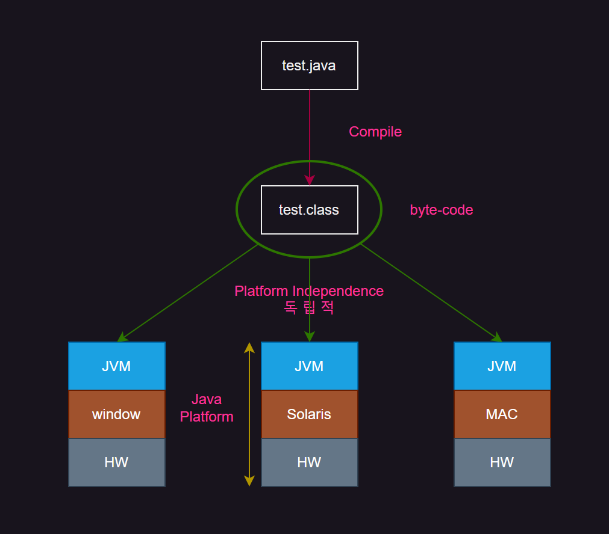
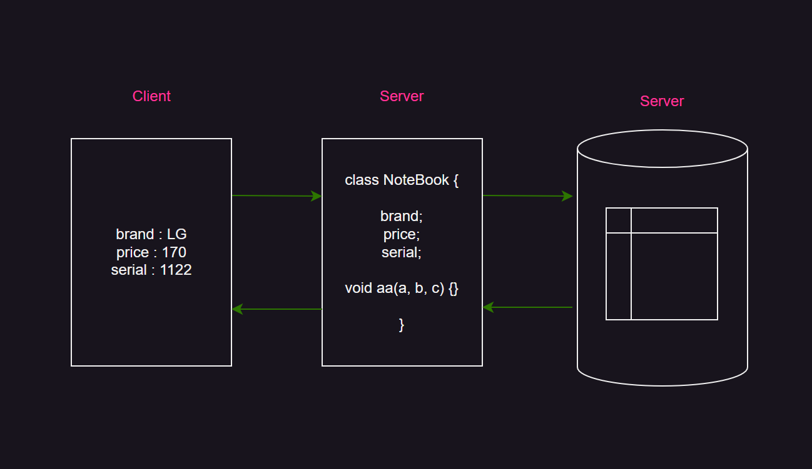
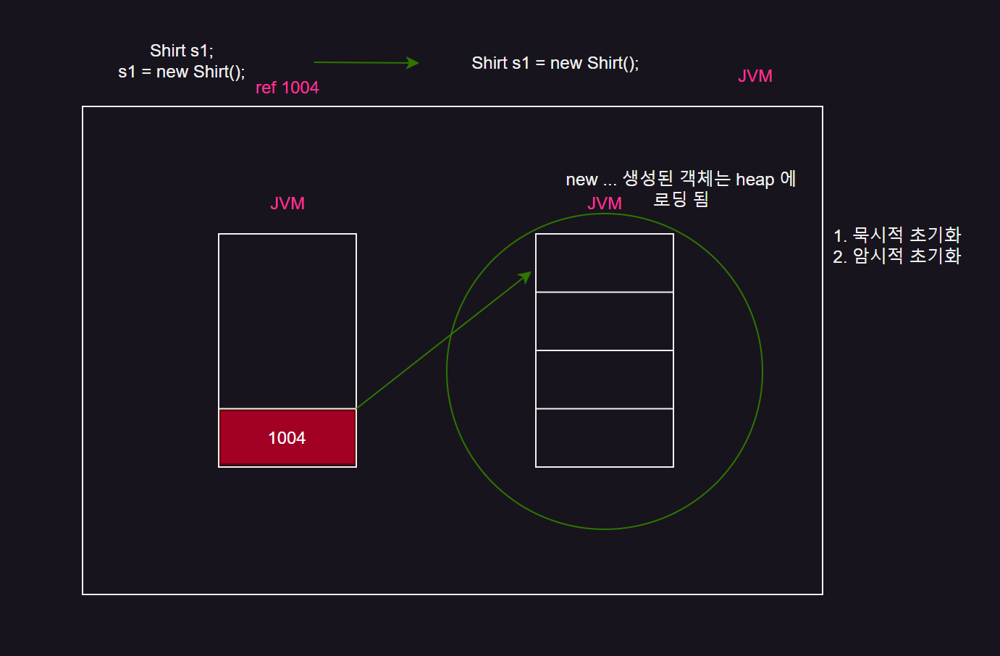
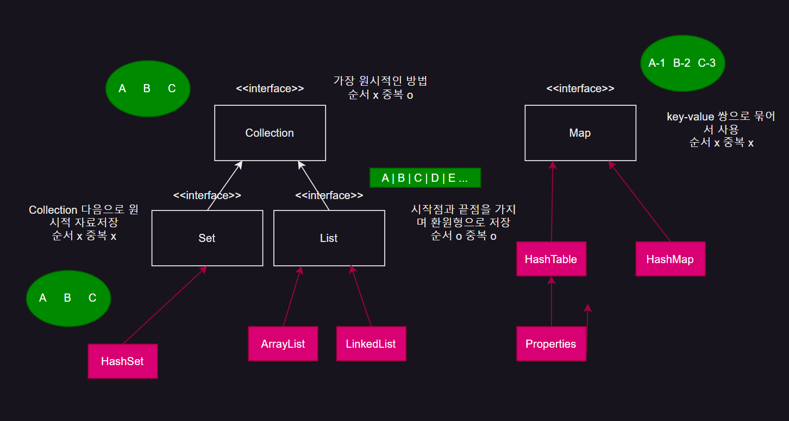
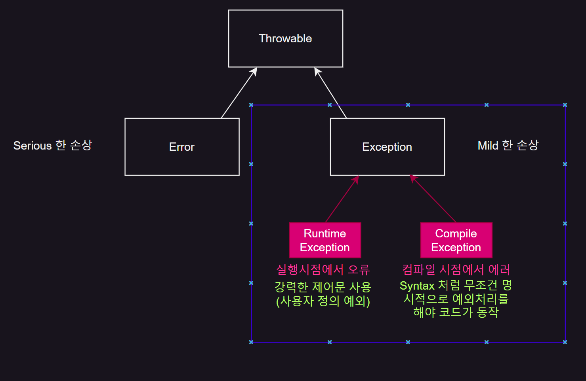

> Back-end 의 기초를 알기 위한 JAVA 학습 페이지입니다.
{: .prompt-tip}

## JAVA SPEC

### J2SE (Java To Standard Edition)

> 자바 프로그래밍 언어의 핵심 플랫폼
> 기본 클래스 라이브러리와 자바 가상 머신(JVM), 개발 도구 등이 포함
> JDBC

### J2EE (JAVA To Enterprise Edition)
> J2SE를 기반으로 하지만, 대규모 엔터프라이즈급 애플리케이션을 개발하기 위한 추가적인 사양 제공
> 웹 서비스, 분산 컴퓨팅, 클라우드 서비스 등을 개발하는 데 필요한 기능을 포함
> 트랜잭션 관리, 보안, 동시성 제어 등의 고급 기능을 제공
> Servlet, JSP, Framework

<hr/>

두 차이는 `WAS` 의 여부에 따라 달라진다.

<hr/>

## JAVA 의 실행 단계

### 1. 소스코드 작성

- 코드를 작성하면 `.java` 확장자로 파일이 처음에 생성이 된다.

### 2. 컴파일 과정

- 자바 컴파일러 `javac` 이 소스코드 `.java` 를 읽고 구문을 분석
- 컴파일러는 소스코드를 보고 오류가 없다면 `bite-code` 로 중간형태 변환을 함
- 해당 `bite-code` 는 **Platform-independence (플랫폼 독립적)** 이기 때문에 다양한 운영체제에서 실행 가능

### 3. 로딩

- 자바 가상머신(JVM) 에서 필요한 `.class` 파일을 로드
- 이 바이트 코드를 메모리로 load 하고 다른 class 나 method 로 연결

### 4. Bite-code 검증

- load 된 `Bite-code` 는 보안을 위해 검증 과정을 거침

### 5. 실행

- 검증에 통과한 `Bite-code` 는 `Java-Interpreter` 에 의해 실행
- 인터프리터는 한줄씩 읽고 실행하며 `JIT` 컴파일러가 기계어로 변환하여 실행 속도를 높일 수 있음
- 프로그램 실행은 `main` 메소드 호출에서 시작되며 진입점이 됨

### 6. 실행 종료

- `main` 메서드의 실행이 완료 되면, 프로그램 실행은 종료 됨
- 필요한 경우 `JVM` 은 사용했던 리소스를 정리하고 시스템 리소스를 해제

{: .w-50 .align-center}

<hr/>

## Test Class 실행과정

{: .w-50 .align-center}
_(전반적인 웹 페이지의 흐름도)_

- 웹페이지는 주로 해당 그림의 흐름에 따라 진행되는데, Java 의 Test 파일은 주로 `Client` 단에서의 작업을 대신한다.

```java
class NoteBook {
    String brand;
    int price;

    // 값 주입 필드 초기화
    public void setNoteBook (String brand, int price) {
        this.brand = brand;
    }

    // 값 변환
    public String getNoteBook() {
        return brand;
    }
}

class NoteBookTest {
    // Client 에 해당
    public static void main() {
        // 첫번째 실행라인
        NoteBook nb = new NoteBook();

        nb.setNoteBook();
        System.out.println(nb.getNoteBook());
    }
}
```

<hr/>

## Java 의 Heap 사용법

> `Shirt s1 = new Shirt();` 코드 실행 시, JVM은 Shirt 객체를 생성하기 위해 힙 메모리를 할당
>
> 힙에 생성된 객체에 대한 참조는 s1 변수에 할당
>
> s1은 스택 메모리에 저장되며, 힙 메모리에 저장된 Shirt 객체를 가리키는 참조(Reference)
>
> 생성 된 객체를 사용하지 않을 경우 자동으로 Heap 의 값이 지워지는게 아닌 연결만 끊긴다.
>
> 따라서 주소값이 바뀌면 다른 객체이고, 주소값이 같아야 같은 값이다.

{: .w-50 .align-center}
_(JVM 에서의 Heap 구조)_

> 하지만 계속 `heap` 을 사용하다 보면 안쓰는 객체나 함수가 생기기 마련
>
> 쌓이면 메모리가 초과가 되는 불상사가 발생한다.
{: .prompt-danger}

<hr/>

## Garbage Collector

> 더 이상 사용되지 않는 객체를 자동으로 감지하고 그 메모리를 회수하는 역할을 수행 가비지 컬렉션의 주요 목적은 메모리 누수를 방지하고 프로그램이 더 효율적으로 작동할 수 있도록 하는 것

<hr/>

## Tight Coupling vs Loose Coupling

### Tight Coupling

- `Tight Coupling`에서는 한 컴포넌트가 다른 컴포넌트와 밀접하게 연결
- 하나의 컴포넌트에 변경이 발생하면 다른 컴포넌트에도 영향을 미침
- 한 컴포넌트를 변경하거나 업데이트할 때 다른 컴포넌트도 함께 변경
- 유지보수가 어렵고, 오류가 발생하기 쉬움
- 재사용성이 낮아짐
- 시스템 유연성이 떨어짐

### Loose Coupling

- `Loose Coupling`에서는 각 컴포넌트가 상대적으로 독립적
- 클래스 간의 상호 의존성이 낮고, 각각이 독립적으로 동작
- `interface`나 `abstract`를 통해 서로 연결 구체적인 구현에 대한 정보는 최소화
- 유지보수가 쉽고 확장성이 좋음
- 재사용성이 높아짐

<hr/>

## Singletone Pattern

- `Client` 의 요청이 들어오기 전 `Server` 상의 객체를 하나만 생성하여 관리
- 이 상태에서 `Client` 서비스 요청은 메서드 하나와 매핑 됨
- 요청이 아무리 많이 들어오더라도 메서드만 계속 호출되고 클래스나 인스턴스 생성은 더이상 진행되지 않음

### 장점
> 인스턴스 생성 및 소멸 과정을 싱글톤 클래스 자체에서 관리
>
> 인스턴스의 라이프사이클과 상태 관리가 용이

### 단점
> 싱글톤 인스턴스가 글로벌 상태를 만들어, 코드의 여러 부분에서 서로 영향을 주고받을 수 있어 디버깅과 유지보수가 어려움
>
> 멀티스레드 환경에서 싱글톤 인스턴스의 동시 액세스를 제어하지 않으면 동기화 문제가 발생할 수 있음

<hr/>

## JAVA 자료구조

### Collection
- 가장 원시적인 방법으로 자료를 저장하며 순서가 없고 중복 가능
- `Collection` 인터페이스 자체로는 인스턴스화할 수 없으며, 구체적인 구현을 제공하는 클래스 **(ArrayList, HashSet ...)** 를 사용

### List
- 순서가 있고 중복 가능
- 시작점과 끝점을 가지면서 환원형으로 자료를 저장함
- 인터페이스는 인덱스를 기반으로 한 접근 방법을 제공, 순서가 있기 때문에 인덱스로 자료 접근가능

### Set
- 순서가 없고 중복되지 않음
- `Collection` 다음으로 원시적으로 자료저장
- 주로 요소의 존재 여부를 확인하는 데 사용

### Map
- 순서가 없고 중복되지 않음
- `key` `value` 로 묶어서 저장
- 각 키는 고유해야 하며, 하나의 키는 정확히 하나의 값에 매핑
- `Collection` 인터페이스를 상속받지 않음

{: .w-50 .align-center}

## JAVA Exception

### Throwable
- JAVA 에서의 예외처리 최상위 class

### Error
- 시스템에 의해 발생하는 심각한 문제를 나타냄
- Error 발생 시 애플리케이션은 보통 복구 불가능한 상태가 되며, 대부분의 경우 프로그램을 종료하는 것이 적절

### Exception
- 클래스는 애플리케이션 코드에서 처리할 수 있는 예외적인 상황

#### Checked Exception
- 명시적인 예외 처리가 필요
- **컴파일 시점**에 발생 프로그램에서 회복 가능한 예외처리
- `IOException`, `SQLException`

#### Unchecked Exception (Runtime Exception)
- **런타임 시 발생**하며, 명시적인 처리를 강제하지 않음
- 주로 프로그램의 버그나 잘못된 사용으로 인해 발생
- `NullPointerException`, `ArrayIndexOutOfBoundsException`

{: .w-50 .align-center}
