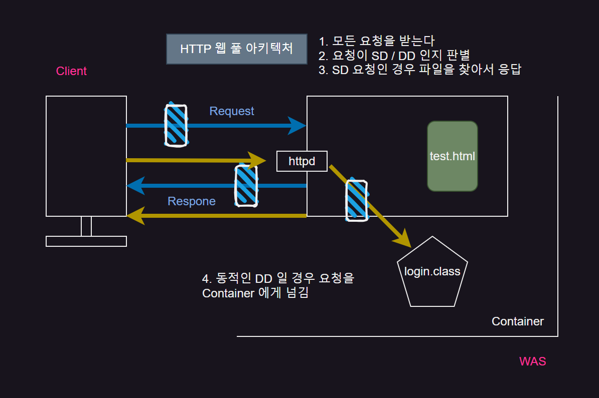
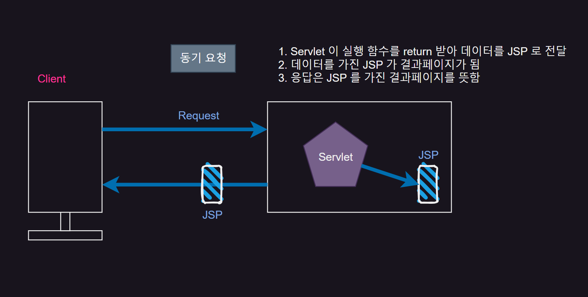
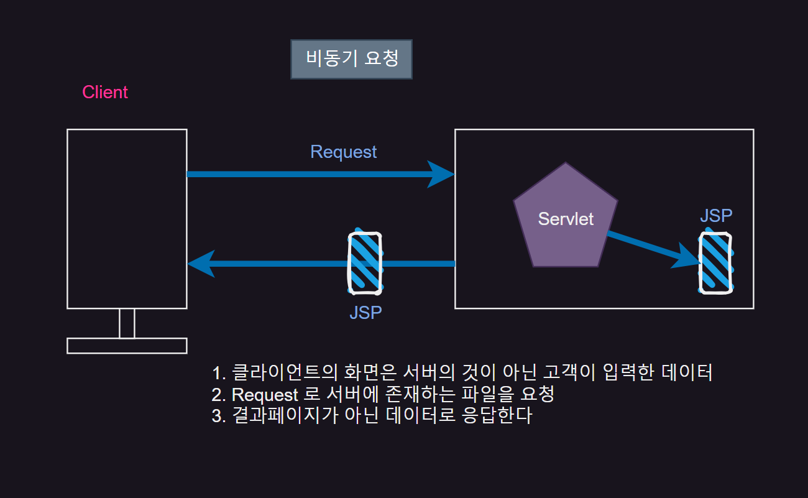
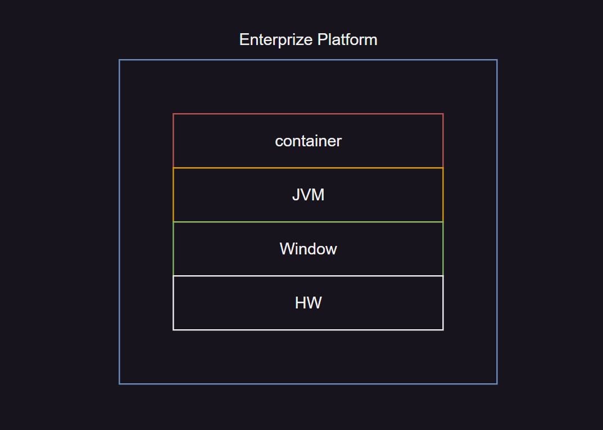
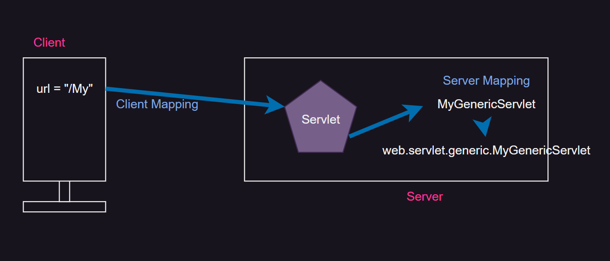

## Web Architecture

{: .w-50 .align-center}

1. `Client` 에서 서버에 서비스를 요청
2. `Server` 에서 모든 요청을 받는데 `SD` `DD` 를 판별
3. `DD` 일 경우 `httpd` 를 거쳐 요청을 `Container(WAS)` 로 넘김
4. `SD` 일 경우 `Server` 내 찾는 파일을 찾아 응답

### SD (Static Document)
> 웹 화면 ex) (html, css, js) 정적인 화면

### DD (Dynamic Document)
> JAVA 소스코드 동작함수 (Servlet, JSP) 등 서비스 작성

<br/>

## 동기 요청 vs 비동기 요청
`ServletRequest`, `ServletResponse`
클라이언트의 요청은 서버에서 생성된 서블릿 안의 쓰레드 단위로 수행된다

요청에 대한 서비스를 다 수행했다면...service() {   }... 메모리에서 쓰레드 단위로 unbind 되면서

그 안에 로컬로 존재하는 `ServeltRequest`, `ServletResponse` 도 메모리에서 Death된다

동기 요청은 `page`, 비동기 요청은 `data` 를 응답한다.

따라서 비동기 요청은 `Server` 와 `Client` 의 분리를 의미함

### 동기 요청

{: .w-50 .align-center}


### 비동기 요청

{: .w-50 .align-center}

<br/>

## Servlet

```java
package web.servlet.generic;

import java.io.IOException;

import javax.servlet.GenericServlet;
import javax.servlet.ServletException;
import javax.servlet.ServletRequest;
import javax.servlet.ServletResponse;

/*
 MyGenericServlet 클래스는 java 기반으로 만들어진 클래스
 java 클래스는 --JVM(플랫폼)
 Servlet 클래스는  -- Container(WAS, Engine)
 */

public class MyGenericServlet extends GenericServlet{ //GenericServlet을 상속받아 Servlet이 됨

	@Override
	public void service(ServletRequest request, ServletResponse response) throws ServletException, IOException {
		
	}
}
```

{: .w-50 .align-center}
_(기본형식)_

`Client`와 `Server`로 나뉘며

`client` 가 하는 대부분의 요청은 `Server` 로 요청이 진행

요청을 하면 2가지가 전송되는데 `networkstream`을 통해 `client` 에서 입력한 값을 전송

`Web-Server(Demon-Server)`는 모든 요청을 받는 리셉션 같은 역할을 한다.

<br/>

그 후 요청이 `static(SD)`한 요청인지 `dynamic(DD)` 한 요청인지 확인 한 후

만약 `DD` 이면 받은 요청정보를 `container(Server, WAS)` 로 넘긴다.

<br/>

이 때 요청을 넘기는 순간 `container` 는 요청 정보를 `ServletRequest` 객체에 담는다. (전송 준비) 

해당 객체를 `unpack` 하면 `getter`,  `pack` 하면 `setter` 이다.

또한 `container` 는 동시에 `response` 객체와 `thread(Service method)`를 만든다.

이 때 `service` 함수의 인자에 (request, response) 객체가 들어가고 request 객체값을 기반으로  **return값**을 response 에 담는다.

<br/>

이 모든 것들은 `Servlet` 이라는 하나의 `process` 에서 진행되며 이때의 `Servlet` 내에서 동작하는 메서드들은 `thread` 라고 이해 하면 된다.

<br/>

{: .w-50 .align-center}


```java
package web.servlet.generic;

import java.io.IOException;
import java.io.PrintWriter;

import javax.servlet.GenericServlet;
import javax.servlet.ServletException;
import javax.servlet.ServletRequest;
import javax.servlet.ServletResponse;

/*
 MyGenericServlet 클래스는 java 기반으로 만들어진 클래스
 java 클래스는 --JVM(플랫폼)
 Servlet 클래스는  -- Container(WAS, Engine)
 
 ::
 
 MyGenericServlet ms = new MyGenericServlet();
 ee레벨에서는 객체생성의 주체가 개발자가 아니다.
 따라서 new로 servlet객체를 만들지 않는다.
 객체 생성의 주체는 container에게 넘어간다.
 
 container가 dd(web.xml) 파일을 보고 객체 생성 
 */

public class MyGenericServlet extends GenericServlet{ //GenericServlet을 상속받아 Servlet이 됨
	@Override
	public void service(ServletRequest request, ServletResponse response) throws ServletException, IOException {
		//웹 브라우저가 응답을 하기위한 객체...
		PrintWriter out = response.getWriter();
		
		out.println("<html><body><h2>");
		out.println("Hello Generic Servlet~!!");
		out.println("<h2></body></html>");
		out.close(); //클라이언트의 응답이 끝났다.(thread, request, response 객체는 메모리에서 내려온다)
	
	}
}
```

```xml
<?xml version="1.0" encoding="UTF-8"?>
<web-app xmlns:xsi="http://www.w3.org/2001/XMLSchema-instance" xmlns="http://java.sun.com/xml/ns/javaee" xsi:schemaLocation="http://java.sun.com/xml/ns/javaee http://java.sun.com/xml/ns/javaee/web-app_2_5.xsd" id="WebApp_ID" version="2.5">
 <servlet>
 <!--web.servlet.generic.MyGenericServlet MyGenericServlet = new web.servlet.generic.MyGenericServlet()  서버 외부 매핑 -->
 	<servlet-name>MyGenericServlet</servlet-name>
 	<servlet-class>web.servlet.generic.MyGenericServlet</servlet-class> <!--위 FQCN를 보고 객체를 생성함  -->
 </servlet>
 
 
 <!--클라이언트 매핑  -->
 <servlet-mapping>
 	<servlet-name>MyGenericServlet</servlet-name>
 	<url-pattern>/My</url-pattern> <!--/My로 요청이 들어오면 MyGenericServlet으로 보낸다  -->
 </servlet-mapping>
</web-app>
```

