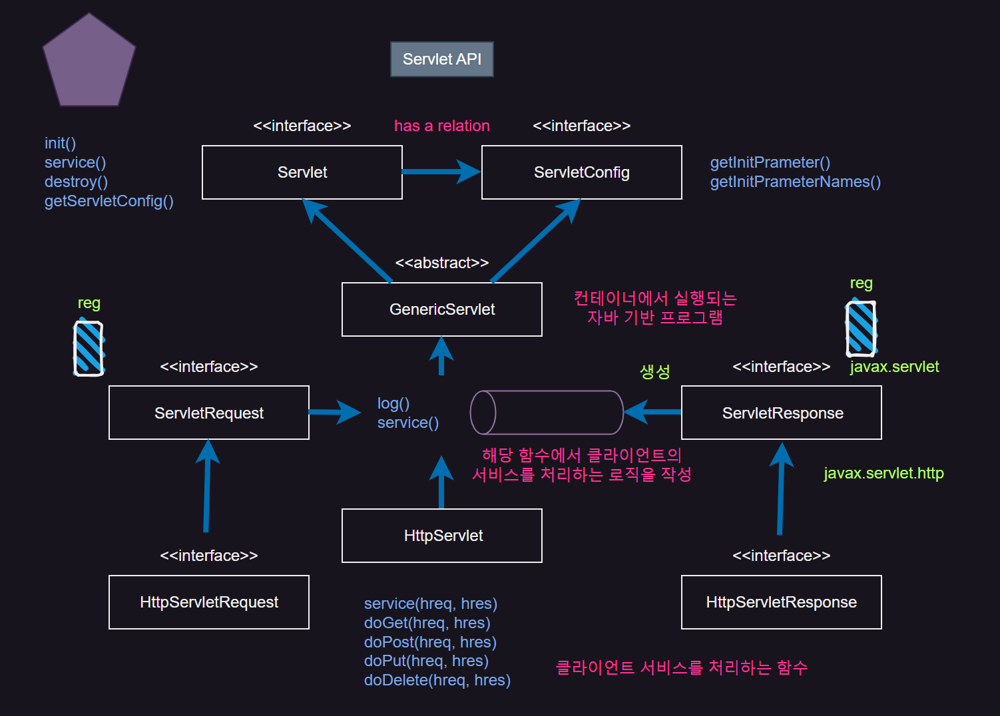
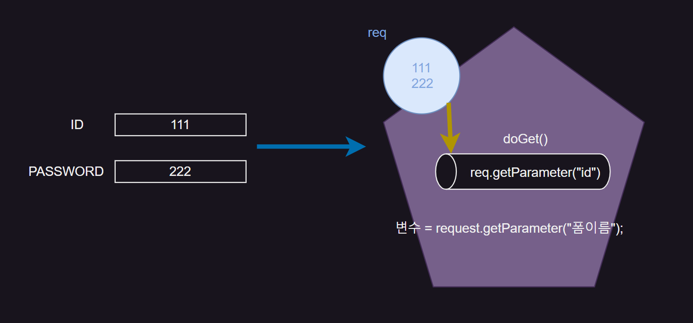
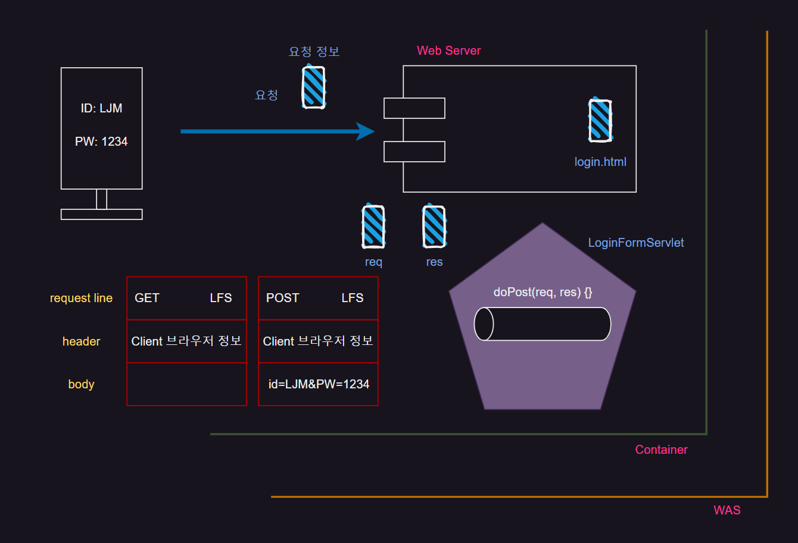

## Servlet-API

{: .w-50 .align-center}
_(Servlet-API)_

`GenericServlet` 은 `Servlet` 인터페이스와 `ServletConfig` 인터페이스를 상속받은 것이며

`Servlet` 인터페이스와 `ServletConfig` 인터페이스는 서로 `has a relation` 관계이다

```java
// Compiled from Servlet.java (version 1.8 : 52.0, no super bit)
public abstract interface Servlet {
  
	//ServletConfig의 setter이다
  public abstract void init(ServletConfig arg0) throws javax.servlet.ServletException;
  
  public abstract ServletConfig getServletConfig();
  
  public abstract void service(ServletRequest arg0, javax.servlet.ServletResponse arg1) throws javax.servlet.ServletException, java.io.IOException;
  
  public abstract void destroy();
}
```

```java
// Compiled from ServletConfig.java (version 1.8 : 52.0, no super bit)
public abstract interface ServletConfig {
  
  public abstract String getServletName();
  
  public abstract ServletContext getServletContext();
  
  public abstract String getInitParameter(String arg0);
  
  public abstract Enumeration getInitParameterNames();
}
```

### GenericServlet

> 위 두개의 인터페이스를 상속한 것이 `GenericServlet` 이며
> 
> `GenericServlet` 은 단독 메소드로 `log()` 와 `service()` 를 가진다.


> GenericServlet를 상속받고 구현하면 다양한 통신(http, ftp… 등)을 사용할 수 있다.
> 
> `GenericServlet` 을 상속받는 `HttpServlet` 이 존재한다.

<br/>

### service()

> `service()` 는 인자값으로 `ServletRequet` 인터페이스와 `ServletResponse` 인터페이스를 받으며
> 
> `service()` 는 해당 함수 내에서 클라이언트의 서비스를 처리하는 로직을 작성한다.

<br/>

### javax.servlet

> 지금까지 말한 클래스들은 `javax.servlet` package에 모두 포함되어 있다.
> 
> `javax.servlet` 프로토콜 독립적인 package 이다.


<br/>

### javax.servlet.http

> 위 클래스는 `javax.servlet.http` package에 포함된다.
> 
> `javax.servlet.http` 는 프로토콜 종속적인 package이다.

<br/>

### HttpServlet

>HttpServlet을 상속받아 사용하면 http 통신만 사용가능하다.
>
>`HttpSerlvet` 은 `service(hreq, hres)` , `doGet(hreq, hres)`, `doPost(hreq, hres)`, `doPut(hreq, hres)` , `doDelete(hreq, hres)` 함수 등을 가진다.

<br/>

### HttpServletRequet & HttpServletResponse

> 인자값으로 `HttpServletRequet` 와 `HttpServletResponse` 인터페이스를 가진다.
> 
> 위 인터페이스 들은 각각 `ServletRequest` 와 `ServletResponse` 를 상속받는다.
> 
> 따라서 http 통신에 특화된 `HttpServlet` 을 가장 많이 사용한다.

<br/>

### 활용 예제

```html
	<form action="LFS">
		ID : <input type = "text" name="id"><br><br>
		PASS : <input type="password" name="password"><br><br>
		<input type="submit" value="LOGIN">
	</form>
```

{: .w-50 .align-center}

```java
package web.servlet.http;

import java.io.IOException;
import java.io.PrintWriter;

import javax.servlet.ServletException;
import javax.servlet.annotation.WebServlet;
import javax.servlet.http.HttpServlet;
import javax.servlet.http.HttpServletRequest;
import javax.servlet.http.HttpServletResponse;

/*
 * 컨테이너가 먼저 annotation을 만나면 아래와 같은 xml 을 간단하게 축약한것이다.
 * <servlet>
 * 		<servlet-name>LoginFromServlet</servlet-name>
 * 		<servlet-class>web.servlet.http.LoginFromServlet</servlet-class>
 * <servlet>
 * 
 * <servlet-mapping>
 * 		<servlet-name>LoginFormServlet</servlet-name>
 * 		<url-pattern> /LFS </url-pattern>
 * 	</servlet-mapping>
 */
@WebServlet("/LFS") //anotation (xml 맵핑정보를 짧게 줄이는 것) 
public class LoginFromServlet extends HttpServlet {
	private static final long serialVersionUID = 1L;
      
	protected void doGet(HttpServletRequest request, HttpServletResponse response) throws ServletException, IOException {
		//1. form 값 받는다. 
		String id = request.getParameter("id");
		String password=request.getParameter("password");
		
		//2. 비즈니스 로직 호출... 했다 치고....
		//Member member = MemberDAOImpl.getInstanse().login(id, password);
		//위 코드가 동작했다 치고  
		
		//3. 반환된 값을 다시 클라이언트로 응답.....
		PrintWriter out = response.getWriter(); //화면에 출력하는 기능을 가지고 있는 객체를 리턴받고.response 를 통해서
		out.println("<html><body>");
		out.println("<ul><li> ID : " + id + "</li>");
		out.println("<li> PASSWORD : " + password +"</li>");
		out.println("</ul></body></html>");
		
		out.close();
	}
}
```
> 2.5ver 으로 DD 파일에 직접 `xml` 파일에 요청경로를 넣어주었지만
>
> 4.0ver 는 `@annotation` 기법을  사용해 `xml` 파일을 한 줄로 대체


## Method 요청 방식

form 태그에서 method 요청방식은 2가지 존재한다.

### GET

>“get it” 의 준말, **단순한 페이지 의 연결**이 주 목적(데이터 전달이 주 목적이 아님)
>
>데이터 전달시 용량, 길이에 제약이 있음 (URL 으로 보내기 때문)
>
>만약에 데이터 전달시 주소창에 `String`으로 붙여서 날라간다
>
>보안상 우려있는 데이터는 get 방식 사용하면 안된다
>
>`doGet()`
    
### POST
    
>post office의 준말, **서버측 프로그램에 데이터 전달**이 주 목적
>
>데이터를 전송해 그 데이터에 맞는 데이터를 다시 보내달라는 의미
>
>많은 양의 데이터 이거나 보안상 노출되면 안되는 경우 반드시 `post` 방식 사용
>
>데이터 용량, 길이에 제약이 없다
>
>`doPost()`

<hr/>

{: .w-50 .align-center}

<br/>

`GET` 방식은 보기와 같이 `request.body` 가 비어있기 떄문에 `Server` 에서 따로 설정해야함

<br/>

### 동시처리 방법

만약 `GET` 과 `POST` 요청을 같이 해야 한다면

동시에 처리하는 `Servlet` 이 처리하는 방법을 알아보겠다

```java
package web.servlet.http;

import java.io.IOException;
import java.io.PrintWriter;

import javax.servlet.ServletException;
import javax.servlet.annotation.WebServlet;
import javax.servlet.http.HttpServlet;
import javax.servlet.http.HttpServletRequest;
import javax.servlet.http.HttpServletResponse;

@WebServlet("/LFS") //anotation (xml 맵핑정보를 짧게 줄이는 것) 
public class LoginFromServlet extends HttpServlet {
	private static final long serialVersionUID = 1L;
       
    
	protected void doPost(HttpServletRequest request, HttpServletResponse response) throws ServletException, IOException {
		doProcess(request, response);
	}
	
	protected void doGet(HttpServletRequest request, HttpServletResponse response) throws ServletException, IOException {
		doProcess(request, response);
	}
	
	protected void doProcess(HttpServletRequest request, HttpServletResponse response) throws ServletException, IOException {
		//로직은 여기서 작성....
		
		//한글처리....PrintWriter 리턴 받기 전에 작성해야 한다. , 양방향 다 해줘야 한다. 
		request.setCharacterEncoding("utf-8");
		response.setContentType("text/html;charset=utf-8");
		
		
		//1. form 값 받는다. 
		String id = request.getParameter("id");
		String password=request.getParameter("password");
				
		//2. 비즈니스 로직 호출... 했다 치고....
		//Member member = MemberDAOImpl.getInstanse().login(id, password);
		//위 코드가 동작했다 치고  
				
		//3. 반환된 값을 다시 클라이언트로 응답.....
		PrintWriter out = response.getWriter(); //화면에 출력하는 기능을 가지고 있는 객체를 리턴받고.response 를 통해서
		out.println("<html><body>");
		out.println("<ul><li> ID : " + id + "</li>");
		out.println("<li> PASSWORD : " + password +"</li>");
		out.println("</ul></body></html>");
				
		out.close();
	}
}
```

>`doProcess()` 를 정의
>
>`doGet()` 메소드가 반응하든 `doPost()` 가 반응하든 `doProcess()` 가 처리하는 것

<hr/>

## Servlet Lifecycle

1. Container를 시작하면 처음에 dd파일(web.xml)을 읽는다. 여기에는 어떤 servlet를 생성할것인가에 대한 맵핑 정보가 담겨져 있음
2. container가 생성자를 호출해 servlet를 생성
3. `init()` (인스턴스 초기화 작업) 를 `container`가 호출 (여기까지 **Ready on** 상태, 클라이언트 요청 대기)
4. container에서 의해서 req, res, thread 객체 생성
    
    thread 객체개 생성된다는 것은 service() 가 만들어진다는 의미이고, 
    
5. `deGet()` , `doPost()` 호출
    
    이 때 req, res객체가 인자값으로 동적으로 passing into 되어진다.
    
6. `doGet()` , `doPost()` 가 수행을 다 했다는 것은 응답을 client에게 완료했다는 의미이고, 
7. req, res, thread 객체가 메모리에서 unbind(죽는) 된다. 
    
    (Ready on 상태 이후 부터 여기까지 clint의 요청이 들어올 때 마다 반복된다.)
    
8. `destroy()` 가 호출된다는 것은 servlet 인스턴스가 메모리에서 죽는다는 의미이다.

보통 인스턴스 초기화 작업은 생성자에서 하지만 `init()` 에서 함

> `Servlet`은 사용자가 아닌 `Container`에서 만들어지기 때문에 생성자의 인자에 필드값을 넣을 수 없다!!
{: .prompt-warning}

따라서 기본 생성자만 생성할 수 있고 필드값 주입은 `init()` 에서 한다.

>1. DD 를 읽어들임
>2. Servlet 생성 container 부터 호출
>3. init() calling ...  ======= READY ON START
>4. req, res thread 객체 생성
>5. service() ---> doGet() , doPost() 재호출
>6. doGet() , doPost() 응답 완료
>7. req, res, thread 객체가 메모리에서 unbind... death ======= READY ON END
>8. destroy() 호출
>9. servlet death


<br/>

```java
package web.servlet.life;

import java.io.IOException;
import java.io.PrintWriter;

import javax.servlet.ServletException;
import javax.servlet.annotation.WebServlet;
import javax.servlet.http.HttpServlet;
import javax.servlet.http.HttpServletRequest;
import javax.servlet.http.HttpServletResponse;

@WebServlet("/Life")
public class LifeCycleServlet extends HttpServlet {
	private static final long serialVersionUID = 1L;
    //필드
	private int count=0;
    
    public LifeCycleServlet() {
        System.out.println("1.servlet 인스턴스 생성...default로 ....");
    }

    @Override
    public void init() throws ServletException {
        System.out.println("2.init calling...by Container");

    }
    
    @Override
    public void destroy() {
    	System.out.println("4. Servlet Instance Undind by container");
    }
    
	protected void doGet(HttpServletRequest request, HttpServletResponse response) throws ServletException, IOException {
		doProcess(request, response);
	}

	
	protected void doPost(HttpServletRequest request, HttpServletResponse response) throws ServletException, IOException {
		doProcess(request, response);
	}
	
	protected void doProcess(HttpServletRequest request, HttpServletResponse response) throws ServletException, IOException {
		
    System.out.println("3. service ...doGet(), doPost(), .,,,..");

		//한글 처리  
		request.setCharacterEncoding("utf-8");
    response.setContentType("text/html;charset=utf-8");
        
    PrintWriter out = response.getWriter();
        
        //브라우저로 바로 출력 
    out.println("<body bgcolor='yellow'>");
    out.println("<h3>Life Cycle CallBack Method...</h3>");
    out.println("<h4><b>Count :: "+ ++count + "</b></h4>");
    out.println("</body>");
       
    out.close();
	}
}
```
> 즉 1, 2번은 Ready on 상태이므로 한번만 호출되고, 3번은 계속해서 호출

### 해결방법

#### init() 초기화

```java
package web.servlet.config;

import java.io.IOException;
import java.io.PrintWriter;

import javax.servlet.ServletException;
import javax.servlet.http.HttpServlet;
import javax.servlet.http.HttpServletRequest;
import javax.servlet.http.HttpServletResponse;

//Annotation이 없다. 2.5버전은 xml 기반이기 때문  
public class GreetingServlet extends HttpServlet {
	private static final long serialVersionUID = 1L;
	private String greet; //greet 변수에 들어가는 값을 service() 하기 전에 초기화 해야 한다.
    
  public GreetingServlet() {
  	System.out.println("1 GreetingServlet 디폴트로 생성....");
  }

  @Override
  public void init() throws ServletException {
  	System.out.println("2 GreetingServlet 필드 초기화 ");
  	greet = getInitParameter("GREET"); //초기에 설정한 name으로 파라미터 값 받아옴
  	System.out.println("Greet Message :: " + greet);
  }
    
	
	protected void doGet(HttpServletRequest request, HttpServletResponse response) throws ServletException, IOException {
		doProcess(request, response);
	}

	
	protected void doPost(HttpServletRequest request, HttpServletResponse response) throws ServletException, IOException {
		doProcess(request, response);
	}
	
	protected void doProcess(HttpServletRequest request, HttpServletResponse response) throws ServletException, IOException {
		
		//클라이언트 요청 시점에 호출...form 값 받아온다.
		//한글처리  
		request.setCharacterEncoding("utf-8");
    response.setContentType("text/html;charset=utf-8");
        
     System.out.println("3 doProcess... 클라이언트 요청시 작동함   ");
     String name = request.getParameter("name");
        
     PrintWriter out=response.getWriter();
     out.println("<body><h3>" +name + ", " + greet + "</h3></body>");
     //greet는 Ready on 상태에서 받아온 값이고 컨테이너 차원에서 설정한 정보, servlet 필드 초기화
     //name은 클라이언트 요청시 받아온값이고, form값 받아서 출력한 
        
     out.close();
	}
}
```
>위 코드대로 작성하면 서버의 최초 요청할 때 `Ready on` 상태 부터 진행 한다. 
>
>따라서 최초 진행한 사람은 `delay`가 생길 수 있다.
>
>이를 **Lazy Loading** 이라고 한다.
>
>`Lazy Loading`을 **Pre Loading**으로 바꿔야 한다.

<br/>


```xml
<?xml version="1.0" encoding="UTF-8"?>
<web-app xmlns:xsi="http://www.w3.org/2001/XMLSchema-instance" xmlns="http://java.sun.com/xml/ns/javaee" xsi:schemaLocation="http://java.sun.com/xml/ns/javaee http://java.sun.com/xml/ns/javaee/web-app_2_5.xsd" id="WebApp_ID" version="2.5">
  <servlet>
    <description>ServletConfig를 이용한 Servlet 객체 초기화</description>
    <display-name>GreetingServlet</display-name>
    <servlet-name>GreetingServlet</servlet-name>
    <servlet-class>web.servlet.config.GreetingServlet</servlet-class>
    <init-param>
      <description></description>
      <param-name>GREET</param-name>
      <param-value>Welcome to the Jambery</param-value>
    </init-param>
    
    <load-on-startup>1</load-on-startup> ////////Pre Loading 수정 부분!!!!!!!!
  </servlet>
  <servlet-mapping>
    <servlet-name>GreetingServlet</servlet-name>
    <url-pattern>/GS</url-pattern>
  </servlet-mapping>
</web-app>
```
> `xml` 을 수정

```java
@WebServlet(urlPatterns = {"/Life"}, loadOnStartup = 1)
```
> 4.0^ver `LifeCycle annotation` 수정

