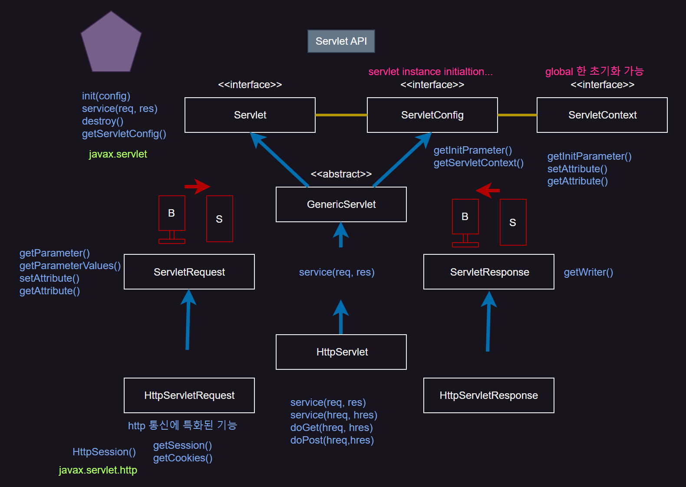
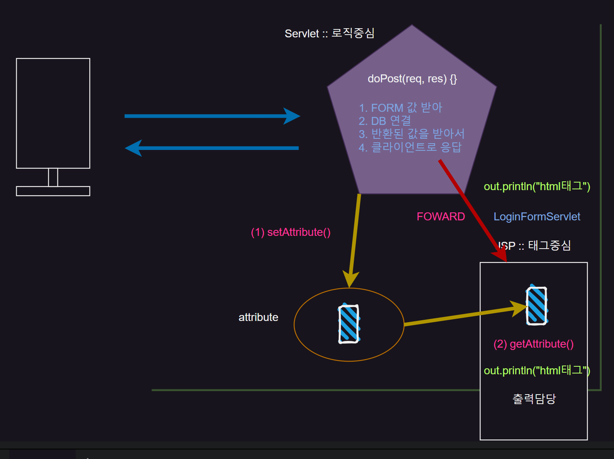
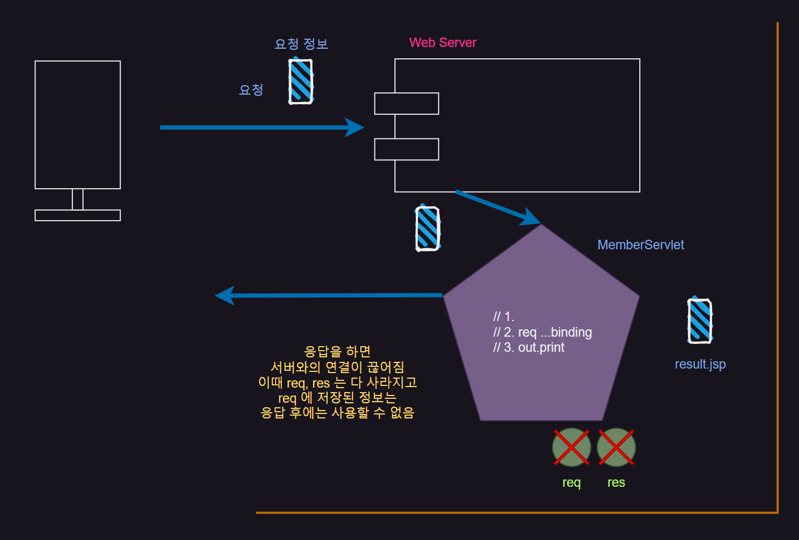
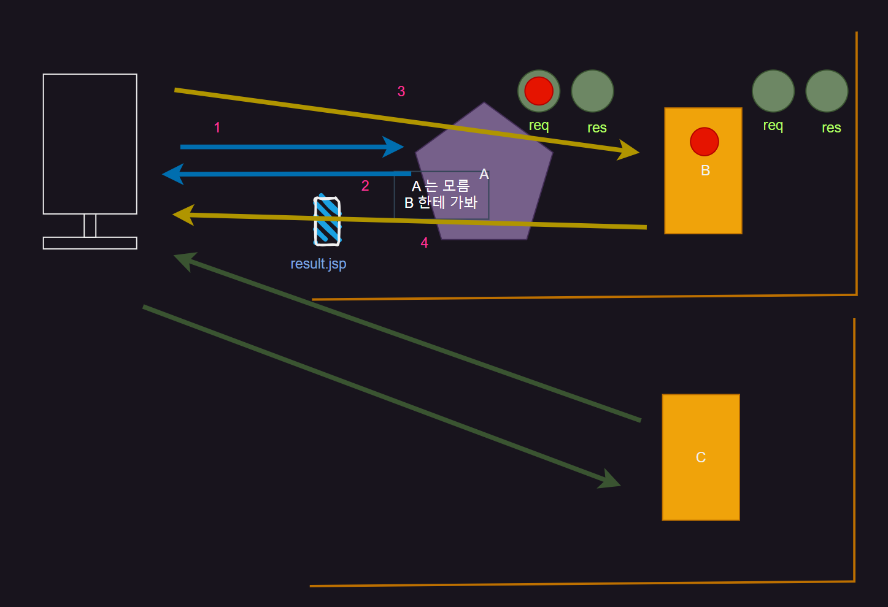
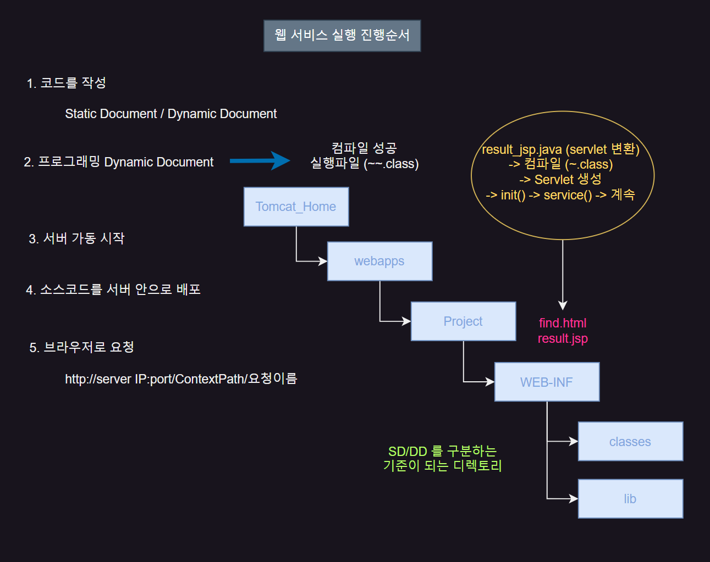
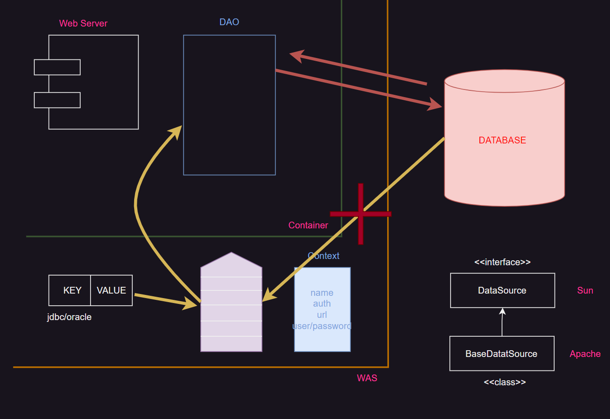

## Servlet-API

{: .w-50 .align-center}


`init(config)` 에 의해 **Servlet**과 **ServletConfig**와 관계가 이뤄진다.(has a Relation)

**Servlet**은 기본 생성자만 존재하고 사용자가 아닌 Container에 의해 생성된다.

따라서 다른 누군가가 **Servlet**을 초기화 해줘야 한다.

**ServletConfig**는 한개의 **Servlet**을 초기화(= A Servlet instance initilization)

이러한 기능을 하는 것이 `getInitParameter()` 이다. 

`getInitParameter()`는 Container에서 초기에 설정한 값으로 Servlet를 초기화 한다.

⇒(web.xml) 초기설정한 DD 파일의 정보를 가져옴

`init()` 내에 `getInitParameter()` 가 들어가 `init()` 이 호출 될 때 이러한 과정이 이루어진다.

### ServletContext

**ServletContext**는 더 넓은 **ServletConfig** 이다. 

global한 초기화를 가능하게 한다. ⇒ `getInitParameter()`

**ServletConfig**의 `getInitParameter()` 은 한 개의 Servlet을 초기화

**ServletContext**의 `getInitParamter()` 은 글로벌한 Servlet을 초기화

### ServletRequest

**ServletRequest( = Client → Server)**

`getParameter(String name)` return String(한개의 값)

`getParameterValues(String name)` return String[] (여러개의 값)

`setAttribute(String name, Object o)` return void (name이 key, o가 value)

`getAttrubute(String name)` return Object (name이 key이므로 이것으로 value 받아옴)

### ServletResponse

**ServletResponse(= Response ← Server)**

`getWriter()` return PrintWriter

### HttpServletRequest

**HttpServletRequest (HTTP 통신에 특화)**

`getSession()`

`getCookie()`

### Servlet 주요 로직 순서

> 1. `Client` 로 부터 데이터를 받음
> 2. 받은 값으로 `VO` 생성 (pvo)
> 3. `DAO` 를 `DB` 로 부터 return 받고 비즈니스 로직 호출 (rvo)
> 4. 반환 값 Attribute 에 바인딩 (vo)
> 5. 페이지 이동, 네비게이션 처리 (jsp)

<hr/>
<br/>

## 페이지 이동

`Servlet` 은 `logic` 중심으로 처리하고 출력부분은 `JSP` 에서 처리하도록 한다.

그럼 Servlet에서 처리한 데이터를 JSP로 보내야 한다. 어떻게 해야할까?

컨테이너 안에 정보를 저장하는 공간을 `Attribute` 라고 한다. 

**Servlet**에서 **`setAttribute()`** 호출해 `Attribute` 에 데이터를 저장한다.

`Attribute` 에 저장된 데이터를 **JSP**에서 **`getAttribute()`**를 해 데이터를 가져온다.

Servlet은 `getAttribute()`를 쓸일이 없다.

`getAttribute()` 는 결과페이지에서만 호출된다.

{: .w-50 .align-center}


> `doProcess()`는 하나의 `thread`이다.
>
> 즉, client에서 요청을 **응답 하면 request, response에 저장된 데이터는 사라지게 된다**.
{: .prompt-tip}

따라서 좀 더 `global` 한 `scope` 를 가진 객체를 사용해야한다. (`ServletContext`)

<br/>

{: .w-50 .align-center}

이전에는 

```
request.getRequestDispatcher("result.jsp").forward(request, response);
```

를 사용해서 MemberServlet이 응답하기 전에 result.jsp로 페이지 이동을 하게 되어

req, res가 살아있는 것이다.

즉, `Client` 에 응답을 하게 되는 것은 `result.jsp` 이다.

지금과 같은 주소를 검색하는 단순한 로직이면 `request.setAttribute()`를 사용해야 한다.

**session을 굳이 사용할 필요가 없는 것**이다.

그럼 `MemberServlet` 에서 `result.jsp` 로 가는 것은 또다른 `Requst` 와 `Response` 를 만드는 것일까?

아니다. 

우리가 `find.html` 에서 `MemberServlet` 으로 요청을 보낼때는 `Request` 와 `Response` 가 만들어졌다.

하지만 `MemberServlet` 에서 `result.jsp` 로 가는것은

`Request` 와 `Response` 가 만들어지지 않는다.

왜냐하는 `MembertServlet` 에서 `result.jsp` 에 요청을 하지 않았기 때문이다.

**요청이란 브라우저에서 Server로 이동하는 것이다.** 

> 즉, `MemberServlet에서` `result.jsp` 로 가는 것은 이동이 아니라 요청이다.
>
> `Container` 내에서 서로 이동하는 것 그럼 `result.jsp`가 접근하는 `attribute` 는 `MemberServlet` 의 것
> 
> `result.jsp` 는 `Attribute` 에 저장된 `MemberService` 의 `request` 를 받아서 `find` 로 응답해주는 것이다.
> 
> 이 때 `Attribute` 의 데이터가 사라진다.
{: .prompt-tip}

<hr/>

### Forward

> 같은 서버 상에서 바로 다른 페이지로 이동하는 방식

{: .w-50 .align-center}


### Redirect

> 방향을 바꾸는 것

{: .w-50 .align-center}

`C`는 `A`에 있는 `Request`, `Response` 를 사용할 수 없다.

따라서 `ServletRequest` 보다 **좀 더 넓은 Scope를 사용하거나 사용하지 말아야 한다.**

`Redirect` 는 **브라우저를 거치고 다시 서버로 이동**한다.

이 때 **서버로 이동할 때는 다른 서버로 요청을 보낼 수 있다.**


<hr/>

## 웹 서비스 실행순서

{: .w-50 .align-center}

1. 코드를 작성
> Static Document / Dynamic Document
2. 프로그램 Dynamic Document
>→ 컴파일 성공(실행파일 ~.class)
3. 서버 가동 start
4. 소스코드 서버안으로 배포
> **WEB-INF** 를 기준으로 하위에는 프로그램(Dynamic Document)들어가고 
>
> 상위에는 정적인 파일(Static Document)

5. 브라우저로 요청
> http://server IP:port/ContextPath/요청이름

<br/>

**JSP**는 프로그램이다. 보이는 것만 태그로 되있어서 `Static Document`로 보일 수 있다.

컨테이너는 `logic` 중심이다. 따라서 `tag` 를 이해하지 못한다.

이것을 `tomcat` 이 `Servlet` 으로 바꾸고 알아서 베포한다.

> result_jsp.java(Servlet 변환) → 컴파일(~.class) → Servlet생성 → init() → Service()

## Attribute 의 Scope

> `Attribute` 서버상의 데이터를 저장하는 일종의 공간
{: .prompt-tip}

1. 데이터를 바인딩 (`setAttribute(”이름”, 객체)`)
2. 저장된 데이터를 찾아오는 (`getAttribute(”이름”)` “이름”으로 바인딩된 객체가 return (Object가 return 되기 때문에 캐스팅을 해줘서 찾아와야 한다.)

### Attribute 의 세가지 종류
> 아래 3가지가 Attribute의 종류이다. (모두 setAttribute, getAttribute 가지고 있다.)

저장 유효기간에 따라 종류가 달라진다.

#### ServletRequest
> 응답을 하게 되면 데이터가 모두 사라진다. 즉, 응답하기 전까지 데이터 유효

#### HttpSession
> 로그인 되는 동안에만 데이터 유효

#### ServletContext
> 서버가 멈추지 않는한 데이터 유효

<hr/>

## DriverManager방식의 Connection

{: .w-50 .align-center}

드라이버 로딩하고, `Connection` 생성하면 비용도 많이 들고 비효율적이다

따라서 미리 만들어둔 `Connection` 들이 들어있는 공간을 **Resource Factory**라고 한다.

### Resource Factory
> Resource Factory는 WAS에 존재한다.
>
> WAS 와 통신 할 수 있는 문서는 `xml` 인데
>
> Connection 을 WAS에 등록하는 문서는 `Context`(name, auth(어떤 container인지), url, user/pass)라고 한다.

**JNDI(Naming)** 기술을 이용해 Resource Factory에 접근할 수 있다.

<br/>

해시와 구조가 비슷하다.

key = jdbc/oracle 

value = **Resource Factory**에 저장된 `Connection` 의 주소값

<br/>

처음에 Resource Factory에 저장된 Connection들은 현재 사용하고 있는 DB에 모두 연결

이것을 하나씩 가져와서 사용하는 것이기 때문에

가져와서 사용하고 `close()` 하면 다시 **Resource Factory**에 `Connection` 을 다시 넣어둔다.

> 만약 close를 안하게 되면 `Connection` 이 동나게 된다.
>
> `WAS` 와 `DB` 사이에 네트워크가 끊어지게 된다.
{: prompt-danger}

<br/>

`Connection` 을 만들 때는 **DataSource(**인터페이스) 타입으로 만든다.  (Sun 회사에서 만듦)

이것을 상속해 만든것이 `BasicDataSource` 타입이다.(Apache 회사에서 만듦)

`BasicDataSource` 를 이제 만들어 `Context` 에 의해 **Resource Factory**에 등록해야 한다.

### BasicDataSource Resource Factory 등록 방법

```xml
<?xml version="1.0" encoding="UTF-8"?>

<Context>
    <Resource
        name="jdbc/oracleDB"
        auth="Container"
        type="javax.sql.DataSource"
        username="mykb"
        password="1234"
        driverClassName="oracle.jdbc.driver.OracleDriver"
        factory="org.apache.tomcat.dbcp.dbcp2.BasicDataSourceFactory"
        url="jdbc:oracle:thin:@127.0.0.1:1521:XE"
        maxActive="500"
	      maxIdle="30"
    />
</Context>
```
> Context 를 `META-INF` 에 생성

```jsp
<%@page import="java.sql.Connection"%>
<%@page import="javax.sql.DataSource"%>
<%@page import="javax.naming.InitialContext"%>
<%@page import="javax.naming.Context"%>
<%@ page language="java" contentType="text/html; charset=UTF-8"
    pageEncoding="UTF-8"%>
<!DOCTYPE html>

<html>
<head>
<meta charset="UTF-8">
<title>Insert title here</title>
</head>
<body>
<h2>Connection Pooling Test..... Using JNDI Service</h2>
<%
    Context ic = new InitialContext();
    DataSource ds = (DataSource)ic.lookup("java:comp/env/jdbc/oracleDB");

    out.println("<b>1. DataSource Lookup....</b>");

    Connection conn =ds.getConnection(); //Resource Factory로 부터 Connection빌려온다..
    out.println("<b>2. Connection Rent Success!!.....</b><br>");
%>
</body>
</html>
```
> `connectionPool.jsp`를 만들어 준다