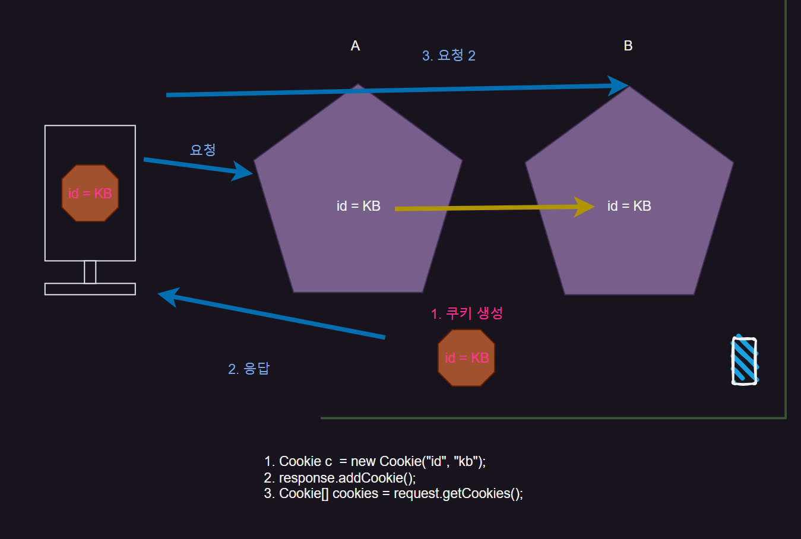
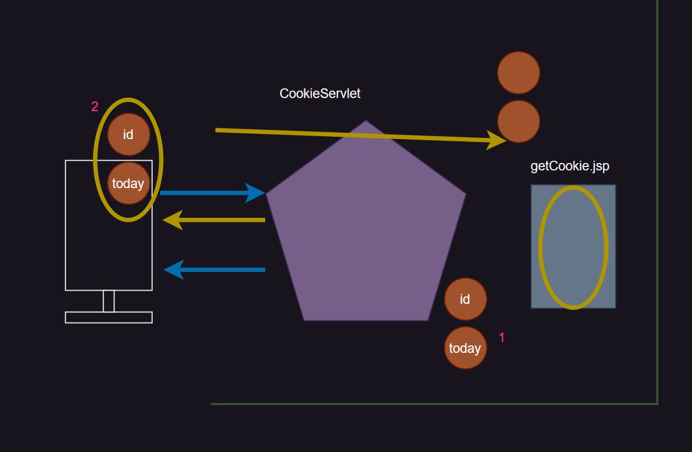
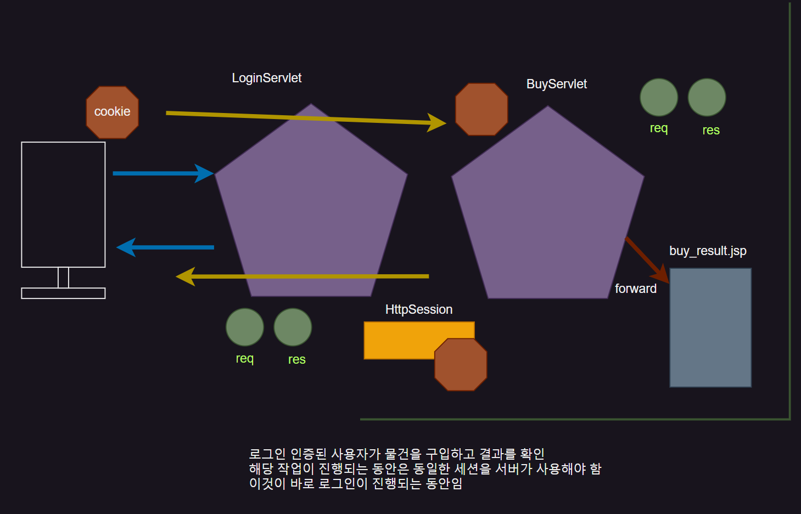
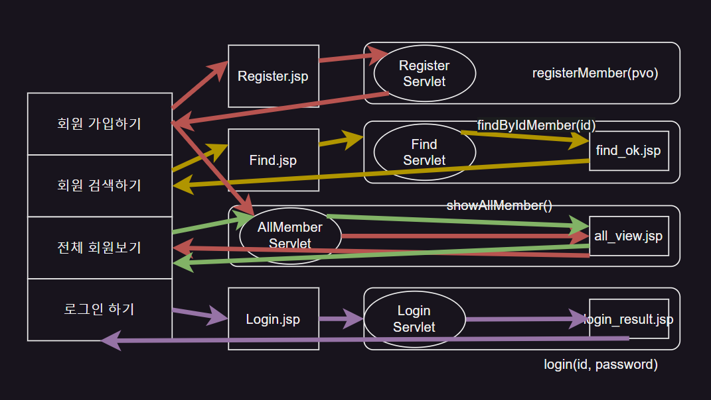
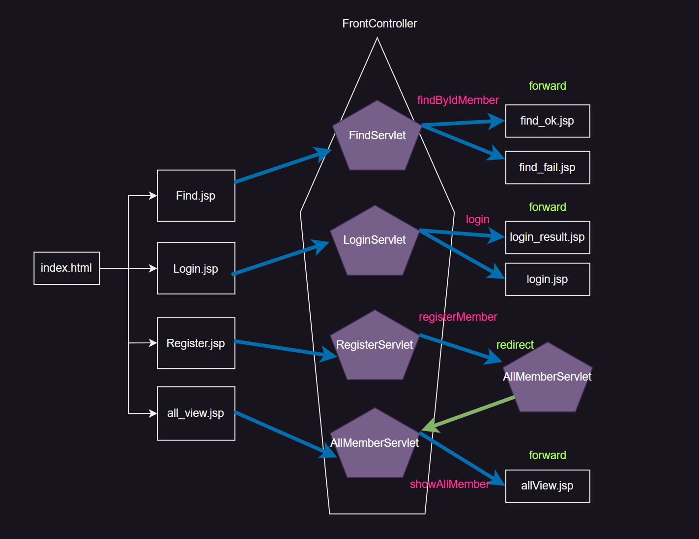

## Pooling 기법

`Apache Tomcat HOME` 하단 `lib` 에 `driver` 를 넣어주면

서버의 모든 곳에서 `DB` 로 접근이 가능해 진다.

`factory` 라는 미리 만들어둔 제품을 보관하는 개념으로 사용하는데,

`Resource Factory` 는 여러가지 `Connection` 을 미리 가지고 있다.

해당하는 Connection 들을 미리 `WAS` 에 등록 시켜놓아야 사용이 가능하다.

따라서 `xml` 을 활용해야 한다

> 1. `Connection` 을 찾아올 때는 `Context(Interface)` 를 사용
> 2. 특히 `Context` 의 메서드 중 `lookup()` 을 활용해 찾을 수 있다.
> 3. 찾아서 반환 할 시에는 `DataSource` 타입이다. (Resource Factory)
> 4. `DataSource` 의 `getConnection()` 을 활용하면 `Connection` 을 얻을 수 있다.
>
> 이러한 방식을 `Pooling 기법` 이라고 한다.

```java
public class MemberDAOImpl implements MemberDAO{
	//필드 추가
	private DataSource ds;
	
	//싱글톤
	private static MemberDAOImpl dao = new MemberDAOImpl();
		//0. InitialContext 객체를 생성
	 	//1. DataSource를 하나 받아온다.
		
	private MemberDAOImpl() {
		//0. InitialContext 객체를 생성
	 	//1. DataSource를 하나 받아온다.
		try {
			InitialContext ic = new InitialContext();
			ds = (DataSource)ic.lookup("java:comp/env/jdbc/oracleDB"); //공장 찾음
			System.out.println("Datasource Lookup Sucess.....");

		}catch(NamingException e) {
			System.out.println("Datasource Lookup faill.....");
		}
	}
	
	public static MemberDAOImpl getInstance() { //싱글톤 
		return dao;
	}
	
	@Override
	public Connection getConnection() throws SQLException {		
		System.out.println("디비연결 성공....");
		return ds.getConnection(); //Connection 하나씩 Pool에서 받아온다..
	}

	@Override
	public void closeAll(PreparedStatement ps, Connection conn) throws SQLException{ //Factory에 Connection 반납 
		if(ps!=null) ps.close();		
		if(conn != null) conn.close();
	}

	@Override
	public void closeAll(ResultSet rs, PreparedStatement ps, Connection conn) throws SQLException{		
		if(rs != null)	rs.close();
		closeAll(ps, conn);		
	}
```
> 코드는 DB 연결을 위한 기본 코드이다. `Singletone` 기법으로 만들었다.
>
>`Context` 클래스를 사용해 `lookup()` 을 통해 Connection을 빌릴 `Factory` 를 반환 받았으며
>
> 반환 받은 `Factory` 는 필드값인 `DataSource ds` 에 넣었다.
>
> 그 다음 `getConnection()` 을 보면 `Factory` 에 저장된 `Connection` 하나를 빌려온다.

```java
@Override
	public void registerMember(MemberVO vo) throws SQLException { //회원 등록 
        Connection conn = null;
        PreparedStatement ps = null;
        try{
            conn = getConnection();
            String query = "INSERT INTO member (id, password, name, address) VALUES(?,?,?,?)";
            ps = conn.prepareStatement(query);

            ps.setString(1, vo.getId());
            ps.setString(2, vo.getPassword());
            ps.setString(3, vo.getName());
            ps.setString(4, vo.getAddress());

            System.out.println(ps.executeUpdate()+" row INSERT OK~~!!");
        }finally{
            closeAll(ps, conn);
        }
    }
```
_(회원가입 페이지)_

```java
@Override
	public ArrayList<MemberVO> showAllMember() throws SQLException { //전체 멤버 조회 
		Connection conn = null;
		PreparedStatement ps = null;
		ResultSet rs = null;
		ArrayList<MemberVO> list = new ArrayList<>();
		try {
			conn = getConnection();
			String query = "SELECT id, password, name, address FROM member";
			ps = conn.prepareStatement(query);
			System.out.println("PreparedStatement....showAllMember()..");
			
			rs = ps.executeQuery();
			while(rs.next()) {
				list.add(new MemberVO(
						rs.getString("id"), 
						rs.getString("password"), 
						rs.getString("name"), 
						rs.getString("address")));
			}
		}finally {
			closeAll(rs, ps, conn);
		}
		return list;
	}
```
_(전체회원 불러오기)_

```java
@Override
	public MemberVO findByIdMember(String id) throws SQLException { //id로 멤버 찾기 
		Connection conn = null;
		PreparedStatement ps = null;
		ResultSet rs = null;
		MemberVO vo = null;
		try{
			conn=getConnection();
			String query = "SELECT id, password, name, address FROM member WHERE id=?";
			ps = conn.prepareStatement(query);
			
			ps.setString(1,  id);
			rs = ps.executeQuery();
			if(rs.next()) {
				vo=new MemberVO(id,
								rs.getString("password"),
								rs.getString("name"),
								rs.getString("address"));
			}
			System.out.println(id + ", findByIdMember Sucess");
			
		}finally{
			closeAll(rs, ps, conn);
		}
		return vo;
	}
```
_(ID 로 회원 찾기)_

>메인 화면에서 ‘회원가입하기’ 버튼을 누르게 되면 register.jsp 로 이동하게 된다

```html
<%@ page language="java" contentType="text/html; charset=UTF-8"
    pageEncoding="UTF-8"%>
<!DOCTYPE html>
<html>
<head>
<meta charset="UTF-8">
<title>Insert title here</title>
<style type="text/css">
	h2{
		text-align: center;
		color: purple;
	}
	#wrap{
		margin-left: 220px;		
	}
</style>
<script type="text/javascript">
	function btnclick(){
		alert("button Click~~!!!");
	}
</script>
</head>
<body>
	<h2>REGISTER MEMBER FORM</h2>
	<div id="wrap">
		<form action="Register" method="post">
			ID <input type="text" name="id" required="required"><br><br>
			PASS <input type="password" name="password" required="required"><br><br>
			NAME <input type="text" name="name" required="required"><br><br>
			ADDR <input type="text" name="address" required="required"><br><br>
			<input type="submit" value="REGISTER">
			<input type="button" value="CLICK" onclick="btnclick()">
		</form>
	</div>
</body>
</html>
```
_(회원가입 폼)_

> `REGISTER` 버튼을 누르면 /Register 주소로 이동하게 된다. 
>
> 그럼 해당 form 값을 받고 데이터 처리를 할 `Servlet` 을 만들어 준다.

```java
@WebServlet("/Register")
public class RegisterServlet extends HttpServlet {
	private static final long serialVersionUID = 1L;
       
	protected void doGet(HttpServletRequest request, HttpServletResponse response) throws ServletException, IOException {
        doProcess(request, response);
	}

	protected void doPost(HttpServletRequest request, HttpServletResponse response) throws ServletException, IOException {
      doProcess(request, response);
	}

	protected void doProcess(HttpServletRequest request, HttpServletResponse response) throws ServletException, IOException {
      request.setCharacterEncoding("utf-8");
      response.setContentType("text/html;charset=utf-8");
      //로직은 여기에 작성
      
      //1. 폼값 받아서 
      String id = request.getParameter("id");
      String password = request.getParameter("password");
      String name = request.getParameter("name");
      String address = request.getParameter("address");

      //2. VO 생성... PVO
      MemberVO pvo = new MemberVO(id, password, name, address);
      String path = "index.html";
      //3. DAO 리턴받고 비즈니스 로직 호출
      try {
    	  MemberDAOImpl.getInstance().registerMember(pvo);
    	  //path = "register_result.jsp"; //굳이 결과 페이지 필요없음
    	  //path="allView.jsp"; 이렇게 하면 500 오류가 난다. allView.jsp는 전체 멤버를 조회하는 DAO를 사용해야 한다. 따라서 AllMemberServlet을 갔다가 allView.jsp로 가야한다.
      }catch(Exception e) {
    	  
      }
      //4. 바인딩?? => 필요없다. 
      
      //5. 네비게이션 register_result.jsp (굳이 결과페이지 필요없음)
      //request.getRequestDispatcher(path).forward(request, response); 
      response.sendRedirect("AllMember");
	}
}
```

form값을 받고 비즈니스 로직인 `registerMember()` 를 호출해 회원등록을 한다.

그 다음 회원가입이 완료했다는 성공 페이지를 보여줘야 하는데 굳이 필요없는 기능이기 때문에

자신이 회원가입이 됐다는 것을 보여주기 위해 전체 회원을 보여주는 편이 낫다.

따라서 `request.getRequestDispatcher("AllMember").forward(request, response)` 를 호출하는것이 아니라 `response.sendRedirect("AllMember")` 를 호출해야 한다.

Client로 다시 가서 **AllMember** Servlet을 거쳐서 그 안에서 `showAllMember()` 로직을 호출해야 

전체 회원을 조회할 수 있기 때문이다.

```java
@WebServlet("/AllMember")
public class AllMemberServlet extends HttpServlet {
	private static final long serialVersionUID = 1L;

	protected void doGet(HttpServletRequest request, HttpServletResponse response)
			throws ServletException, IOException {
		doProcess(request, response);
	}

	protected void doPost(HttpServletRequest request, HttpServletResponse response)
			throws ServletException, IOException {
		doProcess(request, response);
	}

	protected void doProcess(HttpServletRequest request, HttpServletResponse response)
			throws ServletException, IOException {
		request.setCharacterEncoding("utf-8");
		response.setContentType("text/html;charset=utf-8");
		
		//1. DAO 리턴 받고 business logic 호출
		//2. 반환된 값 바인딩
		//3. 결과 페이지로 네비게이션 ...allView.jsp
		
		try {
			ArrayList<MemberVO>list =MemberDAOImpl.getInstance().showAllMember();
			request.setAttribute("list", list);
			request.getRequestDispatcher("allView.jsp").forward(request, response);
		}
		catch(Exception e) {
			
		}
	}
}
```

ArrayList를 이용해 `showAllMember()` 의 return값을 받는다.

DB를 통해 받아온값은 `request` 객체에 넣을 수 없으므로 `setAttribute()` 를 통해 넣어준다.

그래야 allView.jsp 에서 해당 값을 가져올 수 있기 때문이다.

```html
<%@page import="servlet.model.MemberVO"%>
<%@page import="java.util.ArrayList"%>
<%@ page language="java" contentType="text/html; charset=UTF-8"
	pageEncoding="UTF-8"%>
<%
ArrayList<MemberVO> list = (ArrayList) request.getAttribute("list");
%>
<!DOCTYPE html>
<html>
<head>
<meta charset="UTF-8">
<title>Insert title here</title>
<meta name="viewport" content="width=device-width, initial-scale=1">

<link rel="stylesheet"
	href="https://cdn.jsdelivr.net/npm/bootstrap@4.6.2/dist/css/bootstrap.min.css">
<script
	src="https://cdn.jsdelivr.net/npm/jquery@3.6.4/dist/jquery.slim.min.js"></script>
<script
	src="https://cdn.jsdelivr.net/npm/popper.js@1.16.1/dist/umd/popper.min.js"></script>
<script
	src="https://cdn.jsdelivr.net/npm/bootstrap@4.6.2/dist/js/bootstrap.bundle.min.js"></script>
</head>
<body>
	<!--나중에 이부분은 BootStrap 클래스 속성 연결해서 완전한 디자인으로 직접 만들어 주세요  -->
	<div class="jumbotron text-center">
		<h2>회원 전체 명단 보기</h2>
	</div>
	<div class="container">
	<table class="table table-hover">
		<thead>
			<tr>
				<th>ID</th>
				<th>이름</th>
				<th>주소</th>
			</tr>
		</thead>
		<tbody>
			<%
			for (MemberVO vo : list) {
			%>
			<tr>
				<td><%=vo.getId()%></td>
				<td><%=vo.getName()%></td>
				<td><%=vo.getAddress()%></td>
			</tr>
			<%
			}
			%>
		</tbody>
	</table>
	</div>
</body>
</html>
```

```java
@WebServlet("/Find")
public class FindServlet extends HttpServlet {
	private static final long serialVersionUID = 1L;
       
	protected void doGet(HttpServletRequest request, HttpServletResponse response) throws ServletException, IOException {
		doProcess(request, response);
	}

	
	protected void doPost(HttpServletRequest request, HttpServletResponse response) throws ServletException, IOException {
		doProcess(request, response);

	}
	protected void doProcess(HttpServletRequest request, HttpServletResponse response) throws ServletException, IOException {
		request.setCharacterEncoding("utf-8");
        response.setContentType("text/html;charset=utf-8");
        
        //로직은 여기서 작성
        //1 getParameter로 ID 받아오기 -Front와 연결
        String id = request.getParameter("id");
        
        //2 DB 에 해당 ID 있는지 확인 -- DB 연결
        String path="find_fail.jsp";
        try {
        	MemberVO rvo = MemberDAOImpl.getInstance().findByIdMember(id);
        	if(rvo != null) { //ID를 통해 회원을 찾으면
        		request.setAttribute("vo", rvo);//3 반환된 값을 바인딩
        		path="find_ok.jsp";
        	}
        }
        catch(Exception e) {
        	
        }        
        //4 네이게이션...jsp 결과페이지로 -- View와 연결 
		request.getRequestDispatcher(path).forward(request, response);
	}
}
```

`findByIdMember()` 를 활용해 ID를 통해 회원을 찾는다.

rvo가 null 이 아니면 회원을 찾았다는 의미이므로 rvo를 `setAttribute()` 로 저장해주고

path를 find_ok.jsp로 설정한다.

```html
<%@page import="servlet.model.MemberVO"%>
<%@ page language="java" contentType="text/html; charset=UTF-8"
    pageEncoding="UTF-8"%>
<!DOCTYPE html>
<html>
<head>
<meta charset="UTF-8">
<title>Insert title here</title>
</head>
<body>
	<%
		MemberVO vo =(MemberVO)request.getAttribute("vo");
	%>
	<h2>회원 검색 결과</h2>
	ID : <%= vo.getId() %><br>
	NAME :<%= vo.getName() %><br>
	ADDRESS: <%= vo.getAddress() %> 
</body>
</html>
```

<hr/>

## Session Management With Cookie

`Attribute` 에는 데이터 유효기간에 따라 크게 3가지로 나뉨ㄴ

### ServletRequest
> 응답 전까지 데이터 보관

### HttpSession
> 로그인 하는 동안 데이터 보관

로그인 상태인 것을 어떻게 확인할까?

> 이전 사용자와 방금 요청한 사용자의 정보가 같다는걸 인식하는 것이 `로그인`
{: .prompt-tip}

### ServletContext
> 서버가 멈추기 전까지 정보 보관

{: .w-50 .align-center}


## Cookie

1. 쿠키는 A Server에서 만들어 진다.  정보가 String으로 저장된다.
    
    (A 서버의 정보가 쿠키에 들어감)
    
    `Cookie c = new Cookie(”id”, “kb”);`
    
2. Server가 응답하면 쿠키는 브라우저로 보내지게 된다.
    
    `response.addCookie(c);`
    
3. B server로 요청때 브라우저에 저장된 쿠키가 B Server로 전달된다.
    
    전달 될 때 모든 쿠키가 전달 되며 그 중에서 원하는 쿠키를 찾는다.
    
    `Cookie[] cookies = request.getCookies();` => 브라우저에 저장된 모든 쿠키
    
    결국 A서버에서 만든 정보가 B 서버로 데이터 전달이 일어난다.

{: .w-50 .align-center}

### Attribute에서 데이터 전달과 Cookie에서 데이터 전달의 차이

```java
@WebServlet("/CookieServlet")
public class CookieServlet extends HttpServlet {
	private static final long serialVersionUID = 1L;
       
	protected void doGet(HttpServletRequest request, HttpServletResponse response) throws ServletException, IOException {
		request.setCharacterEncoding("utf-8");
        response.setContentType("text/html;charset=utf-8");
        
        //1. 쿠키 생성
        Cookie c1 = new Cookie("id", "KBLife");
        Cookie c2 = new Cookie("today", "2023-08-18");
       
        //쿠키안에 저장된 정보를 유지하는 기간을 지정
        c1.setMaxAge(24*60*60); //하루동안 정보 보관
        c2.setMaxAge(2*24*60*60); //2일 동안 정보 보관
        
        //2. 생성된 쿠키를 클라이언트로 보냄 ... 브라우저에 저장
        response.addCookie(c1);
        response.addCookie(c2);
        
        //3, 페이지 이동... redirect로 해야함 쿠키를 결과페이지에 전달해야 하기 때문 
        response.sendRedirect("getCookie.jsp");
        
	}
}
```
> 현재 쿠키는 브라우저에 있으므로 결과 페이지로 바로 forward 방식이 불가능
>
> 따라서 Redirect를 사용해 브라우저로 갔다가 getCookie.jsp로 가야한다.

```html
<%@ page language="java" contentType="text/html; charset=UTF-8"
    pageEncoding="UTF-8"%>
<%
Cookie[]cs = request.getCookies();
for(Cookie c : cs){
%>
	<li>Name : <%= c.getName() %></li>
	<li>Value : <%= c.getValue() %></li>
	
<%
}
%>
<!DOCTYPE html>
<html>
<head>
<meta charset="UTF-8">
<title>Insert title here</title>
</head>
<body>

</body>
</html>
```

{: .w-50 .align-center}

> 브라우저가 `Server` 로 요청을 하면 `Request`, `Response`, `thread`, `Session` 이 만들어진다.
> 
> 이 때 `Session` 에 값이 자동으로 들어간다.
> 
> 이게 바로 `JSESIONID` 값

```html
<!DOCTYPE html>
<html>
<head>
<meta charset="UTF-8">
<title>Insert title here</title>
</head>
<body>
<h2>Login Page</h2>
<form action="LoginServlet" method="post">
	ID : <input type="text" name="id" required="required"><br><br>
	PASSWORD : <input type="password" name="password" required="required"><br><br>
	<input type="submit" value="Login">
</form>
</body>
</html>
```

```java
@WebServlet("/LoginServlet")
public class LoginServlet extends HttpServlet {
	private static final long serialVersionUID = 1L;
       
	protected void doPost(HttpServletRequest request, HttpServletResponse response) throws ServletException, IOException {
		 request.setCharacterEncoding("utf-8");
	     response.setContentType("text/html;charset=utf-8");
	     
	     /*
	      1. 폼값 받아서...
	      2. DAO 리턴받고.. 비즈니스 로직 호출...
	      3. 반환값 바인딩
	      4. 결과 페이지로 네비게이션
	      */
	     
	     //세션은 클라이언트가 서버에 요청시에 서버에 만들어진다.
	     //만들어진 세션을 받아서 사용한다.
			//login.html에서 LoginServlet으로 요청해서 세션 생성됨
	     HttpSession session =request.getSession(); 
	     
	     System.out.println("JSESSION::" + session.getId()); //JSESSION 확인
	     
	     String id = request.getParameter("id");
	     String password = request.getParameter("password");
	     
	     MemberVO vo = new MemberVO(id, password, "길복순", "여의도");
	     
	     //비즈니스 로직 호출... 결과값 반환...
	     
	     //바인딩 ******************!!
	     //attribute를 session에 바인딩 하는 경우 2가지 
	     // 로그인, 회원정보 수정 이 2개 말고 나머지는 경우 없다.
	     session.setAttribute("vo", vo); //세션에 현재 사용자 정보 저장
	     
	     //네비게이션
	     response.sendRedirect("BuyServlet");
	}
}
```
>현재 사용자가 로그인한 사용자인지 확인하기 위해 `Client` 를 갔다가 다시 책을 사기 위해 `BuyServlet` 으로 이동한다.
>
>그럼 `BuyServlet` 에서 현재 `Session` 을 확인해 이전에 로그인 한 회원인지 판별해야 한다

```java
@WebServlet("/BuyServlet")
public class BuyServlet extends HttpServlet {
	protected void doGet(HttpServletRequest request, HttpServletResponse response)
			throws ServletException, IOException {
		doProcess(request, response);
	}

	protected void doPost(HttpServletRequest request, HttpServletResponse response)
			throws ServletException, IOException {
		doProcess(request, response);
	}

	protected void doProcess(HttpServletRequest request, HttpServletResponse response)
			throws ServletException, IOException {
		request.setCharacterEncoding("utf-8");
		response.setContentType("text/html;charset=utf-8");
		
		//로직은 여기서 작성... 이것은 새로운 세션이 아니라 이전 세션일 것이다...확인 하자
		HttpSession session = request.getSession();
		
		if(session.getAttribute("vo") != null) { //로그인 된 상태라면
			System.out.println("JSESSIONID... ButServlet" + session.getId());
			session.setAttribute("book", "오펜하이머");
			request.getRequestDispatcher("buy_result.jsp").forward(request, response);

		}
		else { //로그인 안된 상태라면... 다시 로그인 하러 보내야 함
			response.sendRedirect("login.html");
		}
	}
}
```

BuyServlet에서 뽑아낸 Session에서 `getAttribute()` 를 했을 때 null 이 아니면 이전에 로그인한

회원이라는 의미이다.

여기서 현재 회원이 “오펜하이머” 라는 책을 샀다고 `setAttribute()` 해주고 buy_result.jsp로 forward 한다

```html
///buy_result.jsp
<%@page import="servlet.model.MemberVO"%>
<%@ page language="java" contentType="text/html; charset=EUC-KR"
    pageEncoding="EUC-KR"%>
<%
	MemberVO vo=(MemberVO)session.getAttribute("vo");
	String book=(String)session.getAttribute("book");
	if(vo==null){ //로그인 한 상태가 아니라면
%>
	<h3>로그인부터 하세여</h3>
	<a href="login.html">LOGIN</a>
<%
	}
%>
<!DOCTYPE html>
<html>
<head>
<meta charset="EUC-KR"> 
<title>Insert title here</title>
</head>
<body>
<h2>Information...</h2>
LOGIN ID : <b><%= vo.getId() %></b><br>
LOGIN Name : <b><%= vo.getName() %></b><br>
ProductName : <b><%= book %></b><br>
</body>
</html>
```
> 해당 JSP 로 확인하면 LoginServlet의 세션과 BuyServlet의 세션이 같다는 것을 알 수 있다.

## MVC

{: .w-50 .align-center}


## FrontController

{: .w-50 .align-center}

위의 코드를 보면 `Servlet` 이 총 4개 나오게 된다.

하나의 Servlet을 만들면 여러 인터페이스나, 요청을 받게 되면 Request, Response, thread, Session이 만들어진다. 

이게  x4가 만들어 지는 것이다.

즉, `Servlet` 이 너무 만들어지는 문제점이 존재하게 되는데

따라서 4개의 `Servlet` 을 1개의 `Servlet` 으로 묶을 것이다.

그렇게 되면 `Servlet` 은 어떤 요청이 오는지 하나하나 판별을 해줘야 한다.

⇒ `FrontController` 패턴으로 만들어주면 된다.

`Servlet` 으로 요청을 모든 곳에서 `FrontController` 로 가게 하는 것이다.

`find.jsp`, `login.jsp`, `register.jsp`, `allView.jsp` 에서 요청을 각각의 `Servlet` 이 아니라

`front.do` 라는 FrontCotroller로 가는 것이다.

그러면 먼저 어떤 요청이 왔는지 알아야 한다.

```html
// find.jsp
<input type="hidden" name="command" value="find">
```
> 해당 코드를 form 태그 안에 넣어 준다. 위 코드는 `hidden` 이기 때문에 `Client` 화면에는 보이지 않는다.

```html
// index.html
<p><a href="front.do?command=showAll">전체 회원 보기</a></p>
```

```java
@WebServlet("/front.do")
public class FrontController extends HttpServlet {
	protected void doGet(HttpServletRequest request, HttpServletResponse response)
			throws ServletException, IOException {
		doProcess(request, response);
	}

	protected void doPost(HttpServletRequest request, HttpServletResponse response)
			throws ServletException, IOException {
		doProcess(request, response);
	}

	protected void doProcess(HttpServletRequest request, HttpServletResponse response)
			throws ServletException, IOException {
		request.setCharacterEncoding("utf-8");
		response.setContentType("text/html;charset=utf-8");

		// 로직은 여기서 작성...어떤 요청이 들어왔는지를 ... 구분
		// register, login, find, showAll...
		String command = request.getParameter("command");

		String path = "index.html";
		if (command.equals("register")) { // 회원가입 로직..
			path = register(request, response);
		} else if (command.equals("find")) {
			path = find(request, response);
		} else if (command.equals("login")) {
			path = login(request, response);
		} else if (command.equals("showAll")) {
			path = showAll(request, response);
		}
		request.getRequestDispatcher(path).forward(request, response);

	}// do process

	private String register(HttpServletRequest request, HttpServletResponse response)
			throws IOException, ServletException {
		// 1. 폼값 받아서
		String id = request.getParameter("id");
		String password = request.getParameter("password");
		String name = request.getParameter("name");
		String address = request.getParameter("address");

		// 2. VO 생성... PVO
		MemberVO pvo = new MemberVO(id, password, name, address);
		String path = "index.html";
		// 3. DAO 리턴받고 비즈니스 로직 호출
		try {
			MemberDAOImpl.getInstance().registerMember(pvo);
			
		} catch (Exception e) {

		}
		return path;
	}

	private String find(HttpServletRequest request, HttpServletResponse response) throws ServletException, IOException {
		// 로직은 여기서 작성
		// 1 getParameter로 ID 받아오기 -Front와 연결
		String id = request.getParameter("id");

		// 2 DB 에 해당 ID 있는지 확인 -- DB 연결
		String path = "find_fail.jsp";
		try {
			MemberVO rvo = MemberDAOImpl.getInstance().findByIdMember(id);
			if (rvo != null) {
				request.setAttribute("vo", rvo);// 3 반환된 값을 바인딩
				path = "find_ok.jsp";
			}
		} catch (Exception e) {

		}
		// 4 네이게이션...jsp 결과페이지로 -- View와 연결
		return path;
	}

	private String login(HttpServletRequest request, HttpServletResponse response) {
		String id = request.getParameter("id");
		String password = request.getParameter("password");
		String path = "index.html";

		try {
			MemberVO rvo = MemberDAOImpl.getInstance().login(id, password);
			HttpSession session = request.getSession();

			if (rvo != null) {
				session.setAttribute("vo", rvo);
				System.out.println("JSESSIONID ::" + session.getId());
				path = "login_result.jsp";
			}
		} catch (Exception e) {
			path = "login.jsp";
		}

		return path;
	}

	private String showAll(HttpServletRequest request, HttpServletResponse response) {
		String path="index.html";
		try {
			ArrayList<MemberVO> list = MemberDAOImpl.getInstance().showAllMember();
			request.setAttribute("list", list);
			path = "allView.jsp";
		} catch (Exception e) {

		}
		return path;
	}
}
```
> 이제 어떤 요청인지 알았으므로 요청에 따른 `Servlet` 을 `FrontController` 에 정의해주면 된다.
>
> 이렇게 작성하면 결국 `Servlet` 을 `FrontController` 1개만 만든 것과 같다.