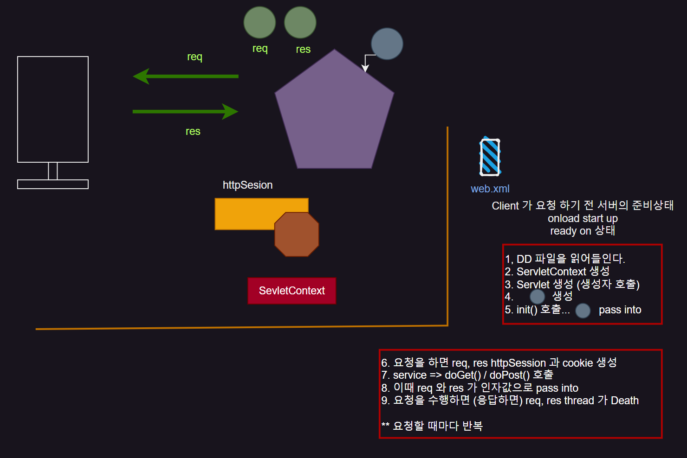
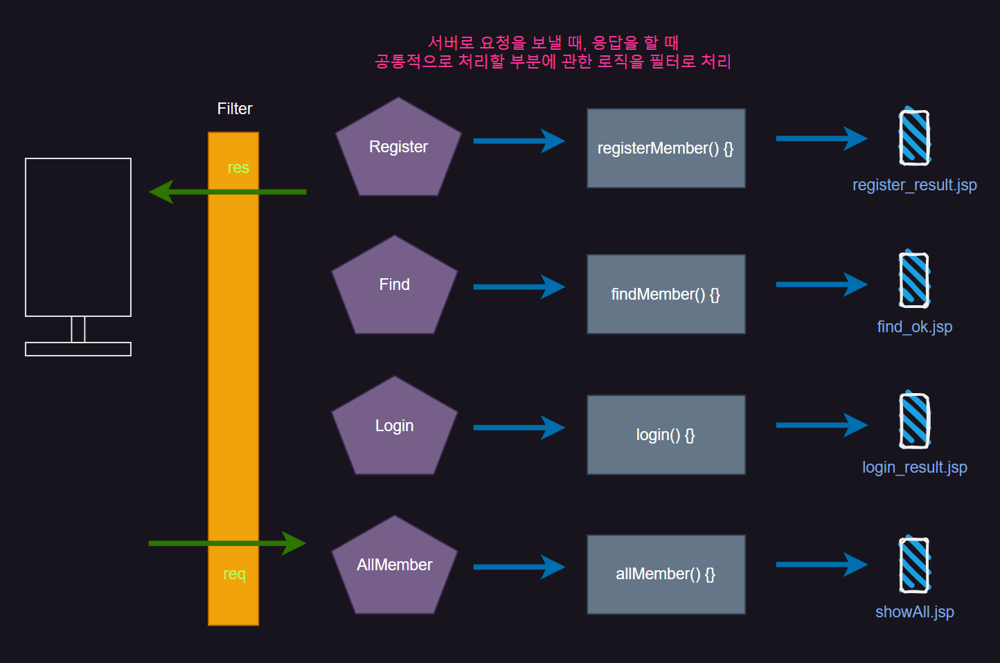

> Preview
>
> `Cookie` 는 `Session` 이 만들어질 때 자동으로 생성이 된다.
>
> `Session` 은 `Client` 가 요청할 때 만들어진다.
>
> `Cookie` 는 맵 방식으로 저장이 되며 `value` 는 `String` 으로 만들어지게 되어있다.
>
> 이때 자동으로 만들어지는 `Cookie` 에는 `JSESSIONID` 라는게 존재하는데
>
> 데이터 (VO ...) 는 `Session` 에 저장하고 사용자를 구분하는 `JSESSIONID` 는 쿠키에 저장한다.

## 전체적인 흐름

{: .w-50 .align-center}

1. 컨테이너는 처음에 주문서(DD)를 읽어들이며 (web.xml) 여기에는 `Servlet` 과 관련된 맵핑 정보가 담겨있다.
2. 그 후 `Servlet`이 먼저 만들어지는게 아니라 `ServletContext` 가 먼저 생성된다.
3. 그 다음 `Servlet`이 만들어진다. (생성자 호출)
4. `0`을 만들고
5. `init()`을 호출, `0`을 인자값으로 넣는다.
6. 여기까지 `Ready on` 상태이다. (`Client`가 요청하기 전 서버 준비 상태이다.)

7. `Client` 가 요청하면 `request`, `response` 객체가 만들어진다. 또한 `Session` 이 만들어지고
8. `JSESSIONID` 값만 저장할 쿠키도 만들어진다.
9. 그 다음 `Service()` 가 호출되고, `doGet()`, `doPost()`가 호출된다. 이 때 `request`, `response` 가 인자값으로 들어간다.
10.  요청을 수행하면(응답하면) `req`, `res`, `thread` 가 죽는다. 요청할 때 마다 반복된다.

<br/>
<hr/>

## Filter

{: .w-50 .align-center}

서버로 요청을 보내고 응답을 할 때 공통적으로 처리(양방향 처리)할 부분에 관한 로직을 `filter` 로 처리한다.

예를 들어 한글 처리 등...

한글 처리는 `Client` 에서 `Server` 로 요청할 때 , `Server` 에서 `Client` 로 응답할 때 모두 처리해줘야 한다.

따라서 `Controller` 에서 처리해주는 것이 아니라 `Filter` 에서 해주는 것이 좋다.

```java
public class EncodingFilter implements Filter{

	@Override
	public void doFilter(ServletRequest request, ServletResponse response, FilterChain chain)
			throws IOException, ServletException {
		//공통적으로 처리해야 할 로직... 모든 서블릿 에서 
		//한글처리
		request.setCharacterEncoding("utf-8");
		response.setContentType("text/html;charset=utf-8");
		
		
		//서버상에서 다음 컴포넌트 프로그램에 계속적으로 필터링한 공통 로직이 적용된다.
		//이 부분을 빠뜨리면 공통로직을 필터링에 정의만 했기 때문에 실질적으로 처리되지 않는다. 반드시 넣어야한다.
		chain.doFilter(request, response);
	}
```