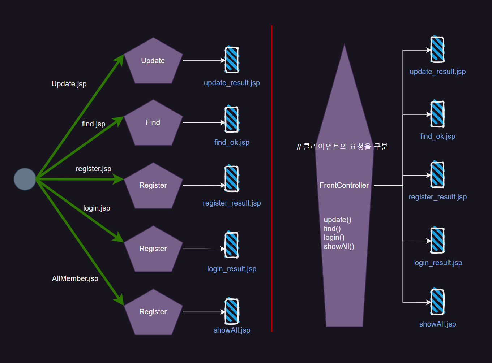
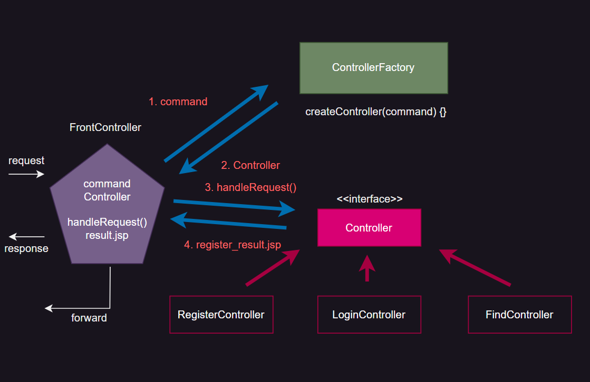
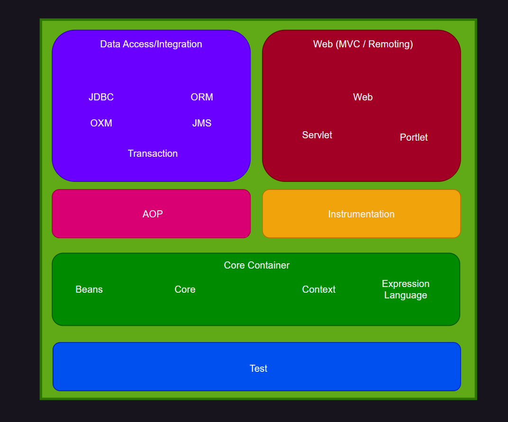

## MVC vs Front-Controller

{: .w-50 .align-center}

`MVC` 와 `FrontController` 의 차이를 알아보자

### MVC Pattern

#### 장점

> 비즈니스 로직이 각각 모듈화 되어 호출이 되어짐
>
> 요구사항이 변경되더라도 다른 컴포넌트에 끼지치지 않음
>
> 확장성이 있다

#### 단점

> 하나의 요구사항 (Business Logic)을 처리하기 위해서 일일히 만들어줘야 함
>

### Front-Controller

#### 장점

> 하나의 서블릿이 모든 요청을 다 처리

#### 단점

> 하나의 Servlet 에서 모든 Business Logic 을 Method Block 으로 다 처리
>
> 매우 무거운 Controller 가 생성 됨

<br/>
<hr/>

## Factory Method Pattern

> `MVC` 와 `FrontController` 의 장점을 모아놓은 것

{: .w-50 .align-center}

Client로 부터 요청이 들어오면 가장 먼저 **FrontController**가 받게 되는데

여기서 어떤 요청이 왔는지 command 변수에 넣어주고 **ControllerFactory**에 넣어준다.

`ControllerFactory` 는 말 그대로 `Controller` 를 만들어주는 공장이라는 의미 이다.

ControllerFactory는 command를 보고 어떤 해당 command에 따른 `Controller` 를 만들어 `FrontController` 에게 전달해준다.

그러면 해당 `Controller` 의 `Component` 메소드 중 `handleRequest()` 를 호출하고 결과 페이지를 얻어

`FrontController` 로 보내고 `FrontController` 에서는 `forward` 나 `Redirect` 를 해서 네비게이션을 해준다.

```java
// frontController

package web.client;
import java.util.Scanner;

import web.controller.Controller;
import web.factory.ControllerFactory;

/*
 * 나중에 Servlet역할
 * FrontController가 된다.
 */
public class FrontController {

	public static void main(String[] args) {
		// 브라우저 폼에서 받은 값을...
		Scanner sc = new Scanner(System.in);
		System.out.println(">>>Command 값입력");
		
		String command = sc.next();
		
		//ControllerFactory로 넘김
		Controller controller = ControllerFactory.getInstance().createController(command);
		
		controller.handleRequest();

		//지금은 결과페이지 네비게이션 안하고 콘솔에서 확인
	}
}
```

```java
//factory controller

package web.factory;

import web.controller.Controller;
import web.controller.FindController;
import web.controller.LoginController;
import web.controller.RegisterController;
import web.controller.UpdateController;

/*
 * Controller를 만드는 공장
 * 이곳에서 Register, Find, Update, Login.,... Controller를 각각 생성한다.
 * ::
 * 1) 4개의 Controller를 생성 --> ControllerFactoryrk 4개 필요??
 * 2) 4개의 Controller생성 --> ControllerFactory가 1개 필요?
 * 
 * ControllerFactory 싱글톤 패턴으로 작성
 */
public class ControllerFactory {
	private static ControllerFactory factory = new ControllerFactory();
	private static Controller controller;

	private ControllerFactory() {
		System.out.println("Creating ControllerFactory...");
	}
	
	public static ControllerFactory getInstance() {
		return factory;
	}
	
	//클라이언드의 요청에 따라서 서로 다른 Controller를 공장에서 생성해낸다.
	public Controller createController(String command) {
		if(command.equals("register")) {
			controller = new RegisterController();
			System.out.println("RegisterController...Creating...OK");
		}
		else if(command.equals("find")) {
			controller = new FindController();
			System.out.println("FindController...Creating...OK");
		}
		else if(command.equals("update")) {
			controller = new UpdateController();
			System.out.println("UpdateController...Creating...OK");
		}
		else if(command.equals("login")) {
			controller = new LoginController();
			System.out.println("LoginController...Creating...OK");
		}
		return controller;
	}
}
```

FrontController로 얻은 command를 받아서 해당 command에 따른 Controller를 생성한다.

Controller를 생성하고 Controller를 호출한 FrontController로 돌아간다.

```java
//ControllerFactory로 넘김
Controller controller = ControllerFactory.getInstance().createController(command);

//handleRequest 호출
controller.handleRequest();
```

이제 handleRequest를 호출한다. 

Controller 타입은 Interface 이다.

```java
package web.controller;
//Template 기능만으로 구성... 
public interface Controller {
	String handleRequest();
}
```

즉, 각 기능당 Controller를 구현해 존재하는 것이다. 

그러면 command에 따른 Controller를 return 받고 그 Controller가 `handleRequest()` 를 호출하면

기능에 맞는 `handleRequest()`가 작동하는 것이다.

```java
package web.controller;

public class FindController implements Controller{

	@Override
	public String handleRequest() {
		/*
		 Controller의 역할
		 1. 폼값 받아서 
		 2. vo 생성
		 3. dao 리턴 받고
		 4. business logic 호출
		 5. 네비게이션
		 //MVC 패턴에서는 Controller 역할은 Servlet 단위가 했고
		 //FrontController에서는 메소드 단위가 했고
		 //지금은 인터페이스 상속받은 자바 클래스에서 하고 있다.
		  * 인터페이스를 상속받은 재사용성이 높은 자바 클래스를 컴포넌트라고 한다.
		 */
		System.out.println("FIndController... Find Member");
		return "find_ok.jsp";
	}

}
```

중요한 점은 지금까지 이러한 Controller의 역할을 MVC에서는 Servlet이 해주었고, 

FrontController 패턴에서는 하나의 Servlet 안에 메소드들이 해주었다.

FactoryMethod 패턴에서는 Controller 인터페이스를 상속받은 자바 클래스에서 하고 있다.

이러한 자바 클래스를 **Component(컴포넌트)** 라고 한다.

## Spring

{: .w-50 .align-center}

스프링 라이브러리는 위와 같이 모듈화 되어 있다.

우리는 먼저 `Core Container`를 살펴본다.

### Spring DI(Core Container)

{: .w-50 .align-center}

`Container` 는 두 가지로 나뉘는데 `Presentation Layer` 와 `Business Logic Layer` 로 나뉜다.

이 두 개를 합치면 `2 Architecture Layer` 라고 함

`Business Logic Layer` 에서 가장 중요한 것은 `MemberDAOImpl` 인데

개발자가 직접 만드는 것이 아닌 `DI` 가 생성하는 것임

Container 는 `DD` 파일을 읽고 `Servlet` 을 생성함 (`Components` 를 생성하는 것이 아님)

이러한 `DAOImpl` 을 `DB` 와 연결하는 프레임워크가 `JDBC Framework` 이다. (MyBatis, Hybernate...)

`Presentation Layer` 을 프레임워크화 한 것을 `SpringMVC` 라고 한다.

### DI(Dependency Injection)

`Container` 가 작동하면 `dd` (web.xml =servlet 매핑 정보로 이루어져 있음) 를 읽고 `Servlet` 을 만든다.

인간의 역할은 주문서 작성이고 기계는 복잡한 작업을 한다.

`Container` 가 `Client` 로 요청을 받으면 `Factory` 에게 알리고 `Factory` 는 `component` 를 만든다.

만들어진 `Component` 는 `Business Logic`을 호출한다.

이러한 `Component` 를 만드는 `Factory` 를 ***DI Container***라고 한다.

`DI Container` 중에 **BeanFactory**로 만들었지만 이번엔 **ApplicationContext**를 사용한다.

`DI Container` 는 매우 경량한 `Container` 이기 때문에 부담이 없다.

`DI Container` 는 **WAS**에 의해 호출되도록 되어있다.

`DI Container`도 주문서를 읽고 `Component` 를 만든다.

어제 기준으로 주문서는 diceservice.xml 이다.

먼저 `vo` 인 User class 작성

```java
package spring.service.domain;
public class User implements Serializable {
	
		///Field
    private String userId; 			/* 회원 ID */
    private String password;     /* 비밀번호 */
    private int age;    					/* 나이 */ 
    
    ///Constructor
    public User() {
		System.out.println("\n::"+getClass().getName()+" 디폴트 생성자....");
		}

		public User(int age, String userId) {
			System.out.println("\n::"+getClass().getName()+" age,userId 인자 받는 생성자....");
			this.age = age;
			this.userId = userId;
		}

		public User(int age, String password, String userId) {
			System.out.println("\n::"+getClass().getName()+"age,password,userId 인자 받는 생성자");
			this.age = age;
			this.password = password;
			this.userId = userId;
		}
		///Method (getter/setter)
		public String getUserId(){
			return this.userId;
		}
		public void setUserId( String userId ){
		   System.out.println("::"+getClass().getName()+".setUserId()");
		   this.userId= userId;
		}
		public String getPassword(){
		   return this.password;
		}
		public void setPassword( String password ){
		   System.out.println("::"+getClass().getName()+".setPassword()");		
		   this.password= password;
		}
		public int getAge() {
			return age;
		}
		public void setAge(int age) {
	        System.out.println("::"+getClass().getName()+".setAge()");
			this.age = age;
		}
		
		@Override
		public String toString() {
			return "UserVO [userId=" + userId + ", password=" + password + ", age="+ age + "]";
		}
}//end of class
```

```java
BeanFactory factory = 
				new XmlBeanFactory(new FileSystemResource("./src/main/resources/config/userservice01.xml"));
```

먼저 `BeanFactory` 를 통해 DI 컨테이너를 생성해준다.

이제 userservice01.xml 주문서를 읽고 bean을 생성해준다.

```java
User user01 = (User)factory.getBean("user01");
System.out.println(user01);
```

id가 “user01” 인 bean을 생성한다.

이에 해당하는 주문서를 살펴본다.

1. setter 주입 :: 단순 파라미터 값 주입
2. `User user01 = new User()`
3. `user01.setUserId(”01유저”)`
    
    `user01.setAge(”01”)`

```xml
<bean id="user01" class="spring.service.domain.User">
	<property name="userId" value="01유저"/>
	<property name="age" value="01"/>
</bean>
```

순서대로 디폴트 생성자 → setUserId() → setAge() 가 호출되었다.

### DI Container 의 Bean 생성 시점

DI Container에서 빈 생성 시점은 언제일까?

1. 주문서 읽자 마자 빈을 만드는지? (preloading)
2. getBean()할 때 (요청 할때) 만드는지? (lazy loading)

```java
BeanFactory factory = 
				new XmlBeanFactory(new FileSystemResource("./src/main/resources/config/userservice01.xml"));

System.out.println("\n=============================================================================");
User user01 = (User)factory.getBean("user01");
System.out.println(user01);
```

> ::spring.service.domain.User 디폴트 생성자...
>
> ::spring.service.domain.User.setUserId()
>
> ::spring.service.domain.User.setAge()
>
> UserVO [userid=01유저, password=null, age=1]

위 Factory는 `BeanFactory`를 사용하였다.(=lazy loading)

다른 Factory인 `ApplicationContext`를 사용해보면

```java
ApplicationContext factory = new ClassPathXmlApplicationContext("/config/userservice.xml");
				
System.out.println("\n=============================================================================");
User user01 = (User)factory.getBean("user01");
System.out.println(user01);
```

> ::spring.service.domain.User 디폴트 생성자...
>
> ::spring.service.domain.User.setUserId()
>
> ::spring.service.domain.User.setAge()
>
> ::spring.service.domain.User 디폴트 생성자...
>
> ::spring.service.domain.User.setUserId()
>
> ::spring.service.domain.User.setAge()
>
> ::spring.service.domain.User.setPassword()
>
> ::spring.service.domain.User 디폴트 생성자...
>
> ::spring.service.domain.UserAge,password,userId 인자 받는 생성자
>
> ::spring.service.domain.UserAge,password,userId 인자 받는 생성자
>
> ==========================================
>
> UserVO [userId=01유저, password=null, age=1]

위와 같이 현재 주문서에 작성되어있는 모든 bean을 만들어 놓고 `DI Container`에 저장해두고

`getBean()` 이 호출되면 미리 만들어 두었던 bean만 return 해준다.