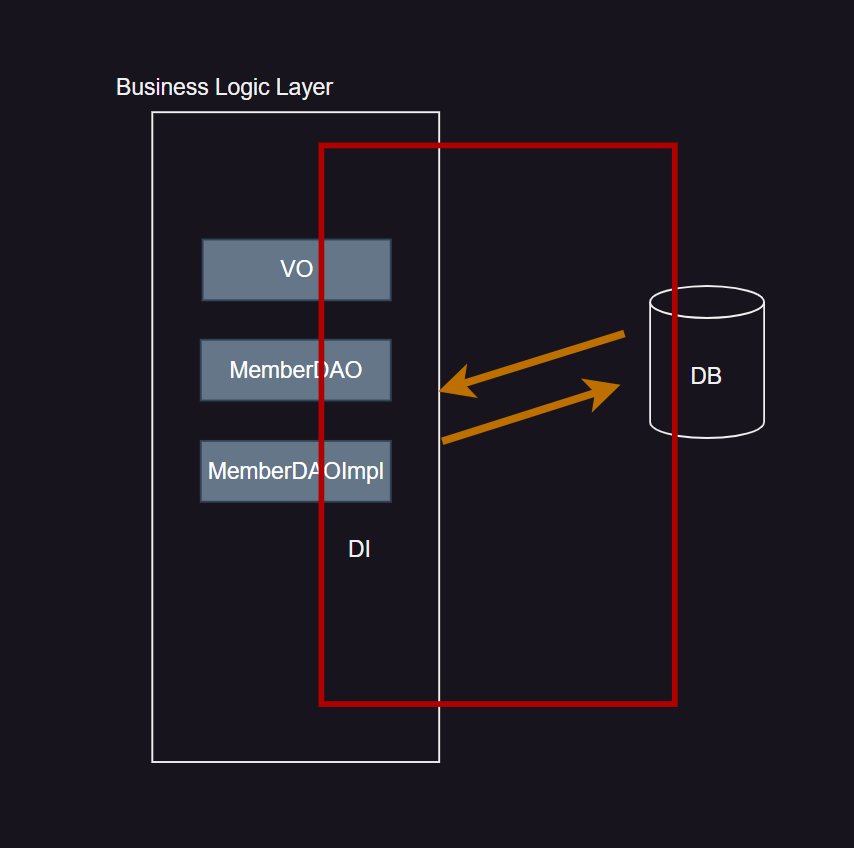
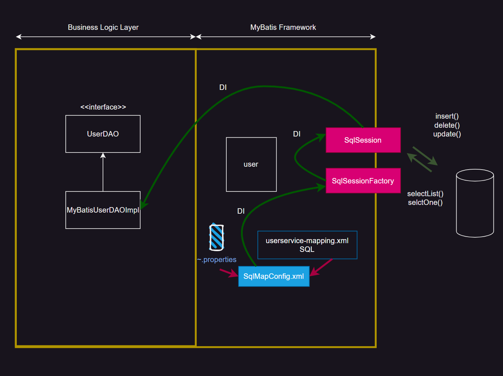
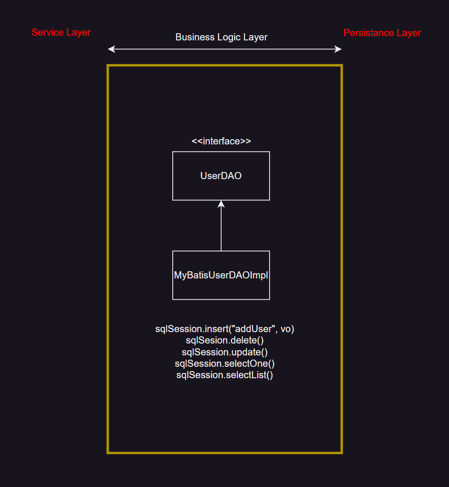
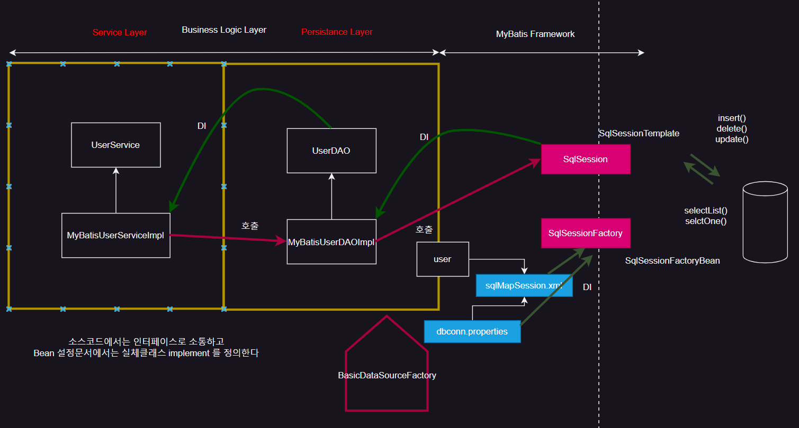
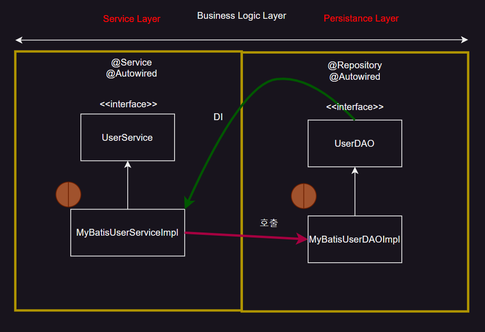

> `Backend` 에서 `DB` 에 접근할 떄 사용하는 기술인 MyBatis 에 대해 알아보자

## MyBatis 란?

{: .w-50 .align-center}

빨간색 네모 부분이 MyBatis 동작 위치

Component는 Business Logic을 호출

Business Logic을 Resources Factory에서 Connection을 받아서 수행한다.

DAOImpl의 역할은 다음과 같다.

1. `connection` 받기
2. 쿼리문 작성 - PreparedStatement
3. 값 바인딩
4. 쿼리문 수행
5. close

위의 5가지 역할을 프레임워크 형태로 묶을 수 있다.

이것이 **MyBatis Framework** 이다.

`MyBatis Framework`의 역할을 하는 다른 `Framework` 도 다양하게 존재한다.

Spring JDBC(일본이 많이 사용), Hibernate(미국), MyBatis(한국) 등


## 구현부에 있어서 작업의 흐름

1.테이블 세팅

```sql
create table mysawon(
num number constraint mysawon_num_pk primary key,
id varchar2(20) constraint mysawon_id_nn not null,
pwd varchar2(20),
name varchar2(40),
age number(3),
hiredate date,
constraint mysawon_id_uq unique(id));

create sequence mysawon_seq
increment by 1
start with 1;
```

2.vo 작성

```java
package com.service.mybatis.vo;

public class MySawon {
	private int num, age; //컬럼명과 동일
	private String id, pwd, name, hiredate; //컬럼명과 동일
	
	//Framework에서는 반드시 기본 생성자가 필요...
	public MySawon() {}

	public int getNum() {
		return num;
	}

	public void setNum(int num) {
		this.num = num;
	}

	public int getAge() {
		return age;
	}

	public void setAge(int age) {
		this.age = age;
	}

	public String getId() {
		return id;
	}

	public void setId(String id) {
		this.id = id;
	}

	public String getPwd() {
		return pwd;
	}

	public void setPwd(String pwd) {
		this.pwd = pwd;
	}

	public String getName() {
		return name;
	}

	public void setName(String name) {
		this.name = name;
	}

	public String getHiredate() {
		return hiredate;
	}

	public void setHiredate(String hiredate) {
		this.hiredate = hiredate;
	}

	@Override
	public String toString() {
		return "MySawon [num=" + num + ", age=" + age + ", id=" + id + ", pwd=" + pwd + ", name=" + name + ", hiredate="
				+ hiredate + "]";
	}
}
```

3.MyBatis Framework 설정문서를 등록

dbconn.properties (DB 서버 정보)

```xml
### dbconn.properties file....dbServer Information Storing
jdbc.oracle.driver=oracle.jdbc.driver.OracleDriver
jdbc.oracle.url=jdbc:oracle:thin:@127.0.0.1:1521:XE
jdbc.oracle.username=dbid
jdbc.oracle.password=1234
```
sqlMapConfig.xml (MyBatis Framework의 핵심 문서)

```xml
<?xml version="1.0" encoding="UTF-8"?>
<!DOCTYPE configuration
PUBLIC "-//mybatis.org//DTD Config 3.0//EN"
"http://mybatis.org/dtd/mybatis-3-config.dtd">
<!-- 
MyBatis의 핵심이 되는 설정문서로서
1. db서버에 대한 정보를 가지고 있다...dbconn.properties 파일에 있기에 Wiring되어진다.
2. DataSource에 대한 정보를 등록
3. sql Query문에 대한 정보를 등록...mapper.xml파일에 있기에 Wiring 되어진다.
4. VO를 여기다 매핑시킨다..알리야스를 기억하자!!
 -->
<configuration>
	<properties resource="config/dbconn.properties"/>
	
	<typeAliases><!--vo를 매핑  -->
		<typeAlias type="com.service.mybatis.vo.MySawon" alias="mySawon"/>
	</typeAliases>
	
	<environments default="AA">
		<environment id="AA">
			<transactionManager type="JDBC"/>
			<dataSource type="UNPOOLED">	<!--DriverManager 방식 만약 pooled로 하면 ResourcesFactory 방식이다-->
				<!--setDriver();  -->
				<!-- value에는 dbconn.properties를 보고 key값이 들어간다 -->
				<property name="driver" value="${jdbc.oracle.driver}"/>
				<property name="url" value="${jdbc.oracle.url}"/>
				<property name="username" value="${jdbc.oracle.username}"/>
				<property name="password" value="${jdbc.oracle.password}"/> 
			</dataSource>
		</environment>
	</environments>
	
	<!--sql 쿼리문 등록된 메타데이터  --> mapper가 추가될 때마다 추가해서 작성해줘야함
	<mappers>
		<mapper resource="mapper/mysawon-mapping.xml"/>
	</mappers>
</configuration>
```

4.mysawon-mapping.xml

```xml
<!--  config를 모두 mapper로 바꿔야 함 -->
<?xml version="1.0" encoding="UTF-8"?>
<!DOCTYPE mapper
PUBLIC "-//mybatis.org//DTD Mapper 3.0//EN"
"http://mybatis.org/dtd/mybatis-3-mapper.dtd">

<mapper namespace="SawonMapper">
	<insert id="sawonAdd" parameterType="mySawon">
		INSERT
		INTO mysawon (num, id, pwd, name, age, hiredate)
		VALUES (mysawon_seq.nextVal, #{id},#{pwd},#{name},#{age},sysdate)
	</insert>
</mapper> 
```
<br/>

{: .w-50 .align-center}

`SqlMapConfig.xml` 은 `vo`, `mysawon.xml`, `dbconn.properties` 을 모두 `hasing`, 모든 정보를 가지고 있다.

`SqlSessionFactory` 가 `SqlMapConfig` 의 정보를 가져 간다.

`SqlSession` 은 `SqlSessionFactory` 의 정보를 가져 간다.

즉, `SqlMapConfig` 가 `DI` 을 `SqlSessionFactory` 에 해주고 `SqlSessionFactory` 가 `DI` 을 `SqlSession` 에

해준다.

`SqlSession` 은 `DB` 와 소통한다.

insert(), delete(), update(), selectList(), selectOne() 등

## MyBatis 의 Null 처리

DB에 `null` 값이 들어가면 큰 오류가 발생한다.

```java
//==> Test 용 User instance 생성 및 age / regData null setting
//==>@@@ null값을 허용할려면 SqlMapConfig01.xml에 Settings 태그를 부착해야한다.@@@
User user = new User("user04","주몽","user04",null,1);
user.setRegDate(null);
```

위와 같이 `null` 값이 들어가게 되면 문제가 발생한다.

`Oracle` 은 `null` 값 허용이 되지 않으므로

따라서 `MyBatis` 에서 `null` 처리해야한다.

`SqlMapConfig01.xml` 로 들어가서 파일을 수정해 주어야 한다.

```xml
<?xml version="1.0" encoding="UTF-8" ?>
<!DOCTYPE configuration PUBLIC "-//mybatis.org//DTD Config 3.0//EN"
	"http://mybatis.org/dtd/mybatis-3-config.dtd">
<configuration>
	<properties resource="config/dbconn.properties"/>
	
	<!--오라클에서는 null 값을 허용하는 옵션을 지정 :: MySqL에서는 이부분이 기본적으로 내장되어 있다.  -->
	<settings>
		<setting name="jdbcTypeForNull" value="NULL"/>
	</settings>
	
	<typeAliases> <!--vo가 여러개면 여러개 만들어야 한다. alias는 소문자로 줘야 한다  -->
		<!-- <typeAlias type="mybatis.services.domain.User" alias="user"/> -->
		<package name="mybatis.services.domain"/> <!-- 패키지 안에 들어있는 User가 user로 alias 된다. -->
	</typeAliases>
	
</configuration>
```

## Alias Skip

```xml
<?xml version="1.0" encoding="UTF-8" ?>
<!DOCTYPE mapper PUBLIC "-//mybatis.org//DTD Mapper 3.0//EN"
	"http://mybatis.org/dtd/mybatis-3-mapper.dtd">

<!--이거 완성하년 CRUD 다 해보는 것임  -->
<mapper namespace="UserMapper07">	
	
	<!-- AS 안쓰기 위해  -->
	<!--결과맵을 명시적으로 지정하면 SELECT 태그마다 AS 사용 안해도 된다.  -->
	<!--resultType 대신에 resultMap을 앞으로는 사용한다.  -->
	<resultMap type="user" id="userSelectMap">
		<result property="userId" column="user_id"/>
		<result property="userName" column="user_name"/>
		<result property="password" column="password"/>
		<result property="age" column="age"/>
		<result property="grade" column="grade"/>	
		<result property="regDate" column="reg_date"/>
	</resultMap>
	
	<!-- id가 user01인 사람을 검색하는 쿼리 -->
	<select id="getUserList01" parameterType="user" resultMap="userSelectMap">
		SELECT
		user_id ,
		user_name ,
		password,
		age,
		grade,
		reg_date
		FROM users
		WHERE user_id=#{userId}
	</select>
	<!--매번 AS 쓰면 귀찮  -->
	
</mapper>
```

## MyBatis Dynamic SQL

상단의 쿼리는 정적인 쿼리라 `Business Logic`이 만약 100개면 100개의 `Query` 를 만들어야한다.

따라서 좀 더 동적인 쿼리를 만들어야한다.

예를 들어 아래 4개의 쿼리를 한번에 처리할 수 있다.

1. userName이 "홍길동" 이고 age=30 인 사람을 검색
2. userName만 "홍길동" 인 사람을 검색
3. age=30 인 사람 검색
4. 모든 사람을 검색

```xml
<select id="getUserList" parameterType="user" resultMap="userSelectMap">
	 	SELECT
		user_id ,
		user_name ,
		password,
		age,
		grade,
		reg_date
		FROM users
		<where>
			<if test="userName != null">
				user_name LIKE #{userName}
			</if>

			<if test="age != null">
				OR age LIKE #{age}
			</if>
		</where>
		ORDER BY user_id DESC
</select>
```

위와 같은 SQL 구문을 짠다.

`<where></where>` 구문을 사용해 WHERE 절을 나눠 주었다.

나눠줄 때는 `<if></if>` 를 사용해 조건문을 사용해 주었다.

```java
User user = new User("user01","홍길동","user01",new Integer(30),1);

//이름이 홍길동이고 age=30인 
(List)session.selectList("UserMapper08.getUserList",user);

//age=30인 사람을 검색
user.setUserName(null);
(List)session.selectList("UserMapper08.getUserList",user);

//이름이 홍길동인 사람을 검색
user.setUserName("홍길동");
user.setAge(null);
(List)session.selectList("UserMapper08.getUserList",user);

//모든 사람을 검색
user.setUserName(null);
user.setAge(null);
(List)session.selectList("UserMapper08.getUserList",user);
```

## SQL 구문의 모듈화

수많은 쿼리 중에 공통되는 부분을 따로 모듈화를 하는 것이 좋다.

```xml
<sql id="select-users">
		SELECT
		user_id ,
		user_name ,
		password,
		age,
		grade,
		reg_date
		FROM
		users
</sql>

<sql id="orderby-userid-desc">
		ORDER BY user_id DESC
</sql>
```

위와 같이 `<sql></sql>` 구문을 사용해 모듈화를 진행한다.

`<sql>` 안에 id를 설정해 참조할 수 있다.

```xml
<select id="getUser" parameterType="user" resultMap="userSelectMap">
		<include refid="select-users" />
		WHERE password=#{password}
</select>

<select id="getUserList" parameterType="user" resultMap="userSelectMap">
		<include refid="select-users"></include>
		<where>
			<if test="userName != null">
				user_name LIKE #{userName}
			</if>

			<if test="age != null">
				OR age LIKE #{age}
			</if>
		</where>
		<include refid="orderby-userid-desc"></include>
</select>
```

`<include>` 태그를 사용해 refid 의 속성값을 sql 태그의 id값 넣으면 된다.

{: .w-50 .align-center}

`MyBatis` 에서 가장 핵심문는 `SqlMapConfig.xml` 이다.

이 문서는 `SqlSessionFactory` 가 먹고, 

`SqlSessionFactory` 는 `SqlSession` 이 먹게 된다.

`MyBatis` 에는 `SqlSession` 이 최상위지만

이것을 `WAS` 에 넘겨야 한다.

받는 것은 `Business Logic Layer`에서 `DAOImpl` 이 먹게 된다.

`DAO` 인터페이스에는 5개의 템플릿이 만들어 져야 한다.

mybatis-userservice-mapping 에서 쿼리를 5개 짰기 때문이다.

또한 DAO 인테페이스 템플릿 이름은 각각 쿼리 5개의 id로 해야한다.

즉, 모든 것은 연결되어야 한다.

먼저 mybatis-userservice-mapping10.xml 코드를 보자

```xml
<?xml version="1.0" encoding="UTF-8" ?>
<!DOCTYPE mapper PUBLIC "-//mybatis.org//DTD Mapper 3.0//EN"
	"http://mybatis.org/dtd/mybatis-3-mapper.dtd">

<!--이거 완성하년 CRUD 다 해보는 것임 -->
<mapper namespace="UserMapper10">

	<resultMap type="user" id="userSelectMap">
		<result property="userId" column="user_id" />
		<result property="userName" column="user_name" />
		<result property="password" column="password" />
		<result property="age" column="age" />
		<result property="grade" column="grade" />
		<result property="regDate" column="reg_date" />
	</resultMap>

	<sql id="select-users">
		SELECT
		user_id ,
		user_name ,
		password,
		age,
		grade,
		reg_date
		FROM
		users
	</sql>

	<sql id="orderby-userid-desc">
		ORDER BY user_id DESC
	</sql>


	<select id="getUser" parameterType="user" resultMap="userSelectMap">
		<include refid="select-users" />
		WHERE password=#{password}
	</select>

	<select id="getUserList" parameterType="user" resultMap="userSelectMap">
		<include refid="select-users"></include>
		<where>
			<if test="userName != null">
				user_name LIKE #{userName}
			</if>
			<if test="age != null">
				OR age LIKE #{age}
			</if>
		</where>
		<include refid="orderby-userid-desc"></include>
	</select>
	
	<insert id="addUser" parameterType="user">
		INSERT
		INTO users(user_id, user_name, password, age, grade, reg_date)
		VALUES(
			#{userId}, #{userName}, #{password},#{age},#{grade},#{regDate}
		)
	</insert>
	
	<update id="updateUser" parameterType="user">
		UPDATE users
		SET user_name=#{userName}
		WHERE user_id=#{userId}
	</update>
	
	<delete id="removeUser" parameterType="string">
		DELETE
		users
		WHERE user_id=#{VALUE}
	</delete>
</mapper>
```

쿼리의 `parameterType` 과 `id` , `resultMap` 의 type을 잘 살펴보자.

이 쿼리로 만들어진 데이터를 이제 WAS의 DAO가 받아야 한다.

쿼리문 tag id 값이 Template 기능의 이름이 된다.

쿼리문 tag parameterType이 Template 기능의 인자 값

쿼리문 tag resultMap, resultType의 값이 Template기능의 return type과 연결

```java
public interface UserDAO {
	int addUser(User user)throws Exception;
	int updateUser(User user)throws Exception;
	int removeUser(String userId)throws Exception;
	User getUser(String userId)throws Exception;
	List<User> getUserList(User user)throws Exception;
}
```

이제 이 interface를 구현해줘야 한다.

```java
public class MyBatisUserDAOImpl10 implements UserDAO{
	private SqlSession sqlSession;
	public static final String MAPPER_NAME="UserMapper10.";
	
	//DI... 완성
	public void setSqlSession(SqlSession sqlSession) {
		this.sqlSession = sqlSession;
		System.out.println("::" + getClass().getName() + ".setSqlSession()...");
	}

	@Override
	public int addUser(User user) throws Exception {
		int result = sqlSession.insert(MAPPER_NAME + "addUser", user);
		sqlSession.commit();
		return result;
	}

	@Override
	public int updateUser(User user) throws Exception {
		int result = sqlSession.update(MAPPER_NAME+"updateUser", user);
		sqlSession.commit();
		return result;
	}

	@Override
	public int removeUser(String userId) throws Exception {
		int result = sqlSession.delete(MAPPER_NAME+"removeUser", userId);
		sqlSession.commit();
		return result;
	}

	@Override
	public User getUser(String userId) throws Exception {
		return sqlSession.selectOne(MAPPER_NAME+"getUser", userId);
	}

	@Override
	public List<User> getUserList(User user) throws Exception {
		return sqlSession.selectList(MAPPER_NAME+"getUserList",user);
	}
}
```

DAO는 SqlSession으로 부터 DI 되는 것이다. 

```java
private SqlSession sqlSession;

//DI... 완성
public void setSqlSession(SqlSession sqlSession) {
		this.sqlSession = sqlSession;
		System.out.println("::" + getClass().getName() + ".setSqlSession()...");
}
```

`setSqlSession()` 을 통해 `sqlSession` 을 얻는 것이다.

그럼 어떻게 활용할까? 테스트 코드를 살펴보자.

```java
SqlSession session = null;
//==> TestUtil 의 getSqlSessionFactory()을 이용 SqlSessionFactory instance GET
SqlSessionFactory factory = TestUtil.getSqlSessionFactory();
session=factory.openSession();

MyBatisUserDAOImpl10 dao = new MyBatisUserDAOImpl10();
dao.setSqlSession(session); //DI 주입!!!!!!!!!!!!!!!!!!!!!!!!!

User user = new User("user04","주몽","user04",null,1);
dao.addUser(user)
```

이런 식으로 `DI` 를 통해 받아온 `SqlSession` 을 활용할 수 있다.

<br/>
<hr/>

## Business Logic Layer 분리

{: .w-50 .align-center}

현업에서는 Business Ligic Layser를 둘로 나눌 수 있다.

`Service Layer` 와 `Persistence Layer` 로 나눌 수 있다.

**Persistence Layer**에서 DB의 정보를 받아오고

**Service Layer**에서 데이터를 가공 하는 것

예를 들어 1000개의 column을 `Persistence Layer`에서 가져오면 

한 화면에 나오면 너무 많으니까 Service Layer에서  10개씩 페이지에 보이게 처리할 수 있다

{: .w-50 .align-center}


먼저 Service Layer를 만들어 주자

```java
package mybatis.services.user;

import java.util.List;

import mybatis.services.domain.User;

public interface UserService {
	void addUser(User user)throws Exception;
	void updateUser(User user)throws Exception;
	User getUser(String userId)throws Exception;
	List<User> getUserList(User user)throws Exception;
}
```

`DAO` 와 매우 유사하다

수정된 점이 `remove` 쿼리가 빠졌다. 

왜냐하면 `Service Layer` 에서는 굳이 데이터를 삭제할 이유가 없기 때문이다.

데이터만 가공하면 된다.

또한 `addUser()` 와 `updateUser()` 의 return 타입이 void로 바꾸었다. 

굳이 쿼리가 제대로 돌아갔는지 확인할 필요가 없는 것이다.

위 interface를 구현해주자.

```java
public class MyBatisUserServiceImpl11 implements UserService{
	
	private UserDAO userDAO;

	public void setUserDAO(UserDAO userDAO) {
		this.userDAO = userDAO;
		System.out.println("::" +getClass().getName() + "sqlSesseion()");
	}

	@Override
	public void addUser(User user) throws Exception {
		userDAO.addUser(user);
	}

	@Override
	public void updateUser(User user) throws Exception {
		userDAO.updateUser(user);
	}

	@Override
	public User getUser(String userId) throws Exception {
		return userDAO.getUser(userId);
	}

	@Override
	public List<User> getUserList(User user) throws Exception {
		return userDAO.getUserList(user);
	}
}
```

```java
SqlSession session = null;
//==> TestUtil 의 getSqlSessionFactory()을 이용 SqlSessionFactory instance GET
SqlSessionFactory factory = TestUtil.getSqlSessionFactory();
session=factory.openSession();

//==> MyBatisUserDAOImpl10 생성 및 SqlSession 객체 setter injection
MyBatisUserDAOImpl10 dao = new MyBatisUserDAOImpl10();
dao.setSqlSession(session);

//==> IBatisUserServiceImpl11 생성 및 IBatisUserDAOImpl10 객체 setter injection
MyBatisUserServiceImpl11 userService = new  MyBatisUserServiceImpl11();
userService.setUserDAO(dao);

User user = new User("user04","주몽","user04",null,1);

userService.addUser(user);
```

DAO에 SqlSession을 받고 그것을 다시 Service에 연결시켜주는 것이다.

## DI Bean 연결

{: .w-50 .align-center}

5개의 bean을 만든다.

사실 `SqlSessionFactory` 가 `SqlMapConfig` 만 가져가는 것이 아니다. `DataSourceFactory` 의 `Connection` 을

받아온다. 따라서 `Connection` 을 보관하는 **Factory Bean**, `Connection` 과 `SqlMapConfig` 의 정보를 가져갈

**SqlSessionFactory Bean**, 이것을 모두 가져갈 **SqlSession Bean**, SqlSession의 정보를 받을 

**MyBatisUserDAOImpl Bean**, 이것을 모두 가져가는 **UserServiceImpl Bean** 따라서 총 5개이다.

이제 `bean` 을 등록할 설정 문서 만든다.

```xml
<?xml version="1.0" encoding="UTF-8"?>
<beans xmlns="http://www.springframework.org/schema/beans"
	xmlns:xsi="http://www.w3.org/2001/XMLSchema-instance"
	xmlns:context="http://www.springframework.org/schema/context"
	xsi:schemaLocation="http://www.springframework.org/schema/beans http://www.springframework.org/schema/beans/spring-beans.xsd
        http://www.springframework.org/schema/context http://www.springframework.org/schema/context/spring-context-4.0.xsd">
        
<!--      
1. DataSource 빈 정의 :: API Bean
2. SqlSessionFactory 빈 정의 :: API Bean
3. SqlSession 빈 정의 :: API Bean
4. UserDAOImpl 빈 정의 :: User Definition Bean
5. UserServiceImpl 빈 정의 :: User Definition Bean   
-->
<context:property-placeholder location="classpath:config/dbconn.properties"/>

<!--MyBatis Framework API Bean  -->
DataSource Bean(Factory Bean)
<bean id = "dataSource" class="org.apache.commons.dbcp.BasicDataSource">
	<property name="driverClassName" value="${jdbc.oracle.driver}"/>
	<property name="url" value="${jdbc.oracle.url}"/>
	<property name="username" value="${jdbc.oracle.username}"/>
	<property name="password" value="${jdbc.oracle.password}"/>
</bean>

SqlSessionFactory Bean
<bean id="sqlSessionFactoryBean" class="org.mybatis.spring.SqlSessionFactoryBean">
	<property name="configLocation" value="config/SqlMapConfig01.xml"/>
	<property name="dataSource" ref="dataSource"/>
</bean>

SqlSession Bean
<bean id="sqlSessionTemplate" class="org.mybatis.spring.SqlSessionTemplate">
	<constructor-arg name="sqlSessionFactory" ref="sqlSessionFactoryBean"/>
</bean>


<!--User Definition Bean  -->
UserDAOImpl Bean
<bean  id="myBatisUserDAOImpl12" class="mybatis.services.user.impl.MyBatisUserDAOImpl12">
	<property name="sqlSession" ref="sqlSessionTemplate"/>
</bean>

UserServiceImpl Bean
<bean id="myBatisUserServiceImpl12" class="mybatis.services.user.impl.MyBatisUserServiceImpl12">
	<property name="userDAO" ref="myBatisUserDAOImpl12"/>
</bean>
  
</beans>
```

잘 보면 `ref` 로 서로를 연결하고 있다.

따라서 마지막 bean만 가져오면 모두 엮여있는 것이다.

이제 빈을 활용할 테스트 코드를 작성한다.

```java
ApplicationContext context =new ClassPathXmlApplicationContext(new String[] {"/bean/userservice12.xml"});
UserService userService = (UserService)context.getBean("myBatisUserServiceImpl12");

User user = new User("user04","주몽","user04",40,40);
userService.addUser(user);
```

`getBean()` 을 사용하면서 인자로 `myBatisUserServiceImpl12` 가 들어간다. 

중요한점은 첫번째 글자가 소문자로 들어간다. `MyBatisUserServiceImpl12` 가 아닌 것이다.

당연한것이 bean주문서 id가 myBatisUserServiceImpl12가 이기 때문이다.

나중에 배울 `@Autowired` 를 사용하면 자동적으로 소문자로 바뀌기 때문에 주의해야 한다.

번외로 Bean을 활용하면 Sql에서 Commit() 을 할 필요가 없다. 자동적으로 해준다.

따라서 DAOImpl에서 `sqlSession.commit()` 을 주석 처리해줘야 한다.

## Annotation 을 활용한 Bean 연결

{: .w-50 .align-center}

`Annotation` 은 `bean` 주문서를 축약하나 것이다.

우리가 위에서 봤던 `bean` 주문서에 `<bean></bean>` 을 `@Component` 를 사용해 대체할 수 있다.

```java
@Component
public class MyBatisUserDAOImpl13 implements UserDAO{
	...
}

@Component
public class MyBatisUserServiceImpl13 implements UserService{
	...
}
```

사실 Service Layer와 Persistence Layer 모두 `@Component` 를 사용할 수 있다.

하지만 전문가들은 @Component 잘 안쓴다.

PersistenceLayer에는 `@Repository`

ServiceLayer에는 `@Service`

그 다음 필드값 선언 맨 위에 `@Autowired`를 사용해 bean을 서로 엮는다.

```java
@Repository
public class MyBatisUserDAOImpl13 implements UserDAO{
	
	@Autowired //setter할 필요없음
	private SqlSession sqlSession;
	...
}

@Service
public class MyBatisUserServiceImpl13 implements UserService{
	
	@Autowired
	private UserDAO userDAO;
	...
}
```

이렇게 작성하게 되면 위에서 봤던 bean 주문서에서 User Definition Bean을 모두 지워도 된다.!!

Annotation을 사용했기 때문이다.

```xml
<?xml version="1.0" encoding="UTF-8"?>
<beans xmlns="http://www.springframework.org/schema/beans"
	xmlns:xsi="http://www.w3.org/2001/XMLSchema-instance"
	xmlns:context="http://www.springframework.org/schema/context"
	xsi:schemaLocation="http://www.springframework.org/schema/beans http://www.springframework.org/schema/beans/spring-beans.xsd
        http://www.springframework.org/schema/context http://www.springframework.org/schema/context/spring-context-4.0.xsd">
       
<context:property-placeholder location="classpath:config/dbconn.properties"/>

<!--MyBatis Framework API Bean  -->
<bean id = "dataSource" class="org.apache.commons.dbcp.BasicDataSource">
	<property name="driverClassName" value="${jdbc.oracle.driver}"/>
	<property name="url" value="${jdbc.oracle.url}"/>
	<property name="username" value="${jdbc.oracle.username}"/>
	<property name="password" value="${jdbc.oracle.password}"/>
</bean>

<bean id="sqlSessionFactoryBean" class="org.mybatis.spring.SqlSessionFactoryBean">
	<property name="configLocation" value="config/SqlMapConfig01.xml"/>
	<property name="dataSource" ref="dataSource"/>
</bean>

<bean id="sqlSessionTemplate" class="org.mybatis.spring.SqlSessionTemplate">
	<constructor-arg name="sqlSessionFactory" ref="sqlSessionFactoryBean"/>
</bean>

<!-- DI에게 base-package 하위를 꼭 봐라고 알려준다. -->
<context:component-scan base-package="mybatis.services.user.impl"></context:component-scan>
  
</beans>
```

마지막으로 `<context:component-scan>` 태그를 사용한다.

위에서 Annotation을 작성한 문서가 위치한 package 명을 `base-package` 의 값으로 넣어준다.

그렇게 되면 Spring은 위치를 보고 Annotation 선언된 클래스를 bean으로 등록하는 것이다.