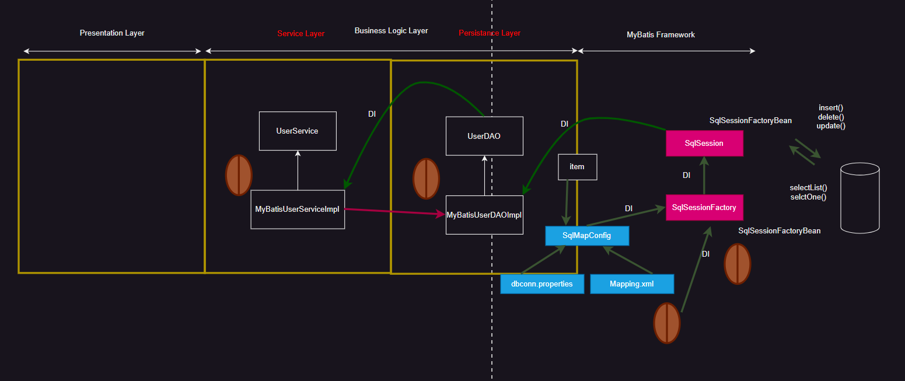

> 

## Two Architecture Layer

{: .w-50 .align-center}

`Two Architecture Layer` 는

**presentation layer**와 **business logic layer** 이다.

`Presentation Layer`와 `Business Logic Layer`를 살펴보면

`Business Logic Layer`는 우리가 알고 있는 부분이다.

`Presentation Layer`는 사용자에게 보이는 결과페이지를 보내준다.

<hr/>

### 동작 순서

`Container` 는 시작하자마자 web.xml 을 읽어들인다.

그 중 먼저 <context-param> 을 찾아 `servletContext` 를 생성한다.

```xml
//web.xml
<context-param>
		<param-name>contextConfigLocation</param-name>
		<param-value>classpath:bean/businessLogicBean.xml</param-value>
</context-param>
```

거기서 `bean/businessLogicBean.xml`을 `wiring` 한다.

말 그대로 `Business Logic`에 해당하는 `bean` 설정 문서를 의미한다.

그 다음 `web.xml`은

`<servlet>` 태그를 찾고 `wiring` 한다.

`servlet` 의 초기화 작업인 `init()` 을 호출할 때 돌아간다.

`<init-param>`을 통해 `bean/presentationBean.xml` 을 `wiring` 한다.

위 `bean` 설정 문서는 `Presentation Layer`에 해당하는 bean을 생성한다.

## Bean 설정문서의 모듈화

```xml
//web.xml
<servlet>
		<servlet-name>appServlet</servlet-name>
		<servlet-class>org.springframework.web.servlet.DispatcherServlet</servlet-class>
		<init-param>
			<param-name>contextConfigLocation</param-name>
			<!--classpath 안붙이면 webapp 밑을 찾는다 classpath를 붙여야 webapp 위에서 찾는다  -->
			<!--servlet만드는 주문서에서 빈을 만드는 주문서 wireing  -->
			<param-value>classpath:bean/presentationBean.xml</param-value>
		</init-param>
		<load-on-startup>1</load-on-startup>
</servlet>
```

classpath를 붙여주었는데 webapp 밖에 있는 파일을 찾을 때는 classpath를 붙여줘야 한다.

위의 이러한 작업은 bean 설정 문서의 모듈화 이다.

이전 까지는 모든 bean 생성을 하나의 bean 설정문서에 넣어놓았다.

하지만 이제 부터 Layer 별로 bean 설정문서를 두었다.

```xml
//web.xml
<filter>
	      <filter-name>encodingFilter</filter-name>
        <filter-class>org.springframework.web.filter.CharacterEncodingFilter</filter-class>
          <init-param>
              <param-name>encoding</param-name>
              <param-value>utf-8</param-value>
          </init-param>
</filter>
<filter-mapping>
        <filter-name>encodingFilter</filter-name>
        <url-pattern>/*</url-pattern>
</filter-mapping>
```

위의 코드는 한글처리를 하는 코드이다.

web.xml에 넣어두었다.

```xml
<!-- businessLogicBean.xml -->
<?xml version="1.0" encoding="UTF-8"?>
<beans xmlns="http://www.springframework.org/schema/beans"
    xmlns:xsi="http://www.w3.org/2001/XMLSchema-instance"
    xmlns:context="http://www.springframework.org/schema/context"
    xsi:schemaLocation="http://www.springframework.org/schema/beans http://www.springframework.org/schema/beans/spring-beans.xsd
        http://www.springframework.org/schema/context http://www.springframework.org/schema/context/spring-context-4.0.xsd">

<!--My Batis -->
<context:property-placeholder location="classpath:config/dbconn.properties"/>
<bean id="dataSource" class="org.apache.commons.dbcp.BasicDataSource">
    <property name="driverClassName" value="${jdbc.oracle.driver}"/>
    <property name="url" value="${jdbc.oracle.url}"/>
    <property name="username" value="${jdbc.oracle.username}"/>
    <property name="password" value="${jdbc.oracle.password}"/>
</bean>

<bean id="sqlSessionFactoryBean" class="org.mybatis.spring.SqlSessionFactoryBean">
    <property name="configLocation" value="classpath:config/SqlMapConfig.xml"/>
    <property name="dataSource" ref="dataSource"/>
</bean>

<bean id="sqlSessionTemplate" class="org.mybatis.spring.SqlSessionTemplate">
    <constructor-arg  ref="sqlSessionFactoryBean"/>
</bean>

    
<context:component-scan base-package="com.service.spring" />
    
</beans>
```
비즈니스 로직을 담당하는 bean 설정 문서이다.

ItemDAO와 ItemCatalogImpl은 Annotation으로 자동으로 bean이 등록되어 있다.

```xml
<!-- presentationBean.xml -->
<?xml version="1.0" encoding="UTF-8"?>
<beans xmlns="http://www.springframework.org/schema/beans"
    xmlns:xsi="http://www.w3.org/2001/XMLSchema-instance"
    xmlns:context="http://www.springframework.org/schema/context"
    xsi:schemaLocation="http://www.springframework.org/schema/beans http://www.springframework.org/schema/beans/spring-beans.xsd
        http://www.springframework.org/schema/context http://www.springframework.org/schema/context/spring-context-4.0.xsd">

<!--Presentation bean  -->
    <bean class="org.springframework.web.servlet.view.InternalResourceViewResolver">
        <property name="prefix" value="/WEB-INF/views/" />
        <property name="suffix" value=".jsp" />
    </bean>
    
    <context:component-scan base-package="com.service.spring.controller" />
    
</beans>
```

Presentation Layer에서 사용하는 bean을 설정하는 문서이다.

결과페이지의 물리적 위치(prefix)와 확장자(suffix)를 설정할 수 있다.

viewResolver라고도 한다.

```xml
<!-- sqlMapConfig.xml -->
<environments default="DEVELOPMENT">
		<environment id="DEVELOPMENT">
			<transactionManager type="JDBC"/>
			<dataSource type="UNPOOLED">
				<property name="driver" value="${jdbc.oracle.driver}"/>
				<property name="url" value="${jdbc.oracle.url}"/>
				<property name="username" value="${jdbc.oracle.username}"/>
				<property name="password" value="${jdbc.oracle.password}"/>
			</dataSource>
		</environment>
	</environments>
```

```xml
<!-- Itemservice.xml (bean 설정문서) -->
<bean id = "dataSource" class="org.apache.commons.dbcp.BasicDataSource">
	<property name="driverClassName" value="${jdbc.oracle.driver}"/>
	<property name="url" value="${jdbc.oracle.url}"/>
	<property name="username" value="${jdbc.oracle.username}"/>
	<property name="password" value="${jdbc.oracle.password}"/>
</bean>
```