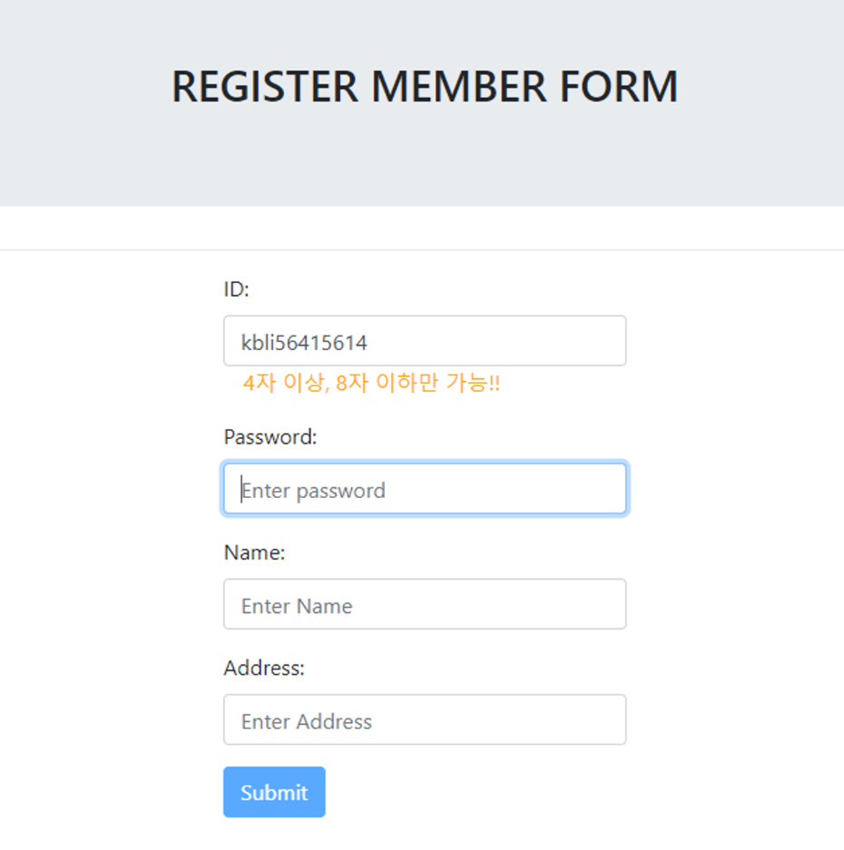
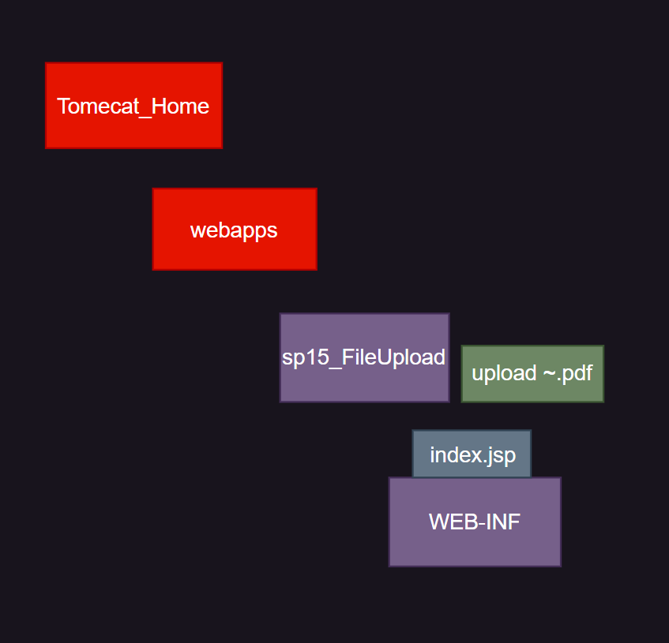
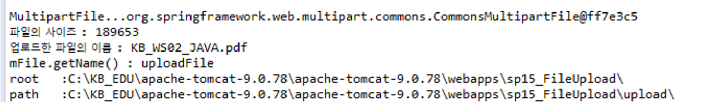
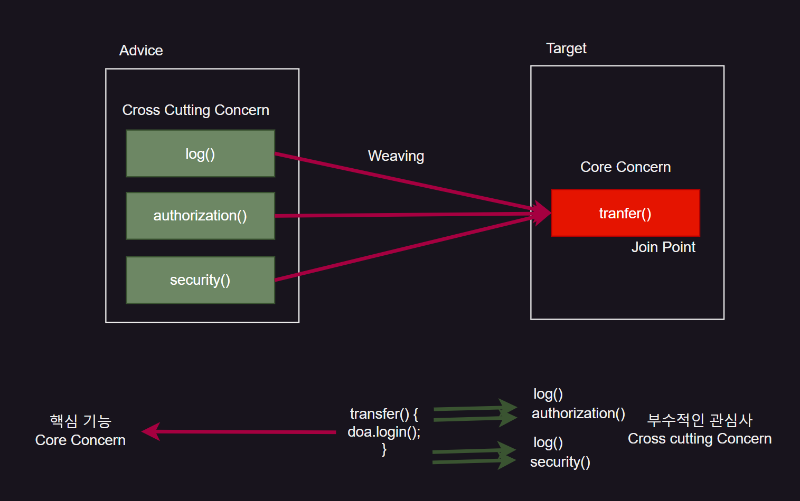
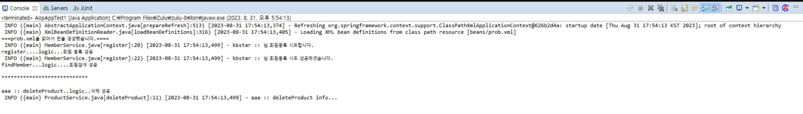
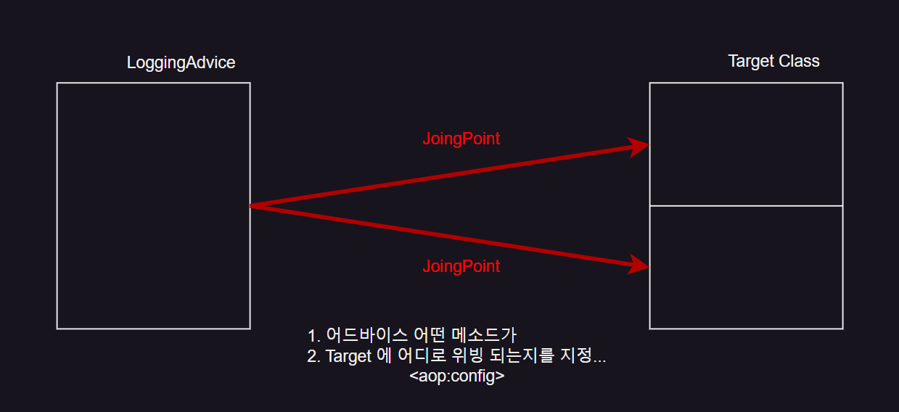

> Component는 인터페이스 기반의 여러 기능들이 있는 것을 말한다.
>
> DI 컨테이너는 Component(bean)을 Singletone 을 기반으로 만든다.


회원가입을 할때 중복된 아이디거나 4~8 자 가 아니면 사용자에게 메시지를 주는 기능을 넣어주려면

먼저 pom.xml 에 Ajax를 처리할 수 있는 `<dependency>` 를 넣어야 한다

```xml
<!-- 8. Ajax Json -->
 <dependency>
        	<groupId>com.fasterxml.jackson.core</groupId>
        	<artifactId>jackson-databind</artifactId>
        	<version>2.5.1</version>
 </dependency>
```

이제 register.jsp에 비동기 처리 코드를 넣어주어야 한다.

```html
<%@ page language="java" contentType="text/html; charset=UTF-8"
    pageEncoding="UTF-8"%>
<!DOCTYPE html>
<html>
<head>
<meta charset="UTF-8">  
<meta name="viewport" content="width=device-width, initial-scale=1">
 <link rel="stylesheet" href="https://cdn.jsdelivr.net/npm/bootstrap@4.6.2/dist/css/bootstrap.min.css">
 <!-- jquery cdn ::  cloudflare, google, ms, jquery -->
 <script src="https://cdnjs.cloudflare.com/ajax/libs/jquery/3.6.0/jquery.min.js"></script>
 
 <script src="https://cdn.jsdelivr.net/npm/popper.js@1.16.1/dist/umd/popper.min.js"></script>
 <script src="https://cdn.jsdelivr.net/npm/bootstrap@4.6.2/dist/js/bootstrap.bundle.min.js"></script>
<title>Insert title here</title>
<style type="text/css">
form{
	width: 300px;
	margin: 0 auto;
}
</style>
<script>
	/* 
		KEY 이벤트 관련 함수
		keypress() 눌렀을 때
		keydown() 버튼을 꾹누를때
		keyup() 버튼을 땔 때
	
	*/
	$(function(){
		$('#id').keyup(function(){
			var id =$(this).val();
			//id값이 4자 이상 8자 이하일 때만 id값을 받아들이겟다.
			if(id.length >= 4 & id.length <=8){
				//이 때만 비동기 요청
				$.ajax({
					type:'post',
					url:'idExist.do',
					data:'id='+id,
					
					success:function(data){ //callback
						//이미 사용중인 아이디......idcheck 영역에 출력
						//사용가능 아이디...idcheck 영역에 출력
					     var jsonData=JSON.parse(data); //[object:object]로 나오는 것을 방지
						if(jsonData.check ==true){
							$('#idcheck').html("<h3><font color=tomato>중복된 아이디</font></h3>");
							$('#submit_btn').attr('disabled', true);
						}
						else{
							$('#idcheck').html("<h3><font color=blue>사용가능  아이디</font></h3>");
							$('#submit_btn').attr('disabled', false);
						}
					}
				});//ajax
			}
			else{ //메세지 출력
				$('#idcheck').html('4자 이상, 8자 이하만 가능!!').css('color', 'orange');
				$('#submit_btn').attr('disabled', true); //비활성화
			}
		});
	});
</script>
</head>
<body>
<div class="container">
	<div class="jumbotron" align="center">
		<h2>REGISTER MEMBER FORM</h2>
	</div>
</div>
<hr>
<div class="container">	
	 <form action="register.do" method="post">	
    <div class="form-group">
      <label for="id">ID:</label>
      <input type="text" class="form-control" id="id" placeholder="Enter Id" name="id">
      <span id="idcheck" style="margin-left:15px"></span>  추가!!!!!!!!!!!!
    </div>
    <div class="form-group">
      <label for="pwd">Password:</label>
      <input type="password" class="form-control" id="pwd" placeholder="Enter password" name="password">
    </div>
        <div class="form-group">
      <label for="name">Name:</label>
      <input type="text" class="form-control" id="name" placeholder="Enter Name" name="name">
    </div>
        <div class="form-group">
      <label for="address">Address:</label>
      <input type="text" class="form-control" id="address" placeholder="Enter Address" name="address">
    </div>
 
    <button type="submit" class="btn btn-primary" id="submit_btn">Submit</button>
  </form>
</div>
</body>
</html>
```

`<script>` 에 다가 Ajax코드를 추가해주었다.

Ajax의 요청이 idExist.do로 들어간다.

따라서 Controller로 가서 idExist.do에 대한 처리를 추가해준다.

```java
//추가...비동기 요청
	@RequestMapping("idExist.do")
	public String idExist(String id, Model model)throws Exception{
		boolean check=false;
		String rid = memberDAO.idExist(id); //id가 있는지 없는지 true, false가 Stirng형태로 return됨
		//true이면 중복된 아이디, false이면 사용가능한 아이디

		if(rid!=null)check = true;//중복된 아이디
		
		model.addAttribute("check", check);
		
		return "JsonView";
	}
```

비동기 요청에서 data에 다가 id를 담아왔다.

`idExist()` 의 결과값이 null이 아니면 해당 id가 이미 존재하는 것이므로 check 변수에 true를 할당해 준다.

이에 대한 return값은 `JsonView` 로 간다.

비동기 처리를 하기 위해서는 `PresentationBean.xml` 을 수정해줘야 한다.

```xml
<?xml version="1.0" encoding="UTF-8"?>
<beans xmlns="http://www.springframework.org/schema/beans"
	xmlns:xsi="http://www.w3.org/2001/XMLSchema-instance"
	xmlns:context="http://www.springframework.org/schema/context"
	xsi:schemaLocation="http://www.springframework.org/schema/beans http://www.springframework.org/schema/beans/spring-beans.xsd
		http://www.springframework.org/schema/context http://www.springframework.org/schema/context/spring-context-4.0.xsd">

	<bean class="org.springframework.web.servlet.view.InternalResourceViewResolver">
		<property name="prefix" value="/WEB-INF/views/" />
		<property name="suffix" value=".jsp" />	
		<property name="order" value="1" />
	</bean>
	
	<bean class="org.springframework.web.servlet.view.BeanNameViewResolver">
		<property name="order" value="0" />
	</bean>
	
	<!--  Ajax를 위한 빈을 등록 -->
	<bean id="JsonView" class="org.springframework.web.servlet.view.json.MappingJackson2JsonView" >
	    <property name="contentType" value="text/html;charset=utf-8" />
	</bean>
	
	<!--  3. Business Logic Layer Bean :: Service + Persistence Layer-->
	<context:component-scan base-package="com.service.spring.controller" />
</beans>
```

전에 본것과 같이 `BeanNameViewResolver` 가 필요하다.

그리고 id값이 JsonView인 AJax를 위한 빈을 등록한다.

{: .w-50 .align-center}
_(정상작동하는 모습)_

## Spring 에서 파일 업로드 하는 법
> 사용자가 올린 파일은 어디다 저장을 할까?
{: .prompt-warning}

{: .w-50 .align-center}

`Tomcat_Home` → `webapps` → `sq15_FileUpload` → 우리가 올린 파일들은 정적인 파일이기 때문에 `WEB-INF` 상위에 들어간다.

```html
<%@ page language="java" contentType="text/html; charset=EUC-KR"
    pageEncoding="EUC-KR"%>
<!DOCTYPE html>
<html>
<head>
<meta charset="EUC-KR">
<title>Insert title here</title>
</head>
<body>
<h2 align="center">File Upload Form</h2>
<form action="fileupload.do" method="post" enctype="multipart/form-data">
	사용자명<input type="text" name="userName"> <!-- name으로 필드값 지정 -->
	<input type="file" name="uploadFile"> <!--name으로 필드값 지정  -->
	<input type="submit" value="파일 업로드">

</form>
</body>
</html>
```

​
> 파일 업로드 기술 사용시 주의할 점
> 
> 1. form 태그 안에 input type="file"로 폼을 만든다
> 2. method=post 만 가능하다.
> 3. enctype="multipart/form-data"
> 4. poem.xml에 fileupload dependency 추가
> 5. 파일업로드한 정보를 저장하는 vo를 먼저 만들고 요청을 처리한다.(RequestMappping)
{: .prompt-danger}

```xml
<!-- 9. FileUpload -->
<dependency>
        	<groupId>commons-fileupload</groupId>
        	<artifactId>commons-fileupload</artifactId>
        	<version>1.3.3</version>
</dependency>
```

```java
package com.service.spring.domain;

import org.springframework.web.multipart.MultipartFile;

/*
 * 파일 탐색창에서 선택한 파일의 정보를 저장하는  VO  클래스..
 */
public class UploadDataVO {
	private String userName; // 사용자명 저장
	private MultipartFile uploadFile;// 업로드 파일 정보 저장
	//MultipartFile은 사용자가 파일을 업로드 할 수 있게 보여지는 파일 탐색창

	public String getUserName() {
		return userName;
	}

	public void setUserName(String userName) {
		this.userName = userName;
	}

	public MultipartFile getUploadFile() {
		return uploadFile;
	}

	public void setUploadFile(MultipartFile uploadFile) {
		this.uploadFile = uploadFile;
	}
}
```

필드값의 userName과 uploadFile은 아래의 name과 동일해야 한다.

```html
사용자명<input type="text" name="userName"> <!-- name으로 필드값 지정 -->
<input type="file" name="uploadFile"> <!--name으로 필드값 지정  -->
```

이제 fileupload.do로 들어오는 요청을 처리하기 위해 Controller를 만든다.

```java
@Controller
public class FileUploadController {
	
	@RequestMapping("fileupload.do")
	public String upload(UploadDataVO vo, Model model, HttpSession session)throws Exception{
		
		MultipartFile mFile = vo.getUploadFile(); //사용자가 선택한 파일 받아옴
		System.out.println("MultipartFile..."+mFile);
		
		//.1 MultipartFile의 주요기능... 업로드한 파일 이름
		if(mFile.isEmpty()==false) { //업로드된 파일이 있다면
			System.out.println("파일의 사이즈 : "+ mFile.getSize());
			System.out.println("업로드한 파일의 이름 : "+ mFile.getOriginalFilename());
			System.out.println("mFile.getName() : "+mFile.getName());
		}
		//2. 업로드한 파일을 Tomcat 서버로 배포(저장)
		//HtteRequest 써도 됨
		String root =session.getServletContext().getRealPath("/");
		System.out.println("root   :"+root);//context path 경로 확보
		
		String path=root+"upload\\";
		System.out.println("path   :"+path);
		
		//3. 업로드한 파일의 카피본을 해당 경로 /upload에 저장
		File copyFile = new File(path + mFile.getOriginalFilename());
		mFile.transferTo(copyFile);
		
		model.addAttribute("uploadfile", mFile.getOriginalFilename());
		
		return "upload_result";
	}
}
```

<br/>

{: .w-50 .align-center}
_(파일이 정상적으로 지정되었다)_

`path` 경로로 업로드한 파일이 저장된다.

```html
<%@ page language="java" contentType="text/html; charset=UTF-8"
    pageEncoding="UTF-8"%>
<!DOCTYPE html>
<html>
<head>
<meta charset="UTF-8">
<title>Insert title here</title>
</head>
<body>
	<b>Upload File OK~~~~</b>
	<ul>
		<li>File download&nbsp;&nbsp;&nbsp;&nbsp;<a href="filedown.do?filename=${uploadfile}">${uploadfile}</a></li>
	</ul>
</body>
</html>
```

`File download` 를 누르면 요청이 `filedown.do`로 간다.

또한 get요청으로 uploadfile이 같이 들어간다.

uploadfile은 Controller에서 

`Model.addAttribute("uploadfile", mFile.getOriginalFileName()` 로 저장되있다.

따라서 filedown.do에 해당하는 Controller를 만들어 줘야 한다.

<br/>

```java
@RequestMapping("filedown.do")
	public String down(String filename, Model model, HttpSession session)throws Exception{
		
		String root =session.getServletContext().getRealPath("/");
		String path=root+"upload\\";
		
		//다운로드 코드 추가
		
		model.addAttribute("path", path);
		
		//파일 다운로드도 결과페이지가 없다
		return "downloadView";
	}
```

`Controller` 에서 처리를 하고 `downloadView` 로 이동한다.

다운로드 완료 라는 페이지는 필요없기 때문에

따라서 비동기처리 처럼 결과페이지가 없다.

결국 `bean` 을 만들어 줘야 한다. ⇒ `BeanNameViewResolver` 사용해야 함

`servlet-context.xml` 로 간다.

```xml
<?xml version="1.0" encoding="UTF-8"?>
<beans:beans
	xmlns="http://www.springframework.org/schema/mvc"
	xmlns:xsi="http://www.w3.org/2001/XMLSchema-instance"
	xmlns:beans="http://www.springframework.org/schema/beans"
	xmlns:context="http://www.springframework.org/schema/context"
	xsi:schemaLocation="http://www.springframework.org/schema/mvc https://www.springframework.org/schema/mvc/spring-mvc.xsd
		http://www.springframework.org/schema/beans https://www.springframework.org/schema/beans/spring-beans.xsd
		http://www.springframework.org/schema/context https://www.springframework.org/schema/context/spring-context.xsd">

	<!-- Enables the Spring MVC @Controller programming model -->
	<annotation-driven />

	<!-- Handles HTTP GET requests for /resources/** by efficiently serving 
		up static resources in the ${webappRoot}/resources directory -->
	<resources mapping="/resources/**" location="/resources/" />

	<!-- Resolves views selected for rendering by @Controllers to .jsp resources 
		in the /WEB-INF/views directory -->
	<beans:bean class="org.springframework.web.servlet.view.InternalResourceViewResolver">
		<beans:property name="prefix" value="/WEB-INF/views/" />
		<beans:property name="suffix" value=".jsp" />
		<beans:property name="order" value="1" />
	</beans:bean>
	
	<beans:bean class="org.springframework.web.servlet.view.BeanNameViewResolver">
		<beans:property name="order" value="0" />
	</beans:bean>
	
	<!-- 다운로드 빈 추가 -->
	<beans:bean name="downloadView" class="util.DownloadView"/>
	
	
	<!-- FileUpload시 반드시 빈 설정 추가 :: MultipartFile -->
	<beans:bean id="multipartResolver"
		class="org.springframework.web.multipart.commons.CommonsMultipartResolver">
		<beans:property name="defaultEncoding" value="utf-8" /> <!--한글처리 -->
		<beans:property name="maxUploadSize" value="-1" /> <!--파일 업로드 할 수 있는 최대 사이즈(동영상도 가능)  -->
	</beans:bean>
	
	<context:component-scan base-package="com.service.spring.controller" />

</beans:beans>
```

잘보면 `<!— 다운로드 빈 추가 —>` 부분에서 `downloadView` 라는 `bean` 이 생성되고

`class=util.DownloadView` 이다. `class` 에 해당하는 위치에 존재하는 클래스를 `bean` 으로 만든다는 의미이다.

```java
package util;

public class DownloadView extends AbstractView {
    // 다운로드 파일의 컨텐트 타입을 지정 
    @Override
    public String getContentType() {
        // 8비트로 된 일련의 데이터..application의 데이타 형식을 굳이 지정하지 않을떄 사용함.
        return "application/octet-stream";
    }

    @Override
    protected void renderMergedOutputModel(Map<String, Object> map,
                                           HttpServletRequest request, HttpServletResponse response) throws Exception {

        System.out.println("downloadView 실행~~~" + map.get("path"));
        String path = (String) map.get("path");
        String fileName = request.getParameter("filename");
        //업로드 경로가 저장된 파일 객체
        File file = new File(path + fileName);

        // 파일 다운로드 
        response.setContentType(this.getContentType());
        response.setContentLength((int) file.length());//파일 크기 설정 
        // 다운로드 파일에 대한 설정 
        response.setHeader("Content-Disposition",
                "attachment; fileName="
                        + new String(file.getName().getBytes("UTF-8"), "8859_1"));
        //데이터 인코딩이 바이너리 파일임을 명시
        response.setHeader("Content-Transfer-encoding", "binary");
        // 실제 업로드 파일을 inputStream 으로 읽어서 
        // response 에 연결된 OutputStream으로 전송하겠다. 
        OutputStream os = response.getOutputStream();
        FileInputStream fis = new FileInputStream(file);
        FileCopyUtils.copy(fis, os);
        System.out.println("다운로드.." + file.getName());
    }
}
```


<br/>
<hr/>

## AOP (Aspect Oriented Programming)

AOP가 적용되는 부분은 Service Layer에 가깝다.

> AOP가 중요한 이유
>
> AOP 는 다른 Service Layer의 메소드를 빨대 꽂아 가져와서 자신만의 새로운 알고리즘으로 
> 
> 편집해 자신만의 것으로 만드는 것이다.
{: .prompt-tip}

`OOP` 는 여러 요소들이 모듈화되어져있어서 독립화 → 재사용성이 높아짐

`AOP` 는 모듈화 되어있는 것을 분해시킨다.


예를 들어 계좌이체를 하는 메소드를 보자

```java
transfer(){ //계좌 이체
	log(); //부수적인 관심사(Cross Cutting Concern)
	dao.login(); //핵심기능(Core Concern)
	security(); //Cross Cutting concern
	log(); //Cross Cutting concern
}
```

{: .w-50 .align-center}

**Target**에는 **Core Concern**에 둔다.

**Advice**에는 **Cross Cutting Concern**에 둔다.

이렇게 분리 하는 것이 `AOP` 라고 한다.

**Aspect**는 `Core Concern` 과 `Cross Cutting Concern` 이다.

분리시켜놓고 `Target` 기능이 실행될 때 내가 원하는대로  `Advice` 부분이  내려 꽂혀서 

실행되는 것이 **Weaving**이라고 한다.

내려 꽂혀지는 곳이 **Join Point** 라고 한다.

프로그램의 결과는 똑같다. 하지만

결과적으로 보면 `OOP` 의 끝판왕이라고 볼 수 있다.

`AOP` 가 어떤 상황에서 어떻게 사용하는지가 중요하다.

먼저 `AOP` 를 적용하지 않은 상태를 보겠다.

<br/>

```java
package spring.aop.prob;

public class MemberService {
	
	private Log log = LogFactory.getLog(getClass());
	
	public void register(String name) {
		log.info(name+" :: 님 회원등록 시도합니다."); //cross cutting
		System.out.println("register....logic...회원 등록 성공"); //core 
		log.info(name+" :: 님 회원등록 시도 성공하셨습니다.");//cross cutting

	}
	
	public void findMember(String id) {
		System.out.println("findMember...logic....회원검색 성공");
	}
}
```

위 코드는 `Business Logic` 을 호출하고 있는 서비스 클래스이다. 

**핵심적인 로직(Core Concern)** 사이사이에 **부수적인 로직(Cross Cutting Concern)**이 산발적으로 혼재되어

있다.

결과적으로 `OOP` 의 본질을 흐리고 있다.

위 코드에서는 `Cross Cutting Concern`에 해당하는 로직을 log 파일 출력으로 정해서 작성하였다.

마찬가지로 비슷한 유형인 `ProductService` class 를 만들어 주었다.

```java
package spring.aop.prob;

public class ProductService {
	private Log log = LogFactory.getLog(getClass());

    public String deleteProduct(String id) {
        System.out.println(id+" :: deleteProduct..logic..삭제 성공");
        log.info(id+" :: deleteProduct info...");

        return "삭제된 상품 ID :"+id;
    }
}
```

이제 DI를 적용하기 위해 bean을 만들어야 한다.

```xml
<?xml version="1.0" encoding="UTF-8"?>
<beans xmlns="http://www.springframework.org/schema/beans"
	xmlns:xsi="http://www.w3.org/2001/XMLSchema-instance"
	xsi:schemaLocation="http://www.springframework.org/schema/beans http://www.springframework.org/schema/beans/spring-beans.xsd">

<bean id="member" class="spring.aop.prob.MemberService"/>
<bean id="product" class="spring.aop.prob.ProductService"/>

</beans>
```

```java
package aop.test;

public class AopAppTest1 {

	public static void main(String[] args) {
		ApplicationContext factory = 
				new ClassPathXmlApplicationContext("beans/prob.xml");
		
		System.out.println("===prob.xml을 읽어서 빈을 생성했습니다.====");
		
		MemberService member = (MemberService)factory.getBean("member");
		ProductService product = (ProductService)factory.getBean("product");
		member.register("kbstar");
		member.findMember("kbstar");
		
		System.out.println("\n****************************\n");
		product.deleteProduct("aaa");
	}
}
```

{: .w-50 .align-center}
_(이와 같은 출력이 나온다)_

`log` 가 같이 나온다.

이제 `AOP` 를 적용해보자

`MemberService` 에서 `Core Concern` 만 빼고 모두 제거했다. 즉 Target 이다.

```java
package spring.aop.solv;

//Target Class..
public class MemberService {
		
	public void register(String name) {
		System.out.println("register....logic...회원 등록 성공"); //core 
	}
	
	public void findMember(String id) {
		System.out.println("findMember...logic....회원검색 성공");
	}
}
```

`ProductService` 도 마찬가지로 `Core Concern`만 남기고 모두 제거했다. 즉, Target 이다.

```java
package spring.aop.solv;

//핵심 관심사만 들어있는 클래스
//Target Class
public class ProductService {

    public String deleteProduct(String id) {
        System.out.println(id+" :: deleteProduct..logic..삭제 성공");
        return "삭제된 상품 ID :"+id;
    }
}
```

이제 제거된 `Cross Cutting Concern` 따로 모아줄 `Advice` 가 필요하다.

```java
package spring.aop.solv;

/*
 * 부수적인 관심사만 모아 놓은 클래스...
 * Advice Class
 */
public class LoggingAdvice {
	private Log log = LogFactory.getLog(getClass());
	
	public void logPush(ProceedingJoinPoint pjp) throws Throwable{
        log.info("\ncheck...before logging...");

        Object ret=pjp.proceed();//target으로 위빙되는 시점
        System.out.println("target method return..."+ret);
	}
}
```

마찬가지로 또 bean을 설정해준다.

```xml
<?xml version="1.0" encoding="UTF-8"?>
<beans xmlns="http://www.springframework.org/schema/beans"
	xmlns:xsi="http://www.w3.org/2001/XMLSchema-instance"
	xmlns:aop="http://www.springframework.org/schema/aop"
	xsi:schemaLocation="http://www.springframework.org/schema/beans http://www.springframework.org/schema/beans/spring-beans.xsd
		http://www.springframework.org/schema/aop http://www.springframework.org/schema/aop/spring-aop-4.0.xsd">

<!-- Target 2개 (member, product),  Advice 1개 (logging)  -->
<bean id="member" class="spring.aop.solv.MemberService"/>
<bean id="product" class="spring.aop.solv.ProductService"/>
<bean id="logging" class="spring.aop.solv.LoggingAdvice"/>

<!-- Advice의 어떤 메소드가 Target에 어디로 weaving 되는지를 지정해줘야 한다. => <aop:config> -->
<aop:config>
	<aop:aspect id="loggingAspect" ref="logging">
		<aop:pointcut expression="execution(* spring.aop..*(..))" id="pc"/> <!--Target의 확장자는 상관없고, spring.aop 밑에 아무거나 상관없이  -->
		<aop:around method="logPush" pointcut-ref="pc"/>
	</aop:aspect>
</aop:config>

</beans>
```

{: .w-50 .align-center}

```java
package aop.test;

public class AopAppTest2 {

	public static void main(String[] args) {
		ApplicationContext factory = 
				new ClassPathXmlApplicationContext("beans/solv.xml");
		
		System.out.println("===solv.xml을 읽어서 빈을 생성했습니다.====");
		
		MemberService member = (MemberService)factory.getBean("member");
		ProductService product = (ProductService)factory.getBean("product");
		member.register("kbstar");
		member.findMember("kbstar");
		
		System.out.println("\n****************************\n");
		product.deleteProduct("aaa");
		
	}
}
```

{: .w-50 .align-center}

위와 같이 출력된다.

결국 `AOP` 를 사용하든 안하든 결과값은 똑같다는 것을 알 수 있다.

하지만 사용하는 이유는  AOP를 사용함으로써

애플리케이션에서 공통의 기능을 가진 부분(예를 들어, 로깅, 보안, 트랜잭션 관리 등)을

별도의 관점(`aspect`)으로 분리하여 관리할 수 있다는 장점이 있다.

> 1. 중복 코드 감소
> 2. 모듈성 향상
> 3. 유지보수 용이성
> 4. 재사용성 증가
> 5. 횡단 관심사(Cross-cutting Concerns)의 효율적 관리