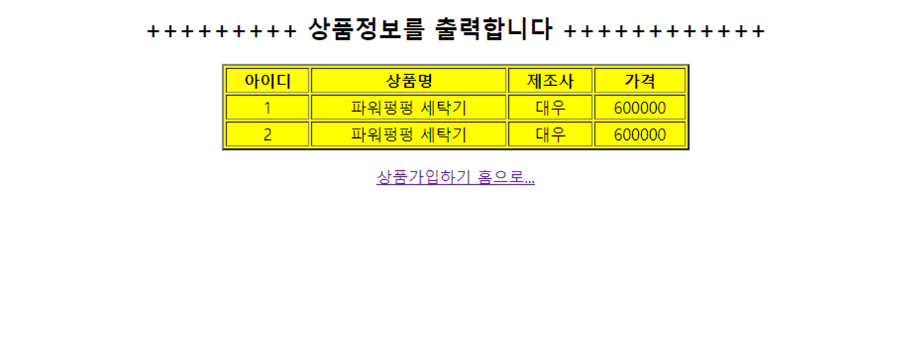
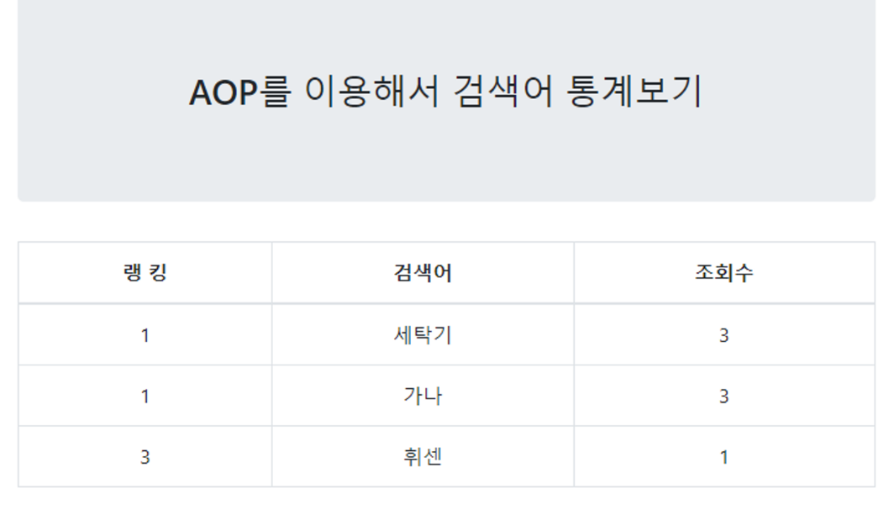
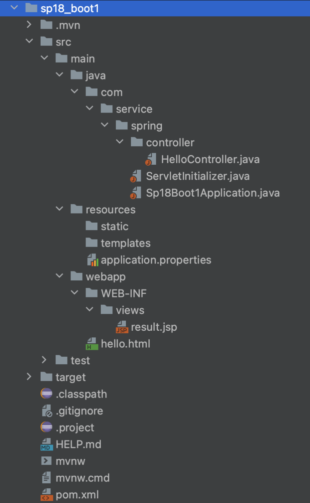

## AOP

`JoinPoint` 은 `Adivce` 의 **Cross Cutting Concern**이 `Target` 클래스의 어느 메소드, 어느 위치에 꽂히는 곳이다.

`JoinPoint` 스펙를 상세하게 적어놓은 것은 `PointCut` 이다.

저번 포스트의 AOP advice class 를 참고하자

```java
public class LoggingAdvice {
	private Log log = LogFactory.getLog(getClass());
	
	public void logPush(ProceedingJoinPoint pjp) throws Throwable{
        log.info("\ncheck...before logging...");

        Object ret=pjp.proceed();//target으로 weaving되는 시점
        System.out.println("target method return..."+ret);
	}
}
```

`ProceedingJoinPoint`가 `proceed()` 함수를 가지고 있는데, 이것이 **Target**이 호출되면 `proceed()` 가

호출되어 **Target**호출 위치를 감지한다.

따라서 그곳에 원하는 부분에 `Advice` 를 `weaving` 할 수 있는 것이다.

`Object ret=pjp.proceed()`

Target 함수의 return 타입으로 반환된다. 따라서 **ret**는 Target함수의 return타입이 들어간다.

```xml
<!-- Advice의 어떤 메소드가 Target에 어디로 weaving 되는지를 지정해줘야 한다. => <aop:config> -->
<!--Advice의 어떤 기능이 Target 메소드 호출 될 때 weaving 되는지를 자세히 설정하는 부분이다.  -->
<aop:config>
	<aop:aspect id="loggingAspect" ref="logging">
		<aop:pointcut expression="execution(* spring.aop..*(..))" id="pc"/> <!--Target의 확장자는 상관없고, spring.aop 밑에 아무거나 상관없이  -->
		<aop:around method="logPush" pointcut-ref="pc"/>
	</aop:aspect>
</aop:config>
```

`<aop:pointcut>`은 `Target` 의 어느 부분이 `JoinPoint` 인지 정해주고 있다.

(..) 앞에 있는 것은 함수 명이다.

*(..) : Target 클래스의 모든 함수에 적재했다.

spring.aop.Service : spring → aop → Service클래스 에 있는 모든 함수

spring.aop. : spring → aop 에 존재하는 모든 클래스

이렇게 `xml` 을 작성하면 길어질 수 있다.

따라서 `Annotation` 으로 만들어야 한다.

저번에 만들었던 LogginAdvice(Advice Class) 를 `Annotation` 으로 변환하자

```java
package spring.aop.anno;

/*
 * 부수적인 관심사만 모아 놓은 클래스...Cross Cutting Concern
 * Advice Class
 * Annotation으로 만든다는 의미는 aop설정을 코드로 작성한다는 의미
 */
//<aop:config> 설정 부분은 이제 xml에서 사라진다.
@Aspect
public class LoggingAdvice {
	private Log log = LogFactory.getLog(getClass());
	
	//Target 클래스 메소드의 return 타입이 String이고 spring패키지 아래에 있는 모든 하위 패키지 중에서 
	//클래스 이름이 Product로 시작하는 클래스 ...함수명이 delete로 시작하고...인자값이 1개 이상인
	@Around("execution(String spring..Product*.delete*(..))")
	public void logPush(ProceedingJoinPoint pjp) throws Throwable{
        log.info("\ncheck...before logging...");
        Object ret=pjp.proceed();//target으로 위빙되는 시점
        System.out.println("target method return..."+ret);
	}
}
```

위의 코드에서 주석을 잘 살펴보자.

`@Aspect` 을 처음에 선언해주고, `@Around` 를 `Cross Cutting Concern` 앞에 넣어준다.

위에 `Advice` 는 `Annotation` 으로 만들어서 `Bean` 설정 문서를 다시 설정해야 한다.

```xml
<?xml version="1.0" encoding="UTF-8"?>
<beans xmlns="http://www.springframework.org/schema/beans"
	xmlns:xsi="http://www.w3.org/2001/XMLSchema-instance"
	xmlns:aop="http://www.springframework.org/schema/aop"
	xsi:schemaLocation="http://www.springframework.org/schema/beans http://www.springframework.org/schema/beans/spring-beans.xsd
		http://www.springframework.org/schema/aop http://www.springframework.org/schema/aop/spring-aop-4.0.xsd">

<!-- Target 2개 (member, product),  Advice 1개 (logging)  -->
<bean id="member" class="spring.aop.anno.MemberService"/>
<bean id="product" class="spring.aop.anno.ProductService"/>
<bean id="logging" class="spring.aop.anno.LoggingAdvice"/>

<!--aopconfig을 annotation으로 했기 때문에 알려줘야 한다.  -->
<aop:aspectj-autoproxy></aop:aspectj-autoproxy> //추가!!!!!!!!!!!!!!!!!

</beans>
```

이전에 `xml` 에서 `aop` 가 다 사라지고 위에서 새롭게 추가한 한줄만 넣어주면 된다.

<br/>
<hr/>

### 검색어 순위 기능 구현

```html
<%@ page language="java" contentType="text/html; charset=UTF-8"
    pageEncoding="UTF-8"%>
<!DOCTYPE html>
<html>
<head>
<meta charset="UTF-8">
<title>Insert title here</title>
</head>
<body>
	<h2 align="center">Product Register Form...</h2>
	<form action="myProduct.do" method="post">
	상품명 : <input type="text" name="name"><br><br>
	제조사 : <input type="text" name="maker"><br><br>
	가  격  : <input type="text" name="price"><br><br>
	
	<input type="submit" value="상품등록">
	</form>
	
	+++++++++++++++++++++++++++++++++++++++++++++++++++
	<br><br>
	<form action="productSearch.do">
	상품명 검색  <input type="text" name="word"><br><br>
	<input type="submit" value="검색하기">
	</form>
	
	<p>
	<hr>
	<a href="report.do">검색어 순위보기</a>
</body>
</html>
```

먼저 상품명 검색에 상품명을 입력하고 검색하기 버튼을 누르면 “productSearch.do”로 요청이 들어간다.

```java
@RequestMapping("productSearch.do")
	public String findByProductName(String word, Model model)throws Exception{		
		
		System.out.println("ProductController...findByProductName() :: "+word);	
		model.addAttribute("list", myProductService.findByProductName(word));
		return "find_result";
	}
```

그리고 `find_result`로 네비게이션 해준다. 검색어는 *세탁기*를 검색해주었다.

{: .w-50 .align-center}
_(세탁기를 검색한 결과)_

```html
<%@ page language="java" contentType="text/html; charset=UTF-8"
    pageEncoding="UTF-8"%>
<!--  jstl :: 라이브러리 다운, taglib 선언-->
<%@ taglib prefix="c" uri="http://java.sun.com/jsp/jstl/core" %>
<!DOCTYPE html>
<html>
<head>
<meta charset="UTF-8">
<title>Insert title here</title>
<style type="text/css">
	td, h2{
		text-align: center;
	}
	table{
		background-color: yellow;
	}
</style>
</head>
<body>
	<h2>+++++++++ 상품정보를 출력합니다 ++++++++++++</h2>
	<table border="2" align='center' width="50%">
		<thead>
			<tr>
				<th>아이디</th><th>상품명</th><th>제조사</th><th>가격</th>
			</tr>
		</thead>
		<tbody>
			<c:forEach items="${list}"  var="vo">
				<tr>
					<td>${vo.id}</td>
					<td>${vo.name}</td>
					<td>${vo.maker}</td>
					<td>${vo.price}</td>
				</tr>
			</c:forEach>
		</tbody>
	</table>
	<p></p>
	<center><a href="product.jsp">상품가입하기 홈으로...</a></center>
</body>
</html>
```

이제는 메인페이지에서 **검색어 순위 보기** 를 누르면 `report.do`로 요청이 들어간다.

여기서 `AOP`기술이 들어간다. 

상품명이 검색이 되면 `Advice` 클래스가 개입해 얼마나 많이 검색했는지 검색어를 세어야 한다.

이때 `AOP`가 사용된다.

일단 먼저 검색어를 저장하기 위해 `report`라는 테이블을 새로만들어 주었다.

```sql
word -- 검색어
cnt --검색어가 얼마나 많이 검색되었는지
```

테이블이 새로 추가되었으므로 해당 DB 쿼리를 작성하기 위해 `mapping.xml`을 작성해야한다.

```xml
<?xml version="1.0" encoding="UTF-8"?>
<!DOCTYPE mapper PUBLIC "-//mybatis.org//DTD Mapper 3.0//EN"
	"http://mybatis.org/dtd/mybatis-3-mapper.dtd">
<mapper namespace="ns.sql.reportMapper">
	<insert id="insertReport" parameterType="string">
		INSERT INTO report VALUES(#{VALUE}, 1)
	</insert>

	<update id="updateReport" parameterType="string">
		UPDATE report SET cnt = cnt+1 WHERE word=#{VALUE}
	</update>
	
	<select id="selectReport" resultType="hashmap">
        <![CDATA[
            SELECT word, cnt, ranking FROM(
                SELECT word, cnt, rank() over(ORDER BY cnt DESC) as ranking
                FROM report
            )
            WHERE ranking <= 5
        ]]>
  </select> 
</mapper>
```

위 `xml` 파일을 기준으로 `DAO` 클래스와 `Service` 클래스를 만들어 주자.

먼저 `DAO` 클래스이다.

```java
// dao class
package com.service.spring.aop.model;

@Repository
public class ReportDAOImpl implements ReportDAO{
	
	@Autowired
	private SqlSessionTemplate sqlSession;
	public static final String NS="ns.sql.reportMapper.";
	
	@Override
	public void insertReport(String word) throws SQLException {
		sqlSession.insert(NS+"insertReport",word);
		
	}

	@Override
	public int updateReport(String word) throws SQLException {
		return sqlSession.update(NS+"updateReport",word);
	}

	@Override
	public List selectReport() throws SQLException {
		return sqlSession.selectList(NS+"selectReport");
	}
}
```

```java
// Service class
package com.service.spring.aop.model;

@Service
public class ReportServiceImpl implements ReportService{
	
	@Autowired
	private ReportDAO reportDAO;
	
	
	@Override
	public List selectReport() throws SQLException {		
		return reportDAO.selectReport();
	}

	@Override
	public void saveReport(String word) throws SQLException {
		int result=reportDAO.updateReport(word);	
		System.out.println(result+"***************************");
		if(result==0) //0이라는 것은 최초로 검색된 검색어라는 의미이다. 따라서 DB에 넣어준다.
			reportDAO.insertReport(word);
	}
}
```

`reportService` 의 함수는 2개

1. `selectReport`
    
    랭킹 순위 결과페이지
    
2. `saveReport`
    
    여기서 `AOP`가 적용된다
    

이제 `report.do`의 요청을 처리할 `Controller` 를 만들어준다.

```java
package com.service.spring.aop.controller;

@Controller
public class ReportController {
	
	@Autowired
	private ReportService reportService;
	
	@RequestMapping("/report.do")
	public String selectReport(Model model)throws Exception{
		
		model.addAttribute("list", reportService.selectReport());		
		return "report_result";
	}	
}
```

여기서는 그냥 순위 리스트만 받아서 `model` 에 저장해준다.

이제 `AOP` 가 들어가는 부분을 보자.

`Advice` 의 클래스를 보자

```java
// advice class
package com.service.spring.aop.advice;

@Component
@Aspect
@EnableAspectJAutoProxy //해당 Annotation을 사용하면 xml파일에 아무것도 쓸 필요가 없다
public class ReportAspect {
	@Autowired
	private ReportService reportService;	
	
	@Around("execution(* com.service..*Service*.find*(String))")	
	public Object report(ProceedingJoinPoint pjp)throws Throwable{
		Object retValue;
		
		retValue = pjp.proceed();//target 메소드가 호출..
		System.out.println("target call...");
		List list = (List)retValue;
		if(!list.isEmpty()) { //찾은 list가 있으면... cnt=cnt+1로 update해줘야 한다.
			Object[ ] params=pjp.getArgs();
			reportService.saveReport(params[0].toString());			
		}
		return list;
	}
}
```

**`com.service`** 패키지 또는 그 하위 패키지에 있는, 이름이 **`Service`**로 끝나는 클래스에, **`find`**로 시작하고 **`String`** 타입의 인자를 받는 모든 메서드를 대상으로 한다.

바로

```java
package com.service.spring.service;

public interface MyProductService {
	int addProduct(MyProduct vo) throws Exception;
	
	public List<MyProduct> findByProductName(String name)throws Exception;
}
```

`findByProductName`이다.

`findByProductName()` 이 호출되면 **Target**클래스이다.

이제 결과페이지인 `report_result.jsp`를 보자

```html
<%@ page language="java" contentType="text/html; charset=UTF-8"
    pageEncoding="UTF-8"%>
<%@ taglib prefix="c"  uri="http://java.sun.com/jsp/jstl/core" %>
<!DOCTYPE html PUBLIC "-//W3C//DTD HTML 4.01 Transitional//EN" "http://www.w3.org/TR/html4/loose.dtd">
<html>
<head>
<meta http-equiv="Content-Type" content="text/html; charset=UTF-8">  
<title>Insert title here</title>
<link rel="stylesheet" href="https://cdn.jsdelivr.net/npm/bootstrap@4.6.2/dist/css/bootstrap.min.css">
<script src="https://cdn.jsdelivr.net/npm/jquery@3.6.4/dist/jquery.slim.min.js"></script>
<script src="https://cdn.jsdelivr.net/npm/popper.js@1.16.1/dist/umd/popper.min.js"></script>
<script src="https://cdn.jsdelivr.net/npm/bootstrap@4.6.2/dist/js/bootstrap.bundle.min.js"></script>
</head>
<body>
	<div class="container  text-center">
	  <div class="jumbotron">
	  	<h3>AOP를 이용해서 검색어 통계보기</h3>
	  </div>  
	
	<table class="table table-bordered">
		<thead>
		<tr>
			<th>랭 킹</th><th>검색어</th><th>조회수</th>
		</tr>
		</thead>
		<c:forEach var="reportMap" items="${list}">
			<tr>		
				<td>${reportMap.RANKING}</td>
				<td>${reportMap.WORD}</td>
				<td>${reportMap.CNT}</td>
			</tr>
		</c:forEach>
	</table>
	</div>
</body>
</html>
```

{: .w-50 .align-center}
_(결과 화면)_

<br/>
<hr/>

## Spring Boot

1. Spring Boot는 `Tomcat server`가 내장되어져 있다.
2. Spring Boot는 `web.xml`이 제공되지 않는다.
3. `Context Path`가 잡히지 않는다. 없다.

{: .w-50 .align-center}

`com.service.spring` 하위에 모든것을 만들어야 한다.

그래야 `Spring Boot`의 영향을 받을 수 있다.

먼저 `Spring Boot` 서버를 가동시켜야 한다. 

바로 `Sq18Boot1Application.java` 를 실행시킨다.

```java
package com.service.spring;

import org.springframework.boot.SpringApplication;
import org.springframework.boot.autoconfigure.SpringBootApplication;

@SpringBootApplication
public class Sp18Boot1Application {

	public static void main(String[] args) {
		SpringApplication.run(Sp18Boot1Application.class, args);
	}
}
```
