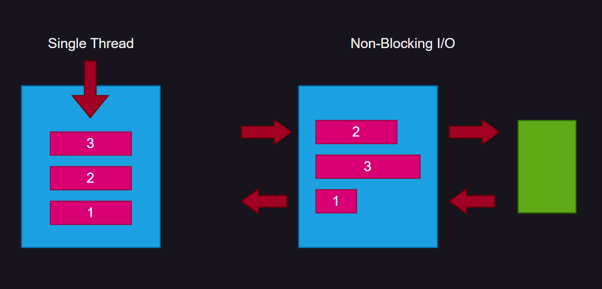

> 해당 페이지는 Node.js 의 동작과정과 Node.js 의 배경에 대해 포스팅 합니다.

## Node.js 의 탄생 배경

먼저 웹 환경을 구현하는 `HTML` 과 `CSS` `JS` 가 있다.

`HTML` 과 `CSS` 는 브라우저 내에 있는 `JavaScript` 엔진을 통해서 해석이 되게 된다.

그 중 구글의 `Chrome` 에서 만든 `v8` 이라는 엔진이 있는데

이 엔진이 개발되고 나서 자바스크립트의 속도가 비약적으로 빨라졌다.

사용도가 엄청나게 증가해 이 `v8` 엔진을 기반으로 생성된 `Node.js`

> 따라서 **Node.js** 는 **Chrome v8 JavaScript 엔진**으로 빌드된 **JavaScript 런타임**이다.
{: .prompt-tip}

여기서 `Runtime` 이란 동작할 수 있는 환경을 제공하는 것을 의미한다.

## Node.js 의 특징 및 구조

{: .w-50 .align-center}
_(특징과 구조)_

### Single Thread

작업을 처리하는 곳이 한 곳임

`JavaScript` 의 속성

### Non-Blocking I/O

앞선 작업이 오래 걸릴 경우 먼저 처리 된 결과를 반환

이 특징 때문에 Node.js 는 짧은 송신을 먼저 즉각적인 대응을 하는 `Messenger` 등에 유리 함

### NPM 을 통한 확장성

> `npm` 이란
>
> `Node.js`의 패키지지를 관리할 수 있는 도구 (Node Package Manager)
{: .prompt-tip}

다양한 Module(Package) 제공

필요한 기능이 미리 구현되어 있음
