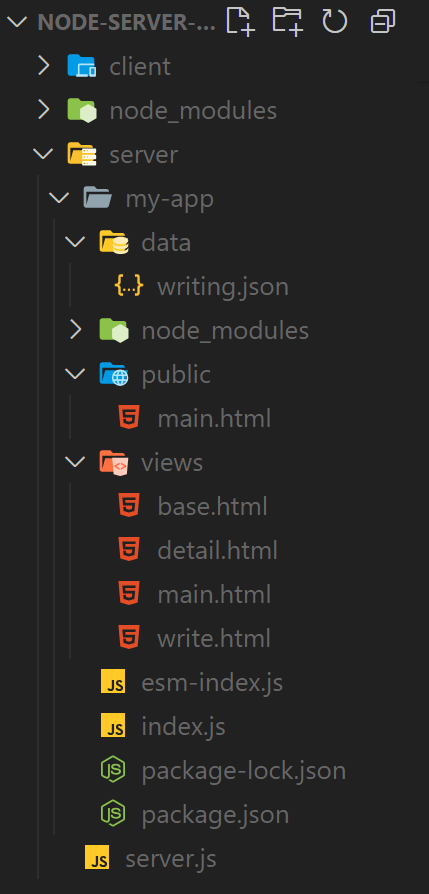
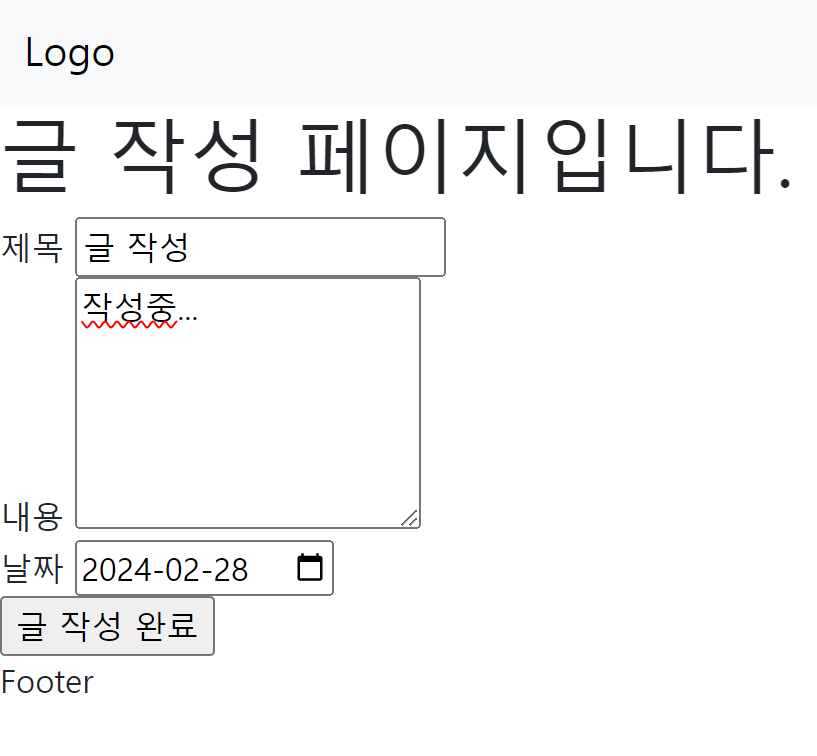
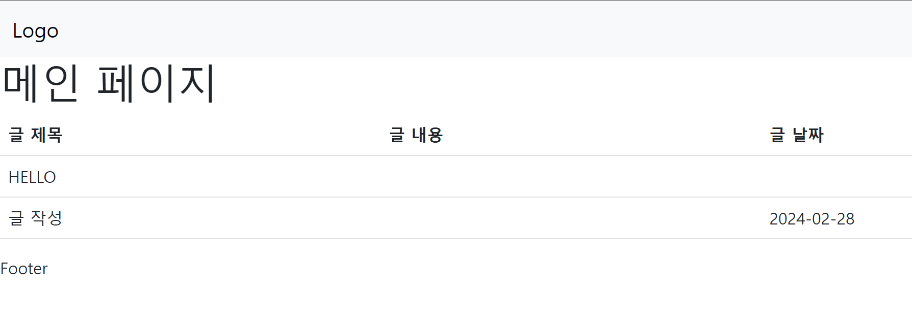

> Server 구현 시의 기본 설정과 서버 구현법에 대해 알아보는 포스트입니다.
{: .prompt-tip}

## CJS

> **CJS** 란?
>
> `Common JS` 의 약자로 순수 JavaScript 만을 사용한 서버 구현을 뜻함

1. 파일 단위로 캡슐화
2. `require` 함수를 사용하여 다른 `module(package)` 를 불러옴
3. `module.exports` 나 `exports` 를 사용하여 모듈의 함수나 객체를 외부에 공개함 

```javascript
const http = require('http');

const server = http.createServer((req, res) => {
  res.writeHead(200, { "Content-Type": "text/plain" });
  res.write("Hello Node.js! CJS!");
  res.end();
});

server.listen(3000, () => {
  console.log("Server is listening on port 3000 ...");
});
```


## ESM

> `ECMAScript Module` 의 약자로 JavaScript 의 공식 모듈 시스템

1. `import` 문을 사용하여 다른 모듈이나 라이브러리의 기능을 불러옴
2. `export` 문을 사용하여 모듈의 함수, 클래스, 변수 등을 외부에 공개
3. `ESM` 은 모듈 로딩을 비동기적으로 처리할 수 있음
4. 코드의 구조를 더 명확하게 하고, 모듈 간의 의존성 관리를 용이

```json
{
    "name": "my-app",
    "version": "1.0.0",
    "description": "test node.js folder",
    "main": "index.js",
    "type": "module"
    
    // 중략...
}
```
> 사용하기 위해 `type` 을 `module` 로 걸어주어야 한다.


```javascript
import { createServer } from "http";
// 내가 원하는 모듈을 사용한다. import 문과 동일

const server = createServer((req, res) => {
  res.writeHead(200, { "Content-Type": "text/plain" });
  res.write("Hello Node.js! ESM!");
  // 항상 response 를 사용해 응답할 때는
  res.end();
  // 응답을 끝내주어야 한다!
});

server.listen(3000, () => {
  console.log("Server is listening port 3000 ...");
});
```

<br/>
<hr/>

## Nodemon

> `Node.js` 서버를 킬 때, 코드 변경이 즉각 반영되지 않는다.
> 
> 즉각 반영되게 해주는 라이브러리

``` terminal
npm install nodemon -D
```

<br/>
<hr/>

## Express 란?

> `Express`는 `Node.js`의 핵심 모듈인 `HTTP`를 추상화하여 라우팅, 요청 처리, 오류 관리 등
>
> 기능을 간결하고 효율적인 방식으로 구현할 수 있도록 도와주는 라이브러리
>
> 즉, `Express` 는 여러 `middleware`의 연결


```javascript
import express from 'express';

const app = express();
const port = 3000;

// 루트 경로에 대한 GET 요청 처리
app.get('/', (req, res) => {
  res.send('Hello World!');
});

// 서버 시작
app.listen(port, () => {
  console.log(`Example app listening at http://localhost:${port}`);
});
```

<hr/>
<br/>

## FS

>  `File System`을 의미하며, 파일 시스템에 접근하여
>
> 파일을 생성, 읽기, 쓰기, 삭제 및 수정 등의 작업을 수행할 수 있는 API를 제공

<hr/>
<br/>

## Template Engine

> 페이지를 만들 때마다 Rendering 할 html 파일을 계속해서 생성할 수 없다.
>
> 따라서 `Template` 화 하여 사용해야 Code 재사용성도 높아지며 가독성도 좋아진다.
>
> 이러한 동작을 도와주는 것이 `Template Engine` 이다.
>
> `Mustache` , `Pug` , `Nunjucks` 가 대표적이며 연습에서는 `Nunjucks` 를 사용할 것이다.

<hr/>
<br/>

## Server 동작 기초 예시

{: .w-50 .align-center}
_(file directory)_

```javascript
import express from "express";
import nunjucks from "nunjucks";
import bodyParser from "body-parser";
import fs from "fs";
import path from "path";

const app = express();
const __dirname = path.resolve();

// file path
// my-app/data/writing.json 으로 경로 지정
const filePath = path.join(__dirname, "data", "writing.json");

// body parser set
app.use(bodyParser.urlencoded({ extended: false })); // express 기본 모듈 사용
app.use(bodyParser.json());

// view engine set
app.set("view engine", "html"); // main.html -> main(.html)

// nunjucks
nunjucks.configure("views", { // views folder 내에 있는 변경 값을 watch
  watch: true, // html 파일이 수정될 경우, 다시 반영 후 렌더링
  express: app,
});

// middleware
// main page GET
app.get("/", (req, res) => {
  const fileData = fs.readFileSync(filePath);
  const writings = JSON.parse(fileData);
  console.log(writings);

  res.render("main", { list: writings });
  // main.html 의 list 에 props 전달
  // list 는 이제 nunjucks 에 의해 값을 활용 가능
});

app.get("/write", (req, res) => {
  res.render("write");
});

app.post("/write", async (req, res) => {
  const title = req.body.title;
  const contents = req.body.contents;
  const date = req.body.date;

  // data 저장
  // data/wriring.json 에 값 저장

  const fileData = fs.readFileSync(filePath);
  console.log(fileData); // 파일 읽기

  const writings = JSON.parse(fileData);
  console.log(writings); // 파일 변환

  // request 데이터 저장
  writings.push({
    title: title,
    contents: contents,
    date: date,
  });

  // data/writing.json 에 저장하기
  fs.writeFileSync(filePath, JSON.stringify(writings));

  res.render("detail", {
    detail: { title: title, contents: contents, date: date },
  });
});

app.get("/detail", async (req, res) => {
  res.render("detail");
});
app.listen(3000, () => {
  console.log(`
  ███╗   ██╗ ██████╗ ██████╗ ███████╗        ██╗███████╗
  ████╗  ██║██╔═══██╗██╔══██╗██╔════╝        ██║██╔════╝
  ██╔██╗ ██║██║   ██║██║  ██║█████╗          ██║███████╗
  ██║╚██╗██║██║   ██║██║  ██║██╔══╝     ██   ██║╚════██║
  ██║ ╚████║╚██████╔╝██████╔╝███████╗██╗╚█████╔╝███████║
  ╚═╝  ╚═══╝ ╚═════╝ ╚═════╝ ╚══════╝╚═╝ ╚════╝ ╚══════╝
                                                        
  `);
});

```

{: .w-50 .align-center}
{: .w-50 .align-center}
{: .w-50 .align-center}

```json
[
  { "title": "HELLO", "contents": "123", "date": "" },
  { "title": "글 작성", "contents": "작성중...", "date": "2024-02-28" }
]
```
_(정상적으로 json 에 data 가 들어간 것을 볼 수 있음)_