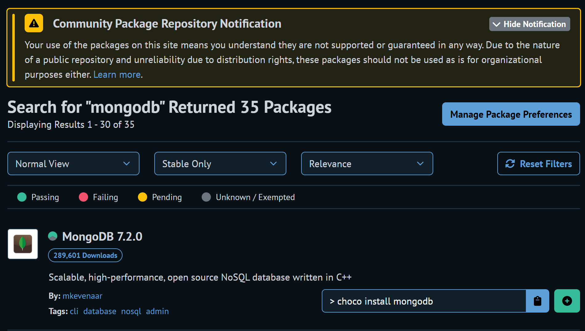
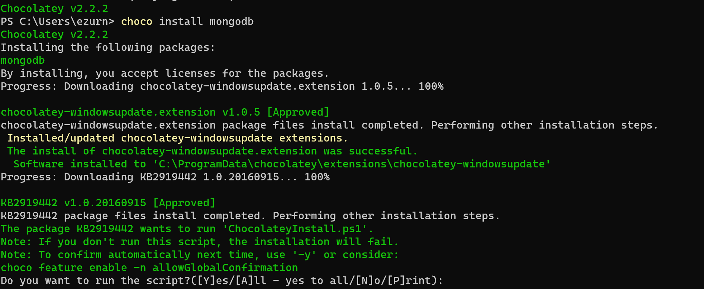
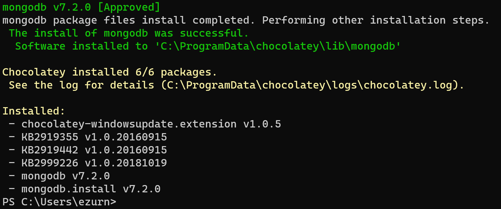
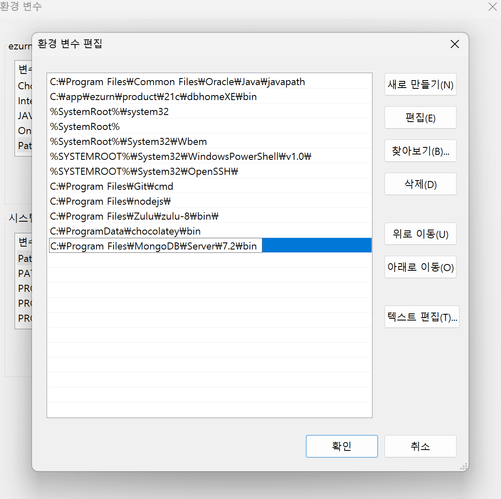
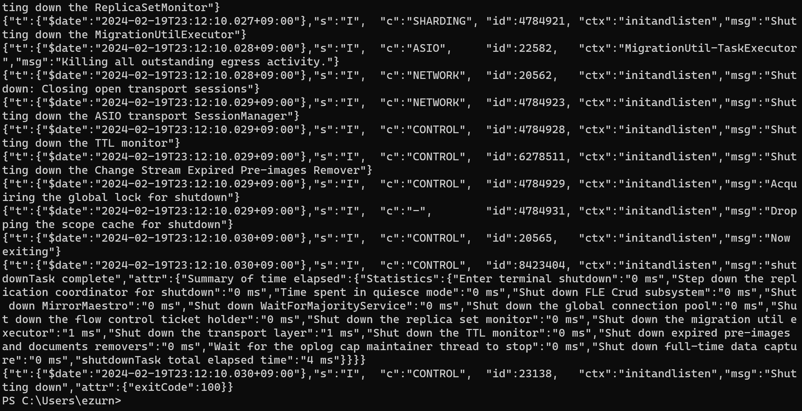
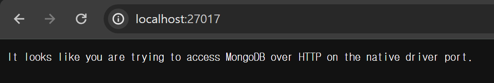
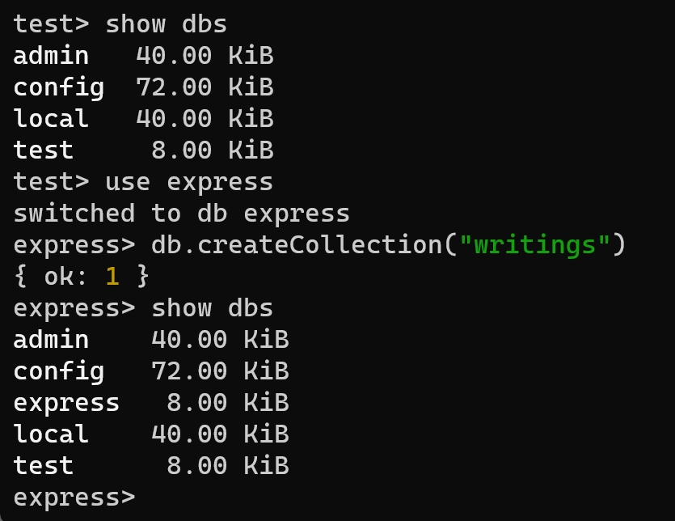
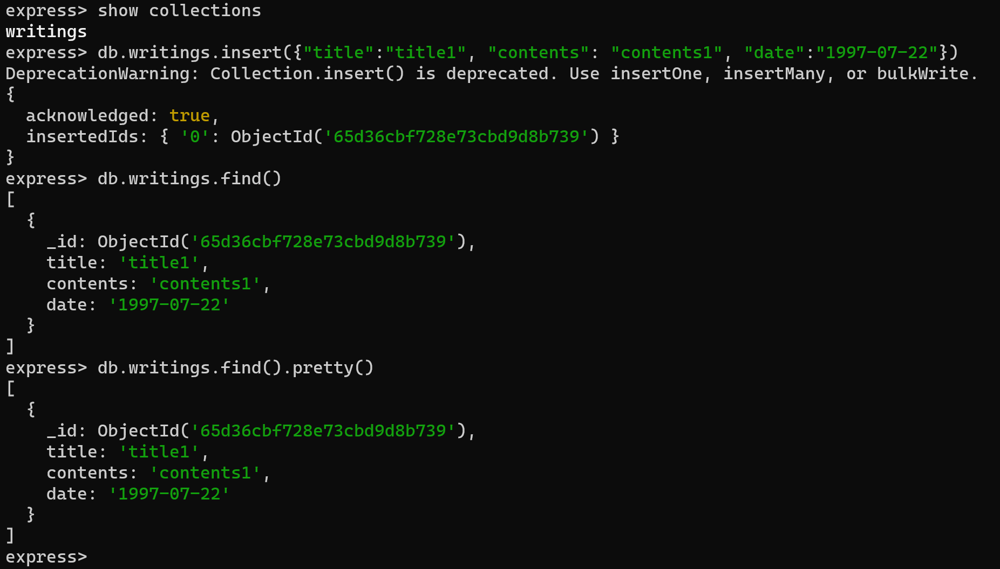

> Node.js 를 사용하기 위해 MongoDB 를 설치 및 설젛아는 포스트입니다.
{: .prompt-tip}

## Database 의 종류

관계형과 비 관계형으로 데이터를 저장, 조회, 관리하는 방식에서 종류를 나눌 수 있다.
 
데이터 모델링, 애플리케이션의 요구 사항, 성능 고려 사항을 결정

### 관계형 DB
> `MySQL`, `Oracle`, `SQLite`

### 비 관계형 DB
> `MongoDB`, `Redis`, `Hadoop`

<br/>
<hr/>

## MongoDB 의 특징

1. 비 관계형 데이터베이스
2. Document-oriented Database (문서지향 데이터베이스)
3. Document (데이터 구조가 key , value 의 하나 이상의 쌍으로 구성, 모든 데이터가 JSON 형태)
4. Collection (Document 의 그룹 단위로 이루어짐)

으로 크게 특징을 4 가지로 볼 수 있다.

## MongoDB 설치

`MongoDB` 를 설치를 `terminal` 로 편하게 하기 위해 우선적으로 `Chocolatey` 를 설치 먼저 한다.

### Chocolatey 설치

`Linux` 의 `Brew` 처럼 편하게 모듈을 설치 할 수 있는 툴 `Chocolatey` 를 설치 한다.

[Chocolatey 공식문서](https://chocolatey.org/install)

```powershell
Get-ExecutionPolicy
```

를 먼저 실행 해 `Restricted` 모드인지 확인한다.

만약 `Restricted` 일 경우

```powershell
Set-ExecutionPolicy AllSigned
# or
Set-ExecutionPolicy Bypass-Scope Process
# 를 사용해 모드를 변경해준다.
```

``` powershell
Set-ExecutionPolicy Bypass -Scope Process -Force; [System.Net.ServicePointManager]::SecurityProtocol = [System.Net.ServicePointManager]::SecurityProtocol -bor 3072; iex ((New-Object System.Net.WebClient).DownloadString('https://community.chocolatey.org/install.ps1'))

# 을 사용해 chocolatey 를 설치해준다!
```

```powershell
choco-?
```

을 사용해 버전이 나온다면 정상적으로 설치가 된 것이다.

> 만약 설치가 정상적으로 되지 않는다면 Powershell 을 관리자 권한으로 실행시켜 다시 진행한다.
{: .prompt-danger}

<br/>

### MongoDB 설치

방금 설치한 `Chocolatey` 를 사용해 쉽고 간편하게 `MongoDB` 모듈을 찾을 수 있다.

[Chocolatey-package-mongodb](https://community.chocolatey.org/packages?q=mongodb)

{: .w-50 .align-center}
_(우측의 choco install mongodb 값이 입력 값이다.)_

해당 값을 `powershell` 에 입력하면

{: .w-50 .align-center}

추가사항 선택 여부를 물어보는데, `A` 를 눌러 전체 동의를 한다.

{: .w-50 .align-center}
_(정상적으로 설치 된 모습)_


#### 환경변수 설정

설치를 마쳤을 경우 환경변수 `Path` 를 설정해주어야 한다.

따라서 내 컴퓨터 내 `MongoDB` 의 bin 폴더 위치를 확인해야 한다.

작성자는 `C:\Program Files\MongoDB\Server\7.2\bin` 였으므로

{: .w-50 .align-center}

환경변수를 추가해준다.

{: .w-50 .align-center}
_(mongod 를 입력해 해당 화면처럼 나오면 정상적으로 설치 완료)_

```powershell
mongosh
# mongodb 실행
# 해당 명령어로 mongodb 는 27017 port-number 를 사용하는 것을 알 수 있음
```

## Mongoose 란?

`Mongoose` 는 `Schema` 라는 것을 제공하는데, `Schema` 는 데이터 처리를 쉽게 도와주는 구조라고 보면 된다.

따라서 해당 기능을 통해 `Node.js` 에서 데이터를 조금 더 편리하게 다룰 수 있게 도와줌

### Schema 의 종류

1. String
2. Number
3. Date
4. Boolean
5. Buffer
6. Mixed (모든 데이터 타입 가능, likes Any...)
7. ObjectedId (객체 ID)
8. Array


### Mongoose 설치 및 연결

정상적으로 `MongoDB` 설치를 마쳤으면 이제 사용할 환경에 `MongoDB` 를 연결해 줄

`Mongoose` 를 설치해준다.

```powershell
npm install mongoose
```

그 후 `localhost:27017` 로 접속해 보면

{: .w-50 .align-center}

정상적으로 설치는 되었지만, 브라우저는 접근할 수 없다는 메세지가 나타난다.

``` javascript
import mongoose from "mongoose";

// mongoose connect
mongoose
  .connect("mongodb://127.0.0.1:27017")
  .then(() => {
    console.log("mongoDB connection success...");
  })
  .catch((error) => console.error(error));

// mongoose set
const { Schema } = mongoose;
const WritingSchema = new Schema({
  title: String,
  contents: String,
  dates: {
    type: Date,
    default: Date.now,
  },
}); // Schema 를 설정

const Writing = mongoose.model("Writing", WritingSchema);
// Writing은 Writing 이라는 이름으로 WritingSchema 의 형태를 띈다고 지정
```

우리가 사용할 `Node.js` 의 server 파일에 해당 값을 추가해 우리가 사용할 Schema 형식을 지정해주고

`Mongoose` 를 통해 `Browser` 와 `mongoDB` 를 연결 해준다.

정상적으로 연결 된 것을 터미널에서 확인 한 후

`MongoDB` 에 `Schema` 를 추가해 준다.

{: .w-50 .align-center}

1. `show dbs` > 현재 존재하는 database 들을 출력
2. `use express` > express 라는 이름으로 database 를 선택. 없으면 생성도 함
3. `db.createCollection("writings")` > writings 라는 collection 을 생성

{: .w-50 .align-center}

4. `show collections` > 현재 선택 된 db 에 존재하는 collection 목록 출력
5. `db.writings.insert(...)` > db 의 wiritings collection 에 값을 추가
6. `db.writings.find().pretty()` > 포함 된 object 값들을 출력

```javascript
app.post("/write", async (req, res) => {
  const title = req.body.title;
  const contents = req.body.contents;
  //   const date = req.body.date;

  // mongodb 저장
  const writing = new Writing({
    title: title,
    contents: contents,
  });

  const result = await writing
    .save()
    .then(() => {
      console.log("Writing Success...");
      res.render("detail", {
        detail: { title: title, contents: contents, date: date },
      });
    })
    .catch((error) => {
      console.error(error);
      res.render("write");
      // 실패했을 때
    });
  // db 에 값을 넣는 거는 오래걸리므로 비동기로 걸어주어야 함
  // 만든 writing 을 저장시켜준다.
});
```