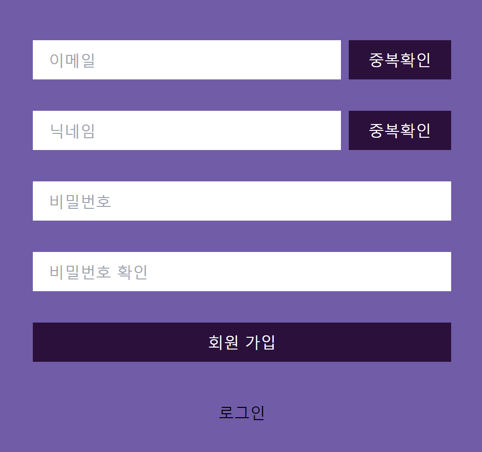

## 왜?

미루고 미뤘던 회원가입의 중복확인 로직을 만들어야했다.

{: .w-50 .align-center}
_(아주 간단한 회원가입 폼을 먼저 만든다)_


현재 96TALK 프로젝트 내에서는 `react-hook-form` 라이브러리를 사용 중인데

중복확인을 두번 해야 하는 상황에 놓였다.

> 이메일 validation 을 통과 했을 때에만 Server에 중복확인 요청 할 순 없을까?
{: .prompt-tip }


오늘은 해당 라이브러리에서 유용한 `trigger` 를 소개하려고 한다.

<hr/>

## 라이브러리 설치

```
npm install react-hook-form
```

## 사용 법

```tsx
// Signup.tsx
const { trigger } = useForm();
```


1. `trigger()` 함수를 가져온다.
2. `trigger()`는 비동기 함수이기에 그에 맞게 `async ... await` 을 걸어준다.
3. `argument` 로 `register` 에서 등록한 값을 넣어주면 해당 input 의 validation 을 검사한다.
4. 검사 후 통과면 **true**, 실패면 **false** 를 반환해주므로 반환값으로 로직 처리


```tsx
// Singup.tsx
  const {
    register,
    handleSubmit,
    formState: { errors },
    setError,
    getValues,
    clearErrors,
    trigger, // trigger 함수를 가져온다
  } = useForm<ISignupProps>();

const onDuplicateEmailCheck = async () => {
const target = getValues("memberEmail");
const isValid = await trigger("memberEmail");
    if (isValid) {
      // Validation 성공 시
      try {
        const response = await getDuplicateEmail(target);
        // API 요청 후 응답 값 받기

        if (response?.status === 200 && response?.data?.status === 200) {
          // 사용가능 한 메일일 경우
          setIsLoginMessage("사용가능한 이메일 입니다.");
          clearErrors("memberEmail");
        }
      } catch (error) {
        setIsLoginMessage("중복된 이메일 입니다.");
        setError("memberEmail", { message: "회원가입 조건이 맞지않습니다." });
      }
    } else {
        // Validation 실패 시
    }
  };
```

## 마치며

> ~~역시나 공식 문서를 뒤져보면 다 나온다...~~
>
> 백앤드 서버에서도 `validation` 을 하지만 이중처리를 하는게 가장 좋기 때문에
>
> 중복확인 따로 재차 검증 할 수 있는지 알아보았다. 결국은 성공.
{: .prompt-info }
