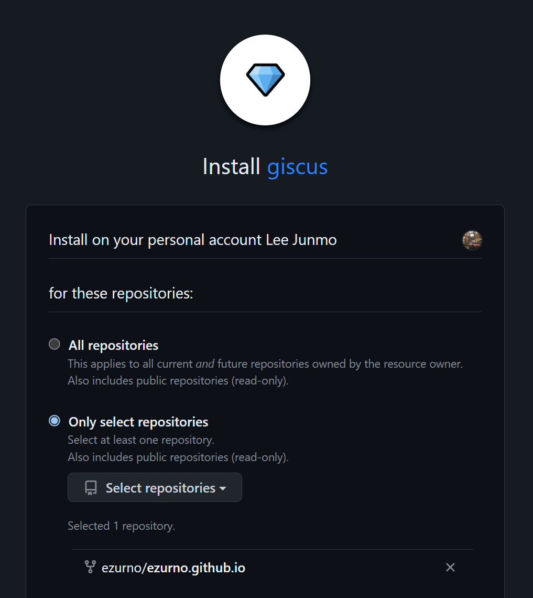
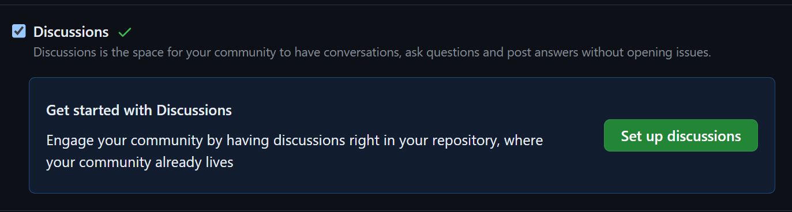
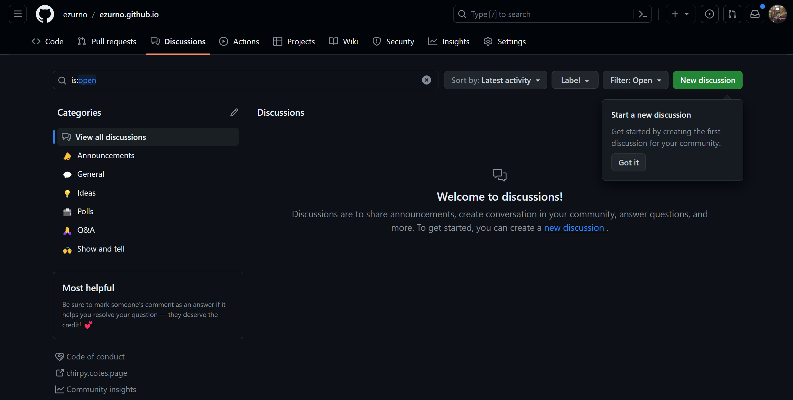
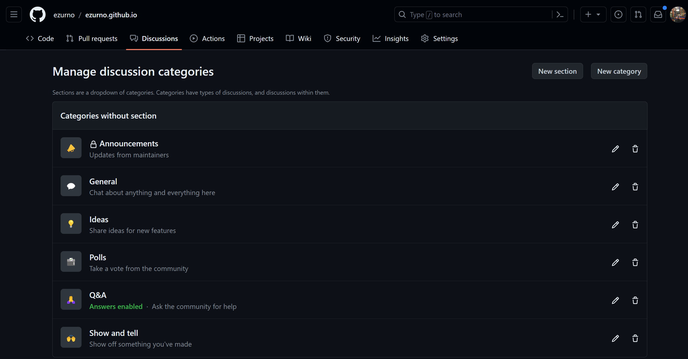
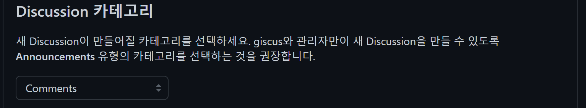
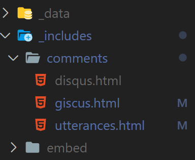
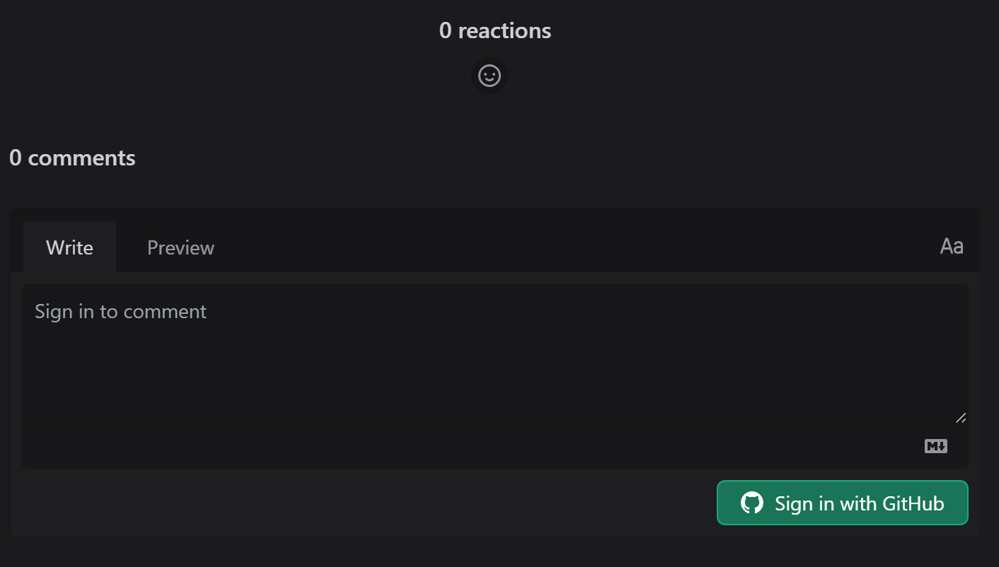

## 비교

우리 도토리 숲 블로그에도 댓글 기능을 추가하고 싶었다.

종류는 생각보다 다양했는데,

`utterances`, `disqus`, `giscus` 이렇게 세가지를 자주 쓰는 것 같았다.

<br/>

_~~하지만 그 때문에 또 고민에 빠지게 됐다.~~_

많은 고민 끝에 `disqus`, `giscus` 로 추렸다. 이 둘은 `github` 기반으로 작동한다고 하기 때문

<br/>

하지만

`disqus` 는 `issue` 기반으로 관리하고

`giscus` 는 `discussion` 을 사용한다는 말을 듣고

댓글이 `issue` 와는 맞지 않는다 판단하여 `giscus` 를 선택했다.

<hr/>

## 적용방법

### 1. [giscus 설치](https://github.com/apps/giscus)

{: .w-50 .align-center}
_(내가 사용할 repo 에 giscus 를 설치를 한다)_


<br/>

### 2. Repo 내 discussion 생성

{: .w-50 .align-center}
_(Repo > Setting > 하단 > discussion Click)_

<br/>

### 3. Repo > Discussions

{: .w-100 .align-center}
_(new discussion 을 클릭한다.)_


{: .w-100 .align-center}
_(새로운 카테고리를 생성)_

{: .w-100 .align-center}
_(Comments 라고 작성 후 Announcement 로 설정 후 저장)_

<br/>

### 4. giscus 설정하기

> 먼저 [giscus 앱 문서](https://giscus.app/ko) 로 이동 해준다.
>
> 저장소를 사용할 repo 명을 입력해 준 후

{: .w-100 .align-center}
_(방금 생성한 Comments 를 적용 시켜준다.)_

<br/>

하단에 나오는 `script-tag` 를 복사해준다.

```html
<script src="https://giscus.app/client.js"
        data-repo="[ENTER REPO HERE]"
        data-repo-id="[ENTER REPO ID HERE]"
        data-category="[ENTER CATEGORY NAME HERE]"
        data-category-id="[ENTER CATEGORY ID HERE]"
        data-mapping="pathname"
        data-strict="0"
        data-reactions-enabled="1"
        data-emit-metadata="0"
        data-input-position="bottom"
        data-theme="dark"
        data-lang="ko"
        crossorigin="anonymous"
        async>
</script>
```

### 5. Jekyll 에 설정 부여하기

`_config.xml` 으로 이동 한 후

```yml
comments:
  active: giscus 

        # 중략

  giscus:
    repo: # 사용할 레포 명
    repo_id: # 복사해 왔던 script 내 repo_id
    category: # script 내 category 값 입력
    category_id: # script 내 category_id 고유 값 입력
```

### 6. Dark / Light mode Theme 부여하기

{: .w-50 .align-center}
_(_includes > comments > giscus.html 로 이동한다)_

``` html
<!-- https://giscus.app/ -->
<script type="text/javascript">
  (function () {
    const origin = 'https://giscus.app';
    const iframe = 'iframe.giscus-frame';
    const lightTheme = 'light_protanopia';
    const darkTheme = 'noborder_dark';

    let initTheme = lightTheme;
    const html = document.documentElement;
```

해당 태그 내 `lightTheme` 과 `darkTheme` 을 전에 방문했던 [giscus 앱 문서](https://giscus.app/ko)

에서의 사용하고 싶은 `Theme` 을 적용해준다.

{: .w-100 .align-center}
_(아주 이쁘게 잘 적용 됐다.)_

<hr/>

## 마치며

아무리 잘 만든 블로그여도 댓글 기능이 없으면 그저 메모 작성에 불과한 것 같아 시작했는데,

생각보다 결과물이 잘나온 것 같고 간단해서 놀랐다.

대성공 대만족