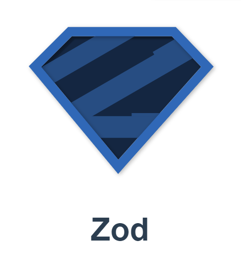

> library 중 `Zod` 를 활용한 validation 에 대해 알아보는 포스트 입니다.


## 개요

요즘 ~~한가로이~~ `NextJS 14`에 대해 배워나가는 중...

`NextJS 14`에서는 `Server Action` 과 `Zod` 를 활용해 API 연결을

보다 더 간결하게 한다는 말을 듣고 알아보게 되었다.

먼저 `Server Action` 에 대해 알아보자

<br/>
<hr/>

## Server Action 이란

> 간단하게 말해 서버에서 작동하게끔 하는 것
{: .prompt-tip}

그렇다. 뜻풀이 그대로 서버에서 구동 가능하게 하는 것이다.

여태 현대 웹의 API 통신을 보면

```ts
//api.ts
export default async function getData() {
  return axios.get()...
}
```

이런 식으로 `api` 를 따로 관리하는 파일을 생성해

함수들을 집어넣곤 한다.

그러다 보니 `api` 함수를 외부로부터 관리하기도 어려워진다.

하지만 `Next 14` 에서는 새로운 기능을 제공한다고 한다.

애초에 api 에 접근하는 것을 `Server` 에서만 작동하게 하는 것이다.

| "use server" | "use client" |
|:-------------|:-------------|
|서버 측에서 구동| 클라이언트 측에서 구동|


```ts
"use server";

/**
 * preState 는 초기값, formData 는 전송할 데이터
*/
export default async function onSubmit(prevState: any, formData: FormData) {
  "use server";
  // 서버 내에서만 작동되는 함수
  console.log("SEND FORM");

  await new Promise((resolve) => setTimeout(resolve, 5000));
  // 임시로 만든 api 함수 대용. 통신 딜레이를 5초를 준다
  // redirect("/");

  return {
    errors: ["wrong password", "password too short"],
    // 임시 에러 목록 반환
  };
}
```

그 후 요청이 진행 중인지, 요청이 만료되었는지 여부를 알기위해

`useFormState` 와 `useFormStatus` 를 활용한다.

### useFormState

- 흔히 아는 `useState` 와 사용 방법이 비슷하다.
- `action` 발생 시 작동할 함수 하나와 값을 가져올 초기 값을 매개변수로 가져야 한다.

```ts
//  인터랙티브 한 동작이므로
"use client";

/* 생 략 */

/*
1. "use client"
2. form 제출 시 작동할 action 과 초기값 state 등록
3. form action 에 걸어주면 끝!
*/

export default function Login() {
  const [state, action] = useFormState(onSubmit, null);
  return (
    <div>
      <form action={action} className="flex flex-col gap-3">
      // form 의 action 에 useFormState action 을 걸어준다!
        <Input
          type={"email"}
          placeholder={"Email"}
          required={true}
          name={"email"}
        />
        <Input
          type={"password"}
          placeholder={"Password"}
          required={true}
          name={"password"}
        />

        <FormButton text={"Login"} />
      </form>
      <SocialLogin />
    </div>
  );
}
```

### useFormStatus

- 주로 `<form>` 내 `<button>` 에 걸며 현재 form 의 전송 상태를 알아볼 수 있다.
- `pending` 이라는 `boolean` 타입 변수를 활용해 값을 제어한다.

```ts
"use client";

/*
1. "use client"
2. const { pending } = useFormStatus();
3. pending 으로 상태동작을 체크할 수 있다.
*/

interface IFormButtonProps {
  text: string;
}

export default function FormButton({ text }: IFormButtonProps) {
  const { pending } = useFormStatus();
  // action 이 끝났는지 여부를 알 수 있음

  return (
    <button
      disabled={pending}
    >
      {pending ? "로딩 중 ..." : text}
    </button>
  );
}
```

{: .w-50 }
_(server 내에서 정상적으로 값이 들어오는 모습)_

여태 껏 `state` 를 통해 form 값을 관리해서 object 로 전달해왔었는데

정말 신기한 방법이다.. 기존의 방법인 api 보다 훨씬 편하기도하고

서버 측에서만 동작이 된다는 점이 정말 큰 메리트 인 것 같다.

사실 아직은 안드로이드 환경이나 다른 외부 `api` 에서는 아직은 기존의

방법을 사용하는 것 같지만 매우 유용한 방법인 것 같다.


<br/>
<hr/>

## Zod 란?

{: .w-50 }
_[(공식 홈페이지 링크)](https://zod.dev/)_

드디어 대망의 내가 이 포스트를 작성하는 이유가 찾아왔다.

일단 `Zod` 가 무엇이냐면

>  스키마 선언을 통한 유효성 검사 라이브러리
{: .prompt-tip}

라고 한다. 더 자세히 알아보자.

<br/>
<hr/>

### 사용하는 이유

`zod` 를 자주 활용하는 이유는 `TypeScript`의 한계 때문이라고 한다

`TypeScript`는 컴파일 시점에서의 타입에러만 잡아낼 수 있고

런타임 단계에서의 타입 에러는 어쩔 방도가 없다.

왜냐면 런타임 단계에서 작동되는 것은 `JavaScript` 이기 때문이다.

또한 원하는 문자열이나 원하는 숫자 범위를 강제하거나 `number`

타입의 정수/실수 구분은 불가능하기 때문에 TypeScript 에서의

한계를 극복하기 위해 요즘은 `Zod` 를 자주 활용한다고 한다.

### 설치 방법

```terminal
npm install zod
```

### 스키마 형태로 정의

```ts
"use server";
import { z } from "zod";

// zod 는 validation 을 schema 형식으로 검증함
const formSchema = z
  .object({
    username: z
      .string()
      .min(3)
      .max(10)
      .toLowerCase()
      .trim(),
    email: z
      .string()
      .email()
      .toLowerCase()
      .trim(),
    password: z
      .string()
      .min(10),
    confirmPassword: z.string(),
  });
```

`Zod` 는 데이터 형식을 Schema 형태로 저장 및 관리한다.

매우 직관적이다. 해당하는 값이 `Schema` 에 적합한지 여부를 확인할 땐

`parse()` 와 `safeParse()` 를 사용한다.

|parse()|safeParse()|
|:------|:----------|
|에러를 반환|에러를 반환하지 않음|

이라는 차이점이 존재하는데, 두개는 거진 취향 차이인 것 같다.

나는 이번엔 기존의 `api` 구문처럼 `try-catch` 문을 최소화 해보고 싶어

`safeParse()` 를 활용했다.

```ts
/*
1. 해당 스키마에 적합한지 parsing
2. 성공하면 success 이므로 에러 핸들링
3. flatten 함수로 에러를 보기편하게 리폼
*/
  let result = formSchema.safeParse(data);
  // error 를 반환하지 않음
  if (!result.success) {
    console.log(result.error.flatten());
    return result.error.flatten();
  } else {
    console.log(data);
  }
```

해당 스키마에 맞지 않는 구문이 생기면 에러가 콘솔에 찍힌다.

```terminal
  issues: [
    {
      code: 'invalid_type',
      expected: 'string',
      received: 'null',
      path: [Array],
      message: 'Expected string, received null'
    },

 <!-- 생략 -->
{
  formErrors: [],
  fieldErrors: {
    username: [ 'Expected string, received null' ],
    password: [ 'String must contain at least 10 character(s)' ],
    confirmPassword: [ 'String must contain at least 10 character(s)' ]
  }
}

<!-- flatten() 으로 reform 한 값 -->
```

우리는 여기에 추가로 `validation` 을 상세하게 적을 수 있다.

### 코드 예시

```ts
"use server";
import { z } from "zod";

const passwordRegex = new RegExp(
  /^(?=.*?[A-Z])(?=.*?[a-z])(?=.*?[0-9])(?=.*?[#?!@$%^&*-]).+$/
);

// zod 는 validation 을 schema 형식으로 검증함
const formSchema = z
  .object({
    username: z
      .string({
        invalid_type_error: "형식이 틀립니다.",
        required_error: "유저 명을 입력해주세요.",
      })
      .min(3, "유저 명이 너무 짧습니다.")
      .max(10, "유저 명이 너무 깁니다.")
      .toLowerCase()
      .trim(),
    email: z
      .string({
        invalid_type_error: "형식이 틀립니다.",
        required_error: "이메일을 입력해주세요.",
      })
      .email({
        message: "이메일 형식이 아닙니다.",
      })
      .toLowerCase()
      .trim(),
    password: z
      .string({
        invalid_type_error: "형식이 틀립니다.",
        required_error: "비밀번호를 입력해주세요.",
      })
      .min(10, {
        message: "비밀번호가 너무 짧습니다.",
      })
      .regex(passwordRegex, {
        message:
          "비밀번호는 숫자, 대문자, 소문자, 특수기호를 포함하여야 합니다.",
      }),
    confirmPassword: z.string(),
  })
  .refine((data) => data.confirmPassword === data.password, {
    message: "비밀번호가 서로 다릅니다.",
    path: ["confirmPassword"],
  });
  // refine() 으로 유효성 검사를 전체적으로 진행이 가능하며
  // path 로 에러의 위치를 반환해줄 수 있음

export default async function createAccount(preState: any, formData: FormData) {
  const data = {
    username: formData.get("username"),
    email: formData.get("email"),
    password: formData.get("password"),
    confirmPassword: formData.get("confirmPassword"),
  };

  let result = formSchema.safeParse(data);
  // error 를 반환하지 않음
  if (!result.success) {
    console.log(result.error.flatten());
    return result.error.flatten();
  } else {
    console.log(data);
  }
}
```

## 마치며

~~진짜 굉장히 편하다 Next 쓰는 이유가 있네~~

Zod 를 처음 볼땐 생소하기도 하고 굳이 써야하나 싶었는데,

`Validation` 은 신중하고 정확해야 하는데 컴파일 단계 뿐만이 아닌

런타임에서도 동작한다는 것이 참 메리트가 컸다.

역시 기술이 있으면 ~~찍먹은~~ 한번 씩 해봐야한다는 걸 느낀다.