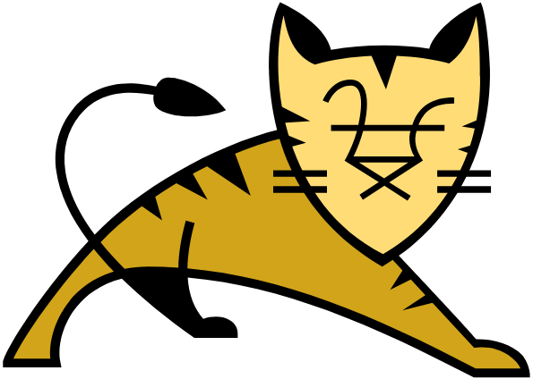
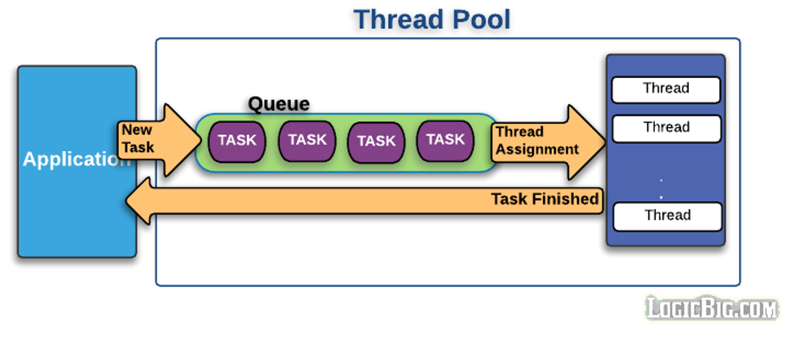
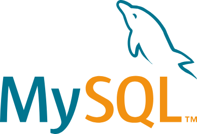
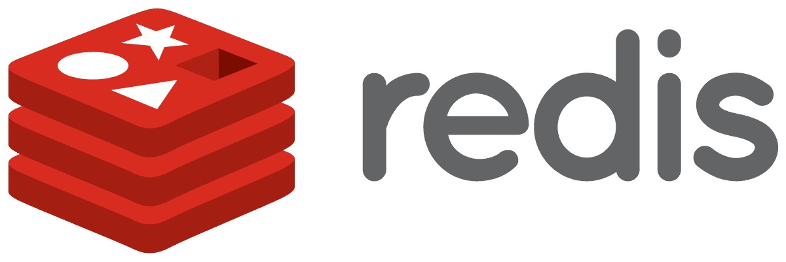

{: .w-50 }
_(GDSC Kprintf)_

> 해당자로는 GDSC 컨퍼런스에 참여하여 들은 강의 내용 소감을 바탕으로
>
> 작성 된 포스트 입니다.

## 개요

요즘들어 면접 질문을 준비하다보면 기술 면접 외에도 CS 관련 면접도 많아진 추세이다.

~~전공학점만 높으면 되는거 아냐?~~ 라는

얄팍했던 내 자신을 한심하게 생각하며 눈물의 포스팅을 남긴다...

<br/>
<hr/>


## CS 는 왜 해야 할까?

이제는 개발자의 문턱이 낮아진 상황, 프로그램을 만드는 사람은 많아졌다.

그래서 프로그램을 ***'잘'*** 만들어야 한다.

그렇기에 어떠한 포텐셜을 갖고있느냐로 평가 할 수 있기 때문이다.

우리의 토이프로젝트는 클라이언트가 숫자가 적다.

하지만 트래픽이 몰린다면..

`CLIENT` -> `SERVER` -> `DATABASE`

Server 의 구조가 바뀐다는 것은 -> 코드가 바뀐다는 것 -> **그동안 짠 코드는 어떡해?**

데이터 베이스의 구조가 바뀐다는 것은 -> **운영중에 어떻게 바꿔? / 기존 데이터는 어떡해?**

해당 상황과 같은 문제점이 발생하기 마련이다.

<br/>
<hr/>

## Transaction Per Second

### TPS 란 무엇인가

> 서버가 초당 처리한 사용자 요청의 수
>
> 기본적으로 서비스 규모를 판단하기 위한 수치로 사용
>
> 서버의 성능을 판단 할 수 있음
{: .prompt-tip}

개발을 할 때는 일부러 트래픽 상황을 걸어서 `TPS` 가 얼마나 몰리는 지로 확인한다.

> Q. 그말이 곧 ***동시접속자*** 라는 말 아니야?
{: .prompt-info}

하지만 엄연히 다르다.

<br/>

|동시 사용자|부하 사용자|
|:--------|:---|
|접속 사용자중 현재 시스템을 사용하고 있는 사용자|동시 사용자 중 트랜잭션을 발생하여 결과를 기다리고 있는 사용자|


그렇다면...

**TPS 만 높으면 다일 까?**

아니다. 서버를 오래 켜둬야 하기 때문에 ***TPS 가 높아도 막연히 좋은게 아니다.***

<br/>
<hr/>

## 서버가 요청을 처리 할 때

프로세스 자체는 직접적으로 통신 할 수 없다.

따라서 `Socket` 을 사용해서 통신을 하는데, 클라이언트와 서버 사이에서 요청을 처리한다.

|Port|Socket|
|:---|:---|
|통신 애플리케이션이 상호구분을 위해 사용하는 번호|네트워크 상에서 돌아가는 두 프로그램간 양방향 통신의 앤드포인트|

**PORT 는 단방향, Socket 은 양방향이라고 생각하면 편하다.**

기본적으로 대부분의 서버는 리퀘스트가 올 시 이에 따른 Process/Thread 가 있어야 한다.

그럼 이제 각자 개발 환경에서 어떤식으로 처리하는지 알아보자

<br/>
<hr/>

### Tomcat

{: .w-50 }
_(apache tomcat)_

사용자가 요청을 처리할 스레드를 ***미리 만들어놓고***, ***요청이 들어올 때마다 스레드를 통해 처리***하는 방식을 사용함

`Thread pool`(스레드를 재활용함)

{: .w-50 }
_(이미지 출처 : LOGICBIC.COM)_


> 스레드 갯수가 부족하면? 처리하지 않고 대기를 함...
{: .prompt-danger}

**Q 10000 개의 클라이언트를 동시에 처리 할 수 있는 네트워크 I/O 를 만들 수 있을까?**

> 단순히 ***Thread pool*** 의 갯수를 늘리면 되는거 아니야?
{: .prompt-info}

하지만 틀렸다.

`Socket` 도 `256` 개라는 갯수 제한이 있기 떄문이다...

따라서 한번에 `256` 개의 클라이언트를 받을 수 밖에 없다.

<br/>


### MySQL

{: .w-50 }
_(mySQL)_

MySQL 도 커넥션 별로 소켓을 열어서 톰캣처럼 관리하고 있다

> DATABASE 은 더 많은 소켓 수를 가지고 있어야 한다...


### 파일 열어보기

```java
File file1 = new File();
File file2 = new File();
```

프로그래밍 언어에서 파일을 관리하는 것은 매우 쉬운데,

한개가 아닌 여러 파일을 여는 것도 문제가 없다.

**즉 하나의 스레드도 파일을 관리하는 방식으로 소켓을 관리한다면 하나의 스레드도 여러 요청을 처리할 수 있지 않을까?**

그게 바로

`I/O Multiplexing`

<br/>

### Redis

{: .w-50 }
_(redis)_

Redis 는 `I/O Multiplexing` 를 통해 메인 스레드를 관리한다.

<br/>
<hr/>

### HTTP 에 대해서

익숙한게 나왔다

> HyperText Transfer Protocol 은 W3 상에서 정보를 주고 받을 수 있는 프로토콜 `TCP`
>
> 하지만 HTTP3 에서는 `UDP` 를 활용

> 그럼 ***TCP*** 와 ***UDP*** 의 차이는 뭐야?
{: .prompt-info}

|TCP|UDP|
|:---|:---|
|신뢰성 있는 통신이 가능| 신뢰성은 없지만 빠름|


#### Hand Shake

**TCP 를 더 빠르게 할 순 없을 까?**

##### TTP/1.0

HTTP/1.0 에서는 웹 화면 하나를 받기 위해 `html`, `js`, `css` 파일을 따로 요청을 주고받는다.

새로고침 하면?

> `Hand Shake` 3회... ~~완전 구리네~~

##### TTP/1.1 Persistance

파일을 하나로 묶어서 한번에 전송

> `Hand Shake` 1회

새로고침 하면? Web Cashe 적용 시 1회

**그럼에도 불구하고 같은 서버에서의 다른 주소에 대해 3번 `Hand Shake` 를 한다...**

> 그럼 신뢰성 있는 통신을 하기 위해 `Hand Shake` 를 하는건데
>
> 1회 성공 시 게속 신뢰 하면 안되는 건가요??
{: .prompt-info}

할 수 있다.

`SYN` 을 통해 Hand Shake 를 간단화 한다.

`Syn + Cookie + Request` 를 한꺼번에 보내주는 방법을 통해 빠르게 할 수 있다.

이 방법을 `TCP Fast Open` 이라고 한다.

> ***UDP*** 는 신뢰성이 없는데 왜 쓸까?
{: .prompt-info}

- 스트리밍 처럼 굳이 신뢰를 할 필요가 없을 때
- 속도가 제일 중요할 때 사용

> **DHCP*** 에서 ***UDP*** 를 사용하는 이유가 무엇 인가?
{: .prompt-info}

- 더 빠르고 더 간단
- 연결 지향적일 필요가 없으니까
- 신뢰성 보다는 속도가 더 중요
- IP 주소가 없으니까

> DHCP 의 정의
>
> 여러 서버에서 가장 응답이 빠른 서버와 통신을 하며 IP 를 할당 받음
>
{: .prompt-tip}

> TCP 는 Hand Shake 과정이 반드시 들어가므로 모든 통신이 1:1로 이루어짐 Unicast
>
> 따라서 비 효율적이기 때문에 DHCP 를 주로 사용한다.

> 그럼 왜 ***HTTP/3*** 은 ***UDP*** 를 사용할까?

- 느려서
- TCP 는 너무 예전에 만들어져서

같은 이유가 있지만 가장 큰 이유는

`네트워크 (OSI) 7 계층`에 있다.

- 구현의 용이함 (각자 레이어는 각자 역할에 충실)
- 서로 완전 독립적으로 운용 가능

**결론적으로 Internet Protocol 위에 UDP 위에 레이어 구조를 추가로 얹을 수 있기 때문이다.**

(HTTP)
(...)
(QUIC)
(UDP)
(INTERNET PROTOCOL)

vs

(HTTP)
(...)
(TCP)
(INTERNET PROTOCOL)


<br/>
<hr/>

## 마치며...

이래서 항상 CS 에 대한 질문을 항상 하는 것이었구나 싶은 밤이다.

얼른 CS 책 펴야지