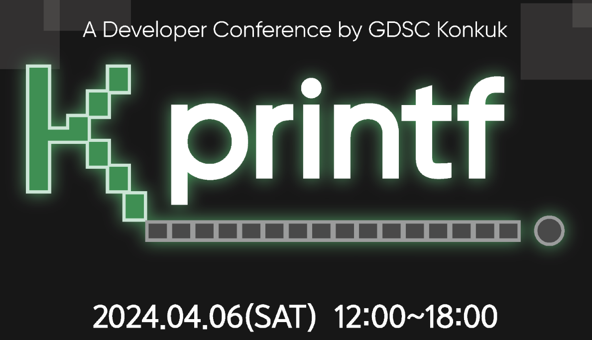

{: .w-50 }
_(GDSC Kprintf)_

> 해당자로는 GDSC 컨퍼런스에 참여하여 들은 강의 내용 소감을 바탕으로
>
> 작성 된 포스트 입니다.

## 개요

항상 보면 이력서가 제일 쓰기 어렵다. 내가 준비해왔던 내용을 쓰는 것임에도 말이다.

내가 어떻게 해왔는지를 풀어 쓰기엔 글재주가 없는 나에겐 아주 큰 곤욕이다..

조언 겸 도움이 되고자 들어보니 많은 도움이 돼서 포스트 남겨 기록한다.

## 사례로 살펴보는 취업 준비 방법

### 회사 조사

**1. 회사에 대한 조사 먼저하기**

우리는 결국 회사가 필요로 하는 개발자가 되어야 하기 때문에

회사가 원하는 개발자 상이 뭔지를 알아야 한다.

> 대용량 트래픽, 문제를 발견해서 적극적으로 개선, 서비스 초기 등등 키워드가 주어지는데
>
> 해당 키워드에 맞춰서 자기소개서를 작성 및 나를 어필해야한다 !!
{: .prompt-tip}

 

**2. 회사들을 티어로 분류하고 저티어 순서대로 지원하기**

- 테크 컴퍼니즈, 잡플래닛, 원티드 인사이트 등 참고 (정보가 많음)
- 채용공고를 그냥 보고 넘기지 말고 우대사항, 필수사항 등 특정 정보를 기반으로 도식화 할 것

예를 들자면

|A회사|B회사|
|:---|:---|
|java, kotlin| JS |
|대용량 트래픽 경험.. | 서비스 경험 |

_(이해를 돕도록 작성해본 예시)_

### 이력서 작성

**1. 내가 이력서를 읽는 사람 입장에서 생각할 것**

우리도 그렇듯 면접관들도 보기 어려운 글은 읽기 싫다.

이력서 검토는 짧은 시간내로 진행이 된다.

따라서 가독성이 좋게 개발을 잘한다고 어필을 해야한다.

- 나는 어떠한 개발자인지를 간략히 설명을 시작해야함
- 나의 역량과 장점 및 노력 을 증명하기 위해 기술 블로그나 깃허브 링크를 첨부

 

**2. 내가 적은 내용은 하위 프로젝트 내용 등을 통해 증명이 되어야 함**

- 만약 **증명할 수 없다면 과감히 정리**하기 (오히려 악효과)
- 핵심만 간추려서 이해하기 쉬운 단어들로 역량 증명

 

따라서

이러한 순서대로 작성하는 것이 좋다.

1. 기본 정보 및 소개
2. 기술적 역량과 경력 (프로젝트)
3. 교육, 스터디, 세미나
4. 학력 및 자격증
5. ***+alpha***

 

**3. 내가 제일 잘하는 기술을 기반으로 작성하는 것들을 우선적으로 작성**

- 내가 지원하는 분야와 맞지 않는 스킬셋은 과감하게 삭제할 것
- 잘 알지 못하는 스킬셋 `K8S...` 과감히 삭제 -> 오히려 질문 폭탄
- 우리가 모든 것을 알것이라 기대를 하지 않으므로 자신 있는 것 위주로 작성

 

**4. 프로젝트 내용은 과감하게 어떤 문제가 있었고 어떻게 해결했는지를 위주로 작성해야 함**

- 내가 적용했던 기술을 구체적으로 명시
- **측정된 수치를 통해 면접관의 관심**을 끌기
- 이력서의 작성은 항상 면접관의 입장에서 작성

 

>(X)- 리소스를 낭비하던 비효율적인 코드 리팩터링
{: .prompt-danger}

>(O)- 매번 Pattern.compile 을 호출하여 50% 까지 튀던 CPU 사용율을 10%로 최적화 시킴
{: .prompt-info}

>(X)- 테스트 보완, 데드코드 삭제로 통한 컨디션 커버리지 상승
{: .prompt-danger}

>(O)- 테스트 보완, 데드코드 삭제로 통한 컨디션 커버리지 상승 (43% -> 69%)
{: .prompt-info}

 

- 지나친 **링크 연결로 인한 컨텍스트 변경 최소화**
- 첨부된 링크 연결에 대해 정상 동작 확인
- **맞춤법**은 기본이므로 제출 전에 확인
- 회사가 원하는 방향이 다르면 그에 따라 맞춰서 사용 `test code`, `error handling`, `traffic`...

 

- 스스로 본인의 이력서를 객관적으로 보기 어려움
- 채용자의 입장과 구직자의 입장은 다를 수 밖에 없음
- 따라서 이력서 작성 후에 피드백

 

- 모든 것을 준비하고 지원하겠다는 마음가짐 X
- **새로운 기술을 우리의 준비 속도보다 빠르게 나오고 요구되는 역량도 계속 발전 됨**
- 따라서 **빠르게 지원**하고, 탈락하고, 부족한 부분을 보완하는 사이클이 필요

 

### 코딩 테스트

- 본인이 사용하는 **프로그래밍 언어와 일치**
- 성능은 알고리즘 대회를 나가지 않는 이상 고려 대상이 아님
- ~~그냥 많이 풀어라..~~
- 년도마다 빈출문제가 있음

 

### 면접

- 빈출 면접 질문들을 수집, 이에 따른 준비
- 인맥을 쌓아 네트워킹을 해야함

면접을 보다보면 모르는 부분을 물어보는 경우가 생길 수 있다.

- 모르는 것이 나올 경우 **솔직하게** 모른다고 답변하기
- 기술 질문이 아닌경우에도 솔직하게 답변
- 면접 복기

 

## 마치며... 

어차피 취업은 준비를 할 뿐 내가 컨트롤 할 수 없다..

그렇기에 내가 제어 할 수 없는 부분에서 최선을 다하면 된다.

떨어진다고 좌절하지말고 꾸준히해서 취업 했으면 좋겠다.

~~포기하는게 지는거야~~

덕분에 내 이력서에 개선방안을 찾았다.

맛굿