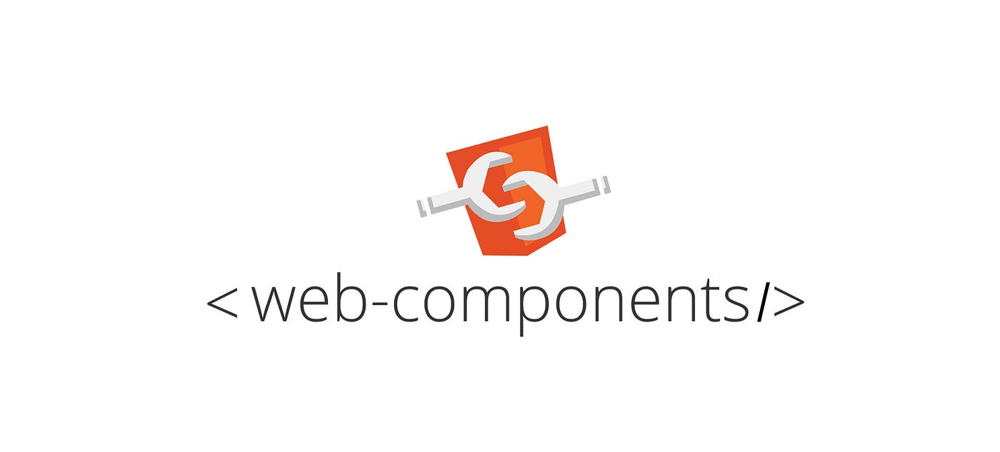

{: .w-50 }
_(GDSC Kprintf)_

> 해당자로는 GDSC 컨퍼런스에 참여하여 들은 강의 내용 소감을 바탕으로
>
> 작성 된 포스트 입니다.

## 개요

프론트앤드 개발자를 준비하는 나로서 최근들어 Next 14 업데이트는 아주 큰 충격이었다.

현재 리액트 버전은 18 이고, 공식 업데이트는 2022년 6월 이후로 없었다.

2년동안 아무것도 없던 것은 굉장히 아쉬운 부분이었다.

그런데 이번에는 React 도 19 버전으로 업데이트 소식이 들려오다니...

과연 뭐가 달라졌을까 알아보자


## 왜 React 는 업데이트를 하는가?

- 이제 리액트는 모든 환경에서 호환되며` Asset loading`, 메타 데이터 조작등 큰 조정이 있을 예정이라고 한다.
- 정식 릴리즈 전 Web Components 지원과 같은 큰 변경이 예고되었다.

그럼 이제 변경이 될 점을 한번 알아보자

<br/>
<hr/>

## 변경 된 점

> 그렇다면 React 19 에서는 ***무슨 변경점이 있길래*** 2년이라는 세월이 걸렸을까?
{: .prompt-info}

리액트는 과거에 큰 변경점이 있었다.

1. 클래스형 컴포넌트에서 함수형 컴포넌트로 업데이트 됐을 때 (19.02.16)
2. Concurrent Mode 를 통해 유저에게 좀 더 친숙한 UI 를 추가 (22.03.09)

리액트는 3개의 레이어가 있는데

- `Code Layer` : React node 를 통한 코드 상태
- `React layer` : Virtual DOM
- `Broser layer` : Browser DOM

이 구조를 일단 알아야 변경점도 이해하기 편하다.

<br/>

과거 변경사항을 토대로 순서대로 흘러가보자

> 왜 ***클래스형 컴포넌트***에서 ***함수형 컴포넌트***로 굳이 변경을 했을까?
{: .prompt-info}

함수형 컴포넌트는 항상 랜더링된 값을 UI 에 보여준다.

따라서 사용자는 더이상 UI 와 데이터간 동기화를 생각하지 않아도 되게 된다.

```ts
import React form "react";

class ProfilePage extends React.Component {
    showMessage = () => {
        alert(user + "를 팔로우 합니다.");
    };

    handleClick = () => {
        const {user} = this.props;
        // 함수가 될 시점의 데이터를 반영 시켜야됨...
        setTimeout(() => this.showMessage(user), 3000);
    }

    render() {
        return <button onClick = {this.handleClick}>Follow</button>;
    }
}
```

상단의 코드는 아주 큰 문제가 있다.

한번 생각해보자

<br/>
<hr/>

### State 란?

> User Interaction 으로 발생한 데이터의 변화
{: .prompt-tip}

모든 데이터는 자기만의 생명 주기를 갖는데 (모든 프로그램의 법칙)

그렇기 떄문에 `interaction` 의 데이터도 ***독립적인 생명주기를 보장***해야한다.

```ts
function Counter() {
    let state = 0;

    const onClick = () => {
        state++;
    };

    return <button onClick={onClick}>Click Me</button>
}
```

위의 값은 `re-rendering` 될 시에는 값이 자동 소멸한다.

`components` 가 호출 됐을 때 초기화가 되기 때문이다.

<br/>
<hr/>

### React Hooks

> 독립적인 state 데이터 조작을 가능하게 하는 API
{: .prompt-tip}

```ts
function Counter() {
    const [first, setFirst] = useState(0);
    const [second, setSecond] = useState(0);
}
```

얼마든지 함수가 호출되어도 데이터를 독립적인 값으로 관리하기 위해 사용하는 `React` 의 `Hook` 이다.

하지만 다른 `state` 들은 `Hooks` 되지 못한 것들이 있는데

- useSuspense
- useCatch(useThrow)
- useProvider
- useShouldComponentsUpdate

> 다른 컴포넌트에서 데이터를 가져오기 때문에 독립적이지 못하기 때문...

<br/>
<hr/>

### Concurrent React (React 18)

이제 더이상 사용자는 UI 와 데이터와 동기화를 생각하지 않아도 된다.

> 그럼 이제 데이터를 ***업데이트를 언제, 어떻게 무엇으로 UI 에 알리지?***
{: .prompt-info}

> 그렇다면 언제 알릴지 React 가 선택권을 쥐고 있다가 필요한 UI 먼저 업데이트를 할 수 있으면 좋지않을까?
{: .prompt-info}

라는 연계 질문에 다다를 수 있는데 그럼 `동시성` 을 고려를 해야한다...

`동시성` 에 대해 알아보자

<br/>
<hr/>

#### Concurrency (동시성)

이해를 돕기 위해 예시를 들자면

통화를 예시를 들어보자 지금 내가 철수의 통화를 받고있다면, 영희의 통화를 들을 수가 없다.

내가 지금 철수와 잡담을 하고 있는데, 영희와 중요한 전화가 걸려온다면...

> 그럼 철수의 통화는 중요하지 않으니 진행 중인 철수 통화는 잠깐 멈추고
>
> 영희의 전화를 받는게 데이터 상으로도 중요도를 나타낼 수 있다.
{: .prompt-warning}

<br/>

따라서 해당 예시를 바탕으로

`setInputValue` 와 `setSearchResult` 를 설명하면

`setInputValue` 가 값을 먼저 저장을 하고나서 `setSearchResult` 를 실행을 해야 하므로

`React 18` 에서부터는 독립적으로 자기만의 스케줄링을 할 수 있어졌다.


ex) Suspense...

```ts
return (
    <Layout> // OK!
        <NavBar/> // OK!
            <Suspense fallback ={<UsersSkeleton/>}> // WAIT!
                <Users/> // FAILED...
            </Suspense>
    </Layout>
)
```
실제 `React` 의 내부에서는 `Ping` 을 통해 렌더링을 시도해달라 요청을 한다.

이게 `useState()` 에서 굳이 컴포넌트를 `async` 처리하지 않아도 되는 이유다.

```ts
//Before React18
function onClick() {
    setOne(); // rendering
    setTwo(); // rendering
    setThree(); // rendering
}

//after React18
function onClick() {
    setOne(); // waiting three
    setTwo(); // waiting three
    setThree(); // rendering
}
```

함수형 컴포넌트 내에서도 적용이 되는 부분이다.

<br/>
<hr/>

### 컴포넌트 동작 분리

각 컴포넌트가 실행이 되어야 하는 곳은 다른 곳이어야 한다.


그 이유는 바로 어떤 컴포넌트는 서버에 접근하여 데이터를 가져와야하고

`State` 는 `Client` 에 존재해야 하며 결국 사용자와 상호작용해야 그 의미를 갖는데

그럼 서버에 접근하는 컴포넌트는 UI 에 의해 처리되고, 또 한번 서버에 의해 처리가 되어야한다.

두번하는 건 엄청 비효율적이다.

이말인 즉슨

- **state 가 없는 컴포넌트는 client 에서 다룰 필요가 없다.**
- **data가 없는 컴포넌트는 server 에서 다룰 필요가 없다.**

라는 두 가지 큰 틀로 표현할 수 있다.

<br/>

따라서 client 에 주지 않아도 되는 컴포넌트를 줄이는 것이 성능 개선에 큰 도움이 된다.

**React 가 19 버전으로 업데이트 되는 가장 큰 이유다.**

`Server Component` 에 대한 본격적인 지원이 시작이 된다 이 말이다.

<br/>
<hr/>

### Server Component 란?

- `Server Component` 는 서버에서만 실행되는 컴포넌트로, 실제 클라이언트에 코드가 전달 되지않음
- DB, 파일 다른 서버 등 `server-side resource` 에 접근 할 수 있음

~~Next 의 `use server` 같은 느낌~~

**따라서 Suspense 와 함께한다면 최적화와 최적의 UI 를 제공할 수 있음!!!**

또한 선형적인 로딩 시간을 병렬적으로도 개선을 할 수가 있어졌다.

따라서 `Client` 는 server component 를 알 필요가 없어졌고

그래서 번들 사이즈가 작아지기 때문에 렌더링 개선에 아주 큰 도움이 되었다.

새로운 React Hook 의 도입도 그에 맞게 개선이 되었다.

- `useFormState()`
- `useFormStatus()`
- ...

<br/>
<hr/>

### Asset Loading

실제 랜더링시 React 의 랜더링과 Asset 의 렌더링 속도의 차이가 나서 불편했다.

그 차이가 개선이 되었는데

어떤 방식으로 개선 되었는지 알아보자

<br/>

#### Resource Hints

`Resource Hints` 가 React 내에서 도입이 되었다.

> Resource Hint
>
> 브라우저에게 미리 리소스를 사용하기 위해 미리 값을 알려주는 방식으로
>
> 랜더링 속도 개선에 아주 큰 도움이 되는 방식이다.
{: .prompt-tip}

- `preconnect` : 미리 서버와 연결까지 구성을 해 TCP Hand-shake 도 빠르게 만들어줌
- `dns-preconnect` : DNS 서버에 접근 하기 전에 미리 알려줌
- `preload` : 특정 리소스가 쓰이는것이 확실할 때

따라서 해당 `Hint` 들을 통해 미리 리소스들을 알게 되므로

`fallback` 을 더 빠르게 관리 할 수 있게 되고 이는 곧 로딩속도 개선에 엄청난 힘이 된다.

~~말 그대로 정보를 미리 알게 되니깐~~

<br/>
<hr/>

#### Web Components

{: .w-50 }
_(Web Components)_

> 리액트가 아닌 다른 환경에서도 ***Components*** 라는 개념을 사용할 수 있을까?
{: .prompt-info}

라는 발상에서 발생된 업데이트로

`Svelte` 같은 환경에서도 `Component` 를 사용할 수 있게 되는 것이다.

<br/>
<hr/>

#### Use Hook

`Use Hook` 을 사용하면 비동기 함수도 동기적으로 사용할 수 있어진다.

따라서 `React-Query` 와 같은 외부 라이브러리에 의존할 필요가 없어진다.

```ts
export async function fetchNote() {
    ...// fetch data
    
    return data
}

export function Note({id}) {
    const note = use(fetchNote(id));

    return (<div>
        <h1>{note.title}</h1>
        <section>{note.body}</section>
    </div>)
}
```

~~`React-Query` 와 매우 비슷하다.~~

#### Forward Ref 가 불필요 해짐

`React` 는 랜더링과 상관없는 값을 가리키기 위한 `useRef` 라는 훅이 있다.

상위 컴포넌트에서 하위로 `ref` 를 넘겨줄 때 `forward ref` 를 사용해서 넘겨주어야 했는데

그 이유눈 `class Component` 내 `ref` 값은 `props` 내 고유한 값이 있기 때문이다.

<br/>

정확히는 **Class** 의 `insatance` 인지 여부를 담고 있는데 잘못하면

클래스 내 **값이 덮어쓰여질 수 있는 위험이 존재하기 때문이다.**

근데 이제 함수형 컴포넌트를 더 자주 사용고 function 은 instance 개념이 없기 때문에

이제 `forward ref` 란 개념이 없고 이제는 ref 를 하위컴포넌트로 props 로 넘겨 줄 수 있다.

<br/>
<hr/>

## 마치며...

{: .w-50 }
_(react 19)_

아직은 `pre realize` 상태기 때문에 아직은 변경될 수 있는 상황이 많지만

**가장 중요한 방법은 토이프로젝트로 직접 체험해 보는 것**이다.

공식 채널을 자주 참고하며 앞으로 다가올 대규모 업데이트

***React 19*** 에 대해 준비를 꾸준히 하자