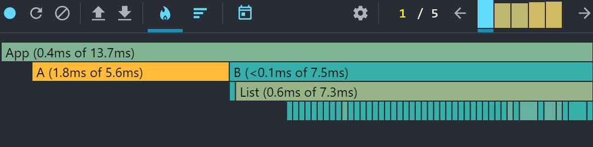
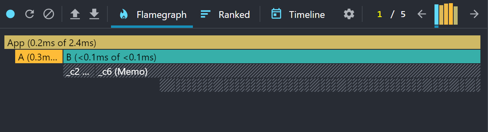

## 개요

코드를 짜는 것에 대한 장벽이 낮아지고 있는 요즘,

사람들이 자기 코드를 개선하고 최적화 하는 일에는 소홀히하는 경향이 있다.

간단한 예제를 바탕으로 코드를 한번 개선해보자

~~귀찮지만 해보자~~

<br/>
<hr/>

## React Profiler 설치

일단 먼저 구글에서 설치가 가능한 `React Profiler` 를 활용할 예정이다.

설치를 하려면 [링크 참고](https://chromewebstore.google.com/detail/react-developer-tools/fmkadmapgofadopljbjfkapdkoienihi?hl=ko&utm_source=ext_sidebar)

{: .w-50 }
_(React Profiler)_

<br/>
<hr/>

## React.memo()

먼저 `React.memo()` 를 활용해보기 전에

`React.memo()` 란 뭘까?

그걸 알려면 일단 `React` 의 기본 동작을 되짚어보아야 하는데

`React` 는 먼저 컴포넌트를 `rendering` 한 후 이전에 `rendering` 된 결과를 비교해

DOM 업데이트를 결정한다 ***(Virtual DOM)***. 만약 ***이와 결과가 다르면 DOM 을 업데이트 하는 식으로 동작***한다.

이때 `React.memo()` 로 쌓여있으면 `React` 는 컴포넌트를 처음 `rendering` 할 때 메모리에 `Memoizing` 한다.

***그 후 다음 rendering 발생 시 컴포넌트의 props 가 일치한다면 React 는 Memoizing 한 값을***

***재사용한다.***

> React 가 메모리에 기억해 뒀다가 다시 재활용하는 것
{: .prompt-tip}

자 이제 함수에 대해 알아보았으니 예시를 보자

### 예시코드

```js
export default function A({ message, posts }) {
  return (
    <div>
      <h1>A Component</h1>
      <p>{message}</p>
      <ul>
        {posts.map((post) => (
          <li key={post.id}>
            <p>{post.title}</p>
          </li>
        ))}
      </ul>
    </div>
  );
}
```

모든 값을 한번에 랜더링 하는 `A-component` 가 있다.

```js
import React from "react";

export default function B({ message, posts }) {
  return (
    <div>
      <h1>B Component</h1>
      <Message message={message} />
      <List posts={posts} />
    </div>
  );
}

const Message = ({ message }) => {
  return <p>{message}</p>;
};

const ListItem = ({ post }) => {
  return (
    <li key={post.id}>
      <p>{post.title}</p>
    </li>
  );
};

const List = ({ posts }) => {
  return (
    <ul>
      {posts.map((post) => (
        <ListItem key={post.id} post={post} />
      ))}
    </ul>
  );
};
```

이번엔 각각 동작을 분리한 `B-components` 가 있다.

`React Profiler` 를 통해 랜더링 속도를 비교해 보자

{: .w-50 }
_(왜 이렇게 차이가 날까?)_

#### 문제 파악

도대체 왜 이런 차이가 발생했을까?

설령 차이가 나더라도 B가 더 빨라야 하는 것 아닐까?

싶지만 B 가 더 느린 이유는 props 로 이미 받아온 값을 하위 컴포넌트에

뿌리고 있기 때문에 랜더링 시 속도가 더 지연되는 상황이다.

그렇기에 해결방안은 간단하다.

상위 컴포넌트에서 props 로 주고 있는 값을 react 에서 ***기억*** 하고 있다가

동일한 값이면 랜더링을 하지 않으면 된다.

<br/>

#### 해결 방법

이런 상황에서 `React.memo()` 를 활용한다.

```js
// React.memo() 를 적용한 모습
import React from "react";

export default function B({ message, posts }) {
  return (
    <div>
      <h1>B Component</h1>
      <Message message={message} />
      <List posts={posts} />
    </div>
  );
}

const Message = React.memo(({ message }) => {
  return <p>{message}</p>;
});

const ListItem = React.memo(({ post }) => {
  return (
    <li key={post.id}>
      <p>{post.title}</p>
    </li>
  );
});

const List = React.memo(({ posts }) => {
  return (
    <ul>
      {posts.map((post) => (
        <ListItem key={post.id} post={post} />
      ))}
    </ul>
  );
});
```

{: .w-50 }
_(랜더링 속도가 확연히 줄어든 것이 보인다)_

> 그렇다고 해서 React.memo() 를 남용해서도 안 된다 !
{: .prompt-danger}

#### 지양해야 하는 상황

랜더링 될 때 `props` 가 다른 경우가 대부분일 경우에는 React.memo() 는 별

도움이 되지 못한다. 그렇다고 모든 함수에 React.memo() 를 사용할 경우

에러가 발생할 수 있다는 경고가 있으니 적재 적소에 사용하는 것이 중요하다.

따라서

> React.memo() 는 성능 개선을 위한 하나의 도구로 생각해야한다.
{: .prompt-info}

<br/>
<hr/>

## useCallback()

원래 컴포넌트가 랜더링 될 때는 그 안에 있는 함수도 다시 만들게 되는데,

계속 같은 컴포넌트가 랜더링 될 때 마다 ***계속 다시 만드는 것***은 좋은 현상은 아니다.

설령 해당 함수가 하위 컴포넌트로 `props` 를 전달하는 상황이라면 하위 컴포넌트도

계속해서 `re-rendering` 되는 현상이 발생한다.

그럴 때는 `useCallback()` 으로 개선 할 수 있다.

```js

import React, { useCallback } from "react";

export default function B({ message, posts }) {
  
  /**
   * 하위 컴포넌트 List 의 props 로 들어가는 함수
  */
  const tsetFunction = useCallback(() => {
    console.log("TEST");
  }, []);

  // useEffect() 와 사용방법이 비슷하다.

  return (
    <div>
      <h1>B Component</h1>
      <Message message={message} />
      <List posts={posts} tsetFunction={tsetFunction} />
    </div>
  );
}


const List = React.memo(({ posts, tsetFunction }) => {
  return (
    <ul>
      {posts.map((post) => (
        <ListItem key={post.id} post={post} />
      ))}
    </ul>
  );
});
```

사용 방법은 간단한데, `useEffect()` 처럼 사용하면 된다.

오른쪽에 있는 배열은 의존성이므로 해당 함수를 다시 랜더링 할 때의 조건을 추가 해주면 된다.

<br/>
<hr/>

## useMemo()

`useMemo()` 도 따지고보면 `Memoization` 에 관련되어 있는데,

간단하게 설명하자면

이미 불필요한 랜더링이 계속 진행 될 때 복잡한 연산식이 있다면 그 값을 `memoization` 하는 것이다.

### 예시코드

```js
function Component({a, b}) {
    const result = calculate(a, b);

    return <div>{result}</div>;
}
```

라는 간단한 함수가 있을 때 `calculate` 라는 연산 값이

변하지 않았는데 계속해서 `rendering` 이 발생해 같은 연산을 반복한다면 좋지 못하다.

따라서 이럴 때 `useMemo()` 를 활용해 쓸데 없는 연산을 줄일 수 있다.

#### 해결 방법

```js
function Component({a, b}) {
    const result = useMemo(() => calculate(a, b), [a, b]);

    return <div>{result}</div>;
}
```

앞서 설명한 `useCallback()` 과 일맥상통한다.

`useEffect()` 처럼 사용한다고 생각하면 편하다. 우측의 배열은 의존성을 추가 하는 것이다.

<br/>
<hr/>

## 마치며


`React` 의 동작방식에 의해 불필요한 랜더링이 많아지자 이에 따른 성능 개선을 위해

사용하는 것이 `Memoization` 을 활용하는데

|useMemo()|useCallback()|
|:--------|:------------|
|연산을 기록할 때|props 나 불필요한 함수를 줄일 때|

로 활용한다고 생각하면 편할 것 같다.

<br/>

다음에 있을 프로젝트에서

해당 페이지에서 배운 `Memoization` 을 활용해 성능 개선을 해볼 예정이다.

얼마나 개선이 되는지 아직은 간단한 코드에서만 테스트 해봤는데

추후 있을 큰 프로젝트에서 활용을 한다면 얼마나 많은 시간 단축이 될지 흥미롭다.

아직까지 코드 개선경험이 모자른 지금 중요한 학습 중 하나였다고 생각한다.

~~생각보다 간단하던데 왜 안했지~~