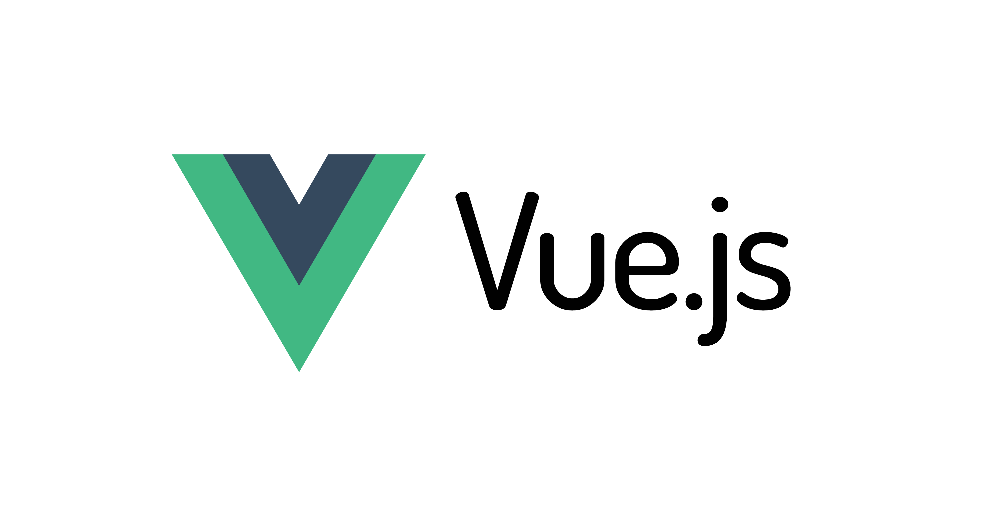

> 해당 포스트는 Vue.js 에 대해 중점적으로 다루는 페이지 입니다.
{: .prompt-tip}


{: .w-50 }

## 왜?

`Vue 2` 의 지원은 2023.12.31 부로 끝이 나기도 했고 현재 다니는 회사에서 `Vue` 를 가장 많이 사용하고 있어 배워보려 했다.

하필 또 내가 안써본 것 중 하나가 `Vue` 이기에..


## Vue 란?

> Vue === View

`Vue` 는 `View` 와 발음이 유사하다. Vue.js 는 Model-View 에서 `View` 에 해당하는

사용자 인터페이스를 구축하기 위한 ***자바스크립트 프레임 워크*** 라고 한다.


 **HTML**, **CSS**, **JavaScript** 위에 구축 되는데

특이하게도 `.vue` 라는 고유 확장자 명을 사용한다. 이걸 주로 **SFC** 라고 부른다.

> SFC (Single File Component)
>
> 상태가 변경 될 때 HTML 을 자동으로 업데이트 하며
>
>
> 이때 변경 된 업데이트를 트리거 할 수 있는 상태를 반응형이라고 함
{: .prompt-tip}


이제 해당하는 Vue 의 특징 중 `SFC` 를 먼저 간략히 알아보자

<br/>

### SFC (싱글 파일 컴포넌트)

빌드 도구를 사용하는 대부분의 Vue 프로젝트에서는 HTML 과 유사한 SFC 파일 형식을 사용하며

**컴포넌트의 논리 (JS)**

**템플릿 (HTML)**

**스타일 (CSS)**

을 한 곳에 묶어 캡슐화 한다.

```html
<!-- vue 이지만 rouge 가 vue 를 인식하지 못하므로 -->
<!-- highlight 를 html 으로 대체 -->

<script setup>
import { ref } from 'vue'
const count = ref(0)
</script>

<template>
  <button @click="count++">Count is: {{ count }}</button>
</template>

<style scoped>
.button {
  font-weight: bold;
}
</style>
```

<br/>

### 프로그레시브 프레임워크

Vue 는 프론트앤드 개발에 주로 사용하는 '프레임워크' 중 하나다.

하지만 웹은 매우 다양하고 구축하려는 것의 형태와 규모가 다 다를 수 있다.

그래서 Vue 는 처음 설계 될 때부터 조금 더 유연한 방법으로 설계되었다고 한다.

- 빌드 과정 없이 정적 HTML 에 적용
- 모든 페이지에 웹 컴포넌트로 추가
- SPA
- SSR
- SSG (정적 사이트 생성)

등 여러 방법으로 구현이 가능하며 이런 특성을 활용해 `Vue` 는 어떤 환경에서도 최적의

방법을 선택하면서 같은 생산성을 유지 할 수 있다고 한다.


<br/>

### API 스타일

Vue 는 Optional API 와 Comoposition API 으로 API 스타일을 두 가지로 작성 할 수 있다고 한다.

각각의 스타일에는 특징이 있는데 한번 알아보자

<br/>

#### Optional API

> `data`, `methods`, `mounted` 같은 객체를 사용하며 컴포넌트의 로직을 정의함 
>
> 옵션으로 정의된 속성은 컴포넌트 인스턴스를 가리키는 함수 내부의 `this` 에 노출이 됨

```html
<script>
export default {
  // data()에서 반환된 속성들은 반응적인 상태가 되어
  // `this`에 노출됩니다.
  data() {
    return {
      count: 0
    }
  },

  // methods는 속성 값을 변경하고 업데이트 할 수 있는 함수.
  // 템플릿 내에서 이벤트 헨들러로 바인딩 될 수 있음.
  methods: {
    increment() {
      this.count++
    }
  },

  // 생명주기 훅(Lifecycle hooks)은 컴포넌트 생명주기의
  // 여러 단계에서 호출됩니다.
  // 이 함수는 컴포넌트가 마운트 된 후 호출됩니다.
  mounted() {
    console.log(`숫자 세기의 초기값은 ${ this.count } 입니다.`)
  }
}
</script>

<template>
  <button @click="increment">숫자 세기: {{ count }}</button>
</template>
```

<br/>

#### Composition API

> import 해서 가져온 api 함수들을 사용하며 컴포넌트의 로직을 정의
>
> SFC 에서 Composition API 는 주로 `<script setup>` 과 함께 사용함
>
> setup 속성을 통해 `Vue` 가 좀 더 적은 문맥의 코드로 composition API 를 사용하고
>
> 의도한 대로 컴파일 동작 할 수 있도록 하는 코드 힌트 중 하나
>
> `<script setup>` 에 `import` 되어 가져온 객체들과 선언 된 최상위 변수 및 함수는
>
> 템플릿에서 직접 사용할 수 있음

```html
<script setup>
import { ref, onMounted } from 'vue'

// 반응적인 상태의 속성
const count = ref(0)

// 속성 값을 변경하고 업데이트 할 수 있는 함수.
function increment() {
  count.value++
}

// 생명 주기 훅
onMounted(() => {
  console.log(`숫자 세기의 초기값은 ${ count.value } 입니다.`)
})
</script>

<template>
  <button @click="increment">숫자 세기: {{ count }}</button>
</template>
```

#### 그럼 뭘 선택하라는거야?

두 API 모두 일반적인 사용환경에서 정상적으로 완벽하게 다룰 수 있다.

하지만 두 가지가 있어 많이들 고민하고 무엇을 선택해야하는지 생각하게 된다.

~~그럼 뭘 하라는거야?~~

> 하지만 옵션 API 는 컴포지션 API 위에 올라간다.
{: .prompt-tip}

**Optional API**

일반적으로 OOP 언어의 배경을 가진 사용자를 위한 Class 기반 모델과 더 잘 맞는

컴포넌트 인스턴스 (this 개념) 을 중심으로 하며 반응형 세부 사항을 추상화 하고

옵션 그룹을 통해 코드 구조를 실행하여 초보자에게 친숙

**Composition API**

함수 범위에서 직접 반응형 변수를 선언하고 복잡성을 처리하기 위해 여러함수의 상태를

함게 구성하는데 중점을 둡니다. 보다 더 자유로운 형식이며 Vue 에서 반응형이 효과적으로

사용하는 방식에 대해 이해를 해야 할 필요가 있음. 좀 더 유연하고 로직을 구성하고

재사용하기 위한 보다 강력한 패턴을 가능하게 함

~~그냥 자기한테 맞는거 사용하자~~

<br/>

## 마치며

Vue 에 대해 간략하게 큰 특징을 기준으로 알아보았다.

다음 포스트에서는 Vue 의 사용 방법과 Vue 의 동작 방식을 기준으로 알아보자.


또 다시 새로운 걸 배우려 하니 머리가 아팠다...

하지만 공부를 해야만 하는 직업이기에 ~~버텨야지~~